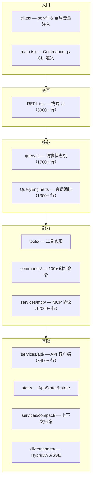
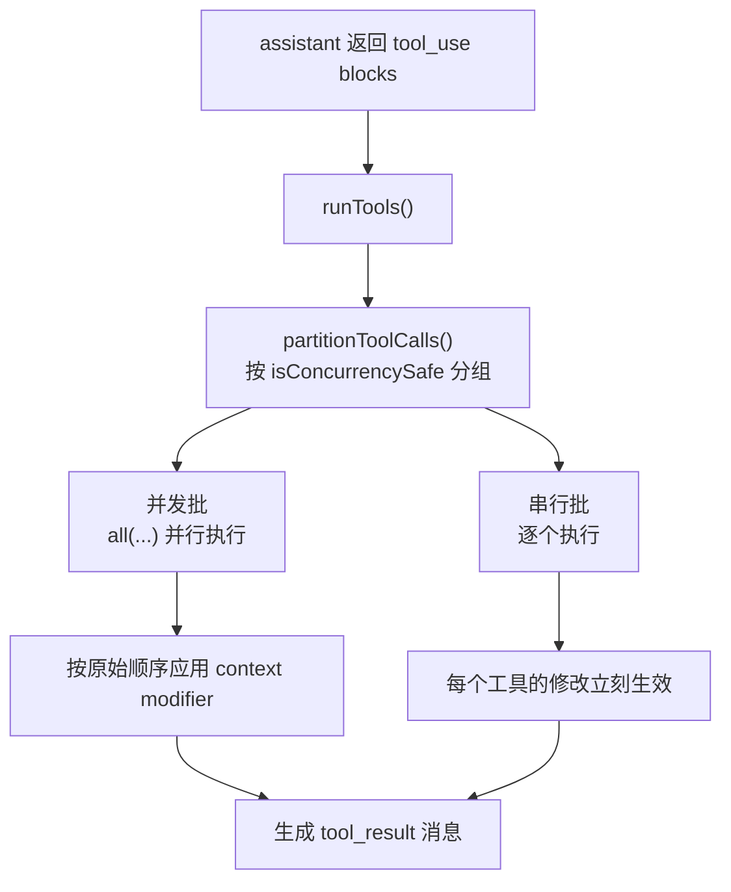
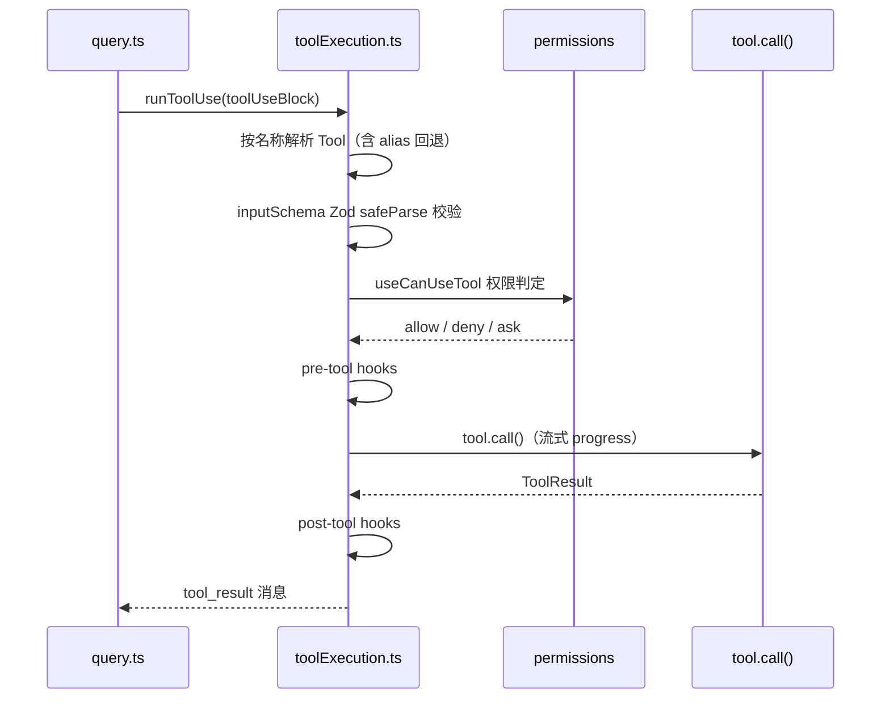
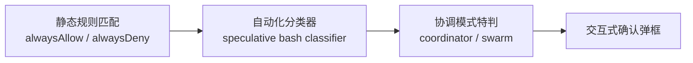
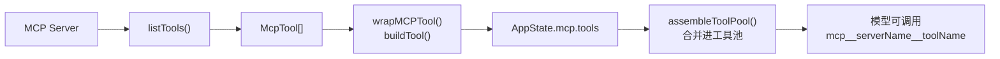
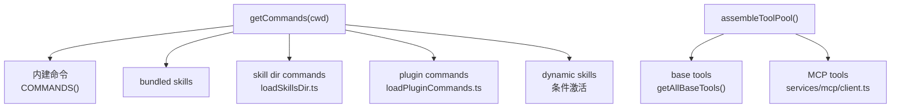

# Codex 工作指南

本文件为 OpenAI Codex 在此工作区工作时提供指导。

## Git 提交署名

每次提交代码时，必须在 commit message 末尾加上以下 co-author trailer：

```
Co-authored-by: Codex <codex@openai.com>
```

## 工作区结构

```
hello-claude-code/
├── claude-code/        # 源代码目录（反编译还原的 Claude Code CLI）
├── deep_dive_cc/       # Claude Code 深度分析文档（10 篇）
├── deep_dive_cx/       # Codex 视角深度分析文档（10 篇 + README）
├── deep_dive_gm/       # Gemini 视角深度分析文档（10 篇）
└── doc/                # 其他文档
```

## 分析文档规范

在 `deep_dive_cc/`、`deep_dive_cx/`、`deep_dive_gm/` 目录下撰写或修改分析文档时，遵守以下规范：

**语言**：全部使用中文撰写，表达要自然流畅，避免机械罗列和模板化措辞。

**文件命名**：序号 + 英文描述 + 下划线分隔，例如 `01_architecture_overview.md`、`06_tool_permissions.md`。

**配图格式**：
- 流程图、时序图、简单架构图 → 使用 Mermaid 格式（`\`\`\`mermaid`）
- 复杂系统架构图、多层级关系图 → 使用 draw.io XML 格式（`\`\`\`xml` 并注明 draw.io）

**写作风格**：像在给同事讲清楚一个系统一样写，有观点、有判断，不要只是堆砌事实。

## 项目概述

`claude-code/` 是 Anthropic 官方 Claude Code CLI 工具的反编译/逆向还原版本。本质上是一套终端中的可扩展 Agent 操作系统内核：UI、命令、工具、权限、上下文压缩、远程会话、多代理，都围绕同一个 query 主循环编织在一起。

- 运行时：**Bun** >= 1.3.11（非 Node.js）
- 语言：TypeScript + TSX
- UI 框架：React + Ink（终端 TUI）
- 模块系统：ESM，Bun workspaces monorepo
- 构建：`bun build src/entrypoints/cli.tsx --outdir dist --target bun`

## 常用命令

```bash
# 在 claude-code/ 目录下执行
bun install
bun run dev          # 开发模式
bun run build        # 构建 dist/cli.js (~25MB, 5326 模块)
bun run lint         # Biome lint
bun run lint:fix     # 自动修复
bun run format       # 格式化
```

## 架构分层



## 工具系统详解

工具系统是整个工程的执行总线，也是 Agent 能力的核心。

### Tool 接口协议（`src/Tool.ts`）

```typescript
type Tool<Input, Output, P> = {
  name: string
  aliases?: string[]
  call(args, context: ToolUseContext, canUseTool, parentMessage, onProgress): Promise<ToolResult<Output>>
  description(input, options): Promise<string>
  inputSchema: Input           // Zod schema
  inputJSONSchema?: ...        // MCP JSON Schema 格式
  isConcurrencySafe(input): boolean
  isReadOnly(input): boolean
  isDestructive?(input): boolean
  isEnabled(): boolean
  isMcp?: boolean
  shouldDefer?: boolean        // 延迟加载（需先调用 ToolSearch）
  alwaysLoad?: boolean
  checkPermissions(input, ctx): Promise<PermissionResult>
  renderToolResultMessage(...): React.ReactNode
  renderToolUseMessage(...): React.ReactNode
}
```

### ToolUseContext（工具运行时上下文）

工具调用时可访问整个 turn 宇宙：commands、tools、mcpClients、AppState getter/setter、messages、readFileState、abort controller、notification 回调、agentId 等。

### 工具注册（`src/tools.ts`）

- `getAllBaseTools()` — 返回所有内建工具
- `getTools(permissionContext)` — 按权限上下文过滤
- `assembleToolPool(permissionContext, mcpTools)` — 合并内建工具与 MCP 工具，顺序稳定（影响 prompt cache）

工具池在运行时可变，REPL 通过 `useMergedTools(...)` 动态组合。

### 内建工具清单

| 工具 | 说明 |
|------|------|
| `BashTool` | Shell 命令执行，含沙箱、权限检查、超时控制 |
| `FileReadTool` | 文件/PDF/图片/Notebook 读取 |
| `FileEditTool` | 字符串替换式编辑（`old_string` → `new_string`），生成 diff |
| `FileWriteTool` | 文件创建/覆写，生成 diff |
| `GlobTool` | Glob 文件匹配 |
| `GrepTool` | 文本搜索 |
| `WebSearchTool` | 网页搜索 + 域名过滤 |
| `WebFetchTool` | URL 抓取 → Markdown → AI 摘要 |
| `AgentTool` | 启动子代理（fork/async/background/remote） |
| `NotebookEditTool` | Jupyter Notebook 单元格编辑 |
| `TodoWriteTool` | Todo 列表管理 |
| `ToolSearchTool` | 搜索延迟加载工具（`shouldDefer: true`） |
| `EnterPlanModeTool` | 进入计划模式 |
| `ListMcpResourcesTool` | 列出 MCP 资源 |
| `ReadMcpResourceTool` | 读取 MCP 资源 |

### 工具执行编排



### 单工具执行生命周期



未知工具也必须返回 `tool_result`，否则消息链不匹配，下一轮会更糟。

### 权限系统

权限模式：`default`（询问危险操作）/ `bypass`（全部允许）/ `plan`（严格）/ `auto`（无询问）



## MCP 系统详解

MCP（Model Context Protocol）让 Claude Code 与外部服务交互，实现工具、资源、提示的标准化接入。

### 支持的传输协议

| 传输 | 说明 |
|------|------|
| `stdio` | 子进程 stdin/stdout，JSON-RPC 换行分隔 |
| `sse` | HTTP Server-Sent Events |
| `http` | HTTP 请求/响应 |
| `ws` | WebSocket |
| `claudeai-proxy` | Claude.ai 代理 |
| SDK in-process | 同进程传输（SDK 模式） |

### MCP 工具集成流程



MCP 工具经过同样的 permission / input validation / result formatting 主链路，与内建工具统一处理。

### MCP 工具调用特殊处理

- `UrlElicitationRequiredError`（`-32042`）：需要用户打开 URL 授权，支持 hook 自动处理或 REPL 交互队列
- 超时控制：自定义 timeout race
- 长任务进度：30 秒一轮的进度日志
- 401 处理：抛出 `McpAuthError`
- session 过期：清缓存并抛 `McpSessionExpiredError`

### MCP 配置

配置文件位置（按优先级）：`<cwd>/mcp.json` → `~/.claude/mcp.json`

```json
{
  "mcpServers": {
    "server-name": {
      "command": "uvx",
      "args": ["some-mcp-server"],
      "env": {}
    }
  }
}
```

## 扩展体系

技能、插件、MCP 直接并入命令表和工具池，不是边缘外挂。



### 技能系统（`src/skills/loadSkillsDir.ts`）

- Markdown 文件 + frontmatter → `Command` 对象
- 支持参数替换、`${CLAUDE_SKILL_DIR}`、`${CLAUDE_SESSION_ID}`
- 支持条件激活（按文件路径匹配）
- MCP 来源技能为不可信来源，禁止执行 inline shell 命令

### 插件系统（`src/utils/plugins/loadPluginCommands.ts`）

- 插件目录 Markdown → plugin command / plugin skill
- 命名空间：`pluginName:namespace:skill`
- 支持变量替换：`${CLAUDE_PLUGIN_ROOT}`、`${CLAUDE_PLUGIN_DATA}` 等

## Feature Flag 系统

30 个 flag 全部 polyfill 为 `false`，均为死代码：

`KAIROS` `PROACTIVE` `COORDINATOR_MODE` `BRIDGE_MODE` `DAEMON` `BG_SESSIONS` `SSH_REMOTE` `DIRECT_CONNECT` `VOICE_MODE` `WEB_BROWSER_TOOL` `WORKFLOW_SCRIPTS` `HISTORY_SNIP` `ULTRAPLAN` `FORK_SUBAGENT` `BUDDY` `UDS_INBOX` `CHICAGO_MCP` `MCP_SKILLS` `AGENT_TRIGGERS` `AGENT_TRIGGERS_REMOTE` `MONITOR_TOOL` `TERMINAL_PANEL` `OVERFLOW_TEST_TOOL` `CCR_REMOTE_SETUP` `CCR_MIRROR` `LODESTONE` `UPLOAD_USER_SETTINGS` `TRANSCRIPT_CLASSIFIER` `ABLATION_BASELINE` `HARD_FAIL` `EXPERIMENTAL_SKILL_SEARCH` `TORCH`

## 工作注意事项

- 不要修复 tsc 错误：约 1341 个反编译产生的类型错误，不影响 Bun 运行时
- React Compiler 输出：`const $ = _c(N)` 是正常的反编译 memoization 样板
- `src/` 路径别名：`import { ... } from 'src/utils/...'` 是合法写法
- Stub 包：`audio-capture-napi`、`image-processor-napi`、`modifiers-napi`、`url-handler-napi`、`@ant/*` 均为 stub

## 参考文档

`deep_dive_cx/` 是 Codex 视角的完整分析（文件命名遵循序号 + 英文 + 下划线规范）：

| 文件 | 主题 |
|------|------|
| `00_README.md` | 总导航，含架构图和阅读路径 |
| `01_architecture_overview.md` | 工程架构总览 |
| `02_startup_flow.md` | 启动流程详解 |
| `03_repl_state.md` | REPL 与状态管理 |
| `04_input_command_queue.md` | 输入、命令、队列 |
| `05_query_request_flow.md` | query 主循环与请求构造 |
| `06_tool_permissions.md` | 工具系统与权限机制 |
| `07_extension_skills_plugins_mcp.md` | 技能、插件、MCP 扩展体系 |
| `08_agents_tasks_remote.md` | 多代理、后台任务、远程会话 |
| `09_performance_cache_context.md` | 性能、缓存、上下文治理 |
| `10_queryengine_sdk.md` | QueryEngine 与 SDK 非交互模式 |

其他参考：`deep_dive_cc/`（Claude Code 视角）、`deep_dive_gm/`（Gemini 视角）
| `07-extension-skills-plugins-mcp.md` | 技能、插件、MCP 扩展体系 |
| `08-agents-tasks-remote.md` | 多代理、后台任务、远程会话 |
| `09-performance-cache-context.md` | 性能、缓存、上下文治理 |
| `10-queryengine-sdk.md` | QueryEngine 与 SDK 非交互模式 |

其他参考：`deep_dive_cc/`（Claude Code 视角）、`deep_dive_gm/`（Gemini 视角）
