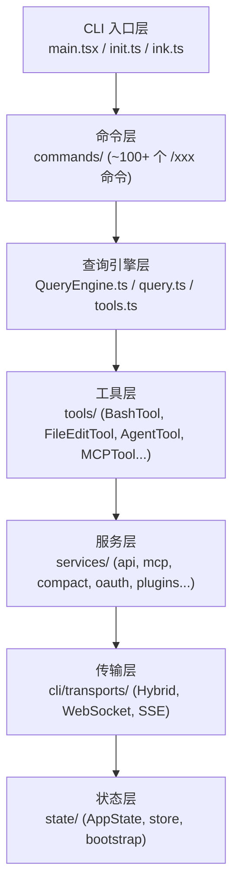
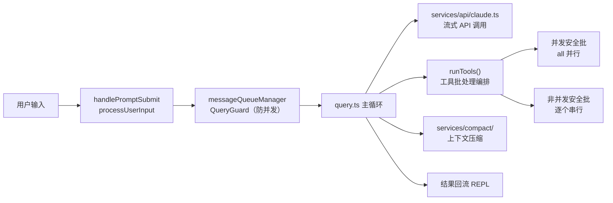

# CLAUDE.md

本文件为 Claude Code（claude.ai/code）在此工作区工作时提供指导。

## Git 提交署名

每次提交代码时，必须在 commit message 末尾加上以下 co-author trailer：

```
Co-authored-by: Claude <claude@anthropic.com>
```

## 工作区结构

```
hello-claude-code/
├── claude-code/        # 源代码目录（反编译还原的 Claude Code CLI）
├── deep_dive_cc/       # Claude Code 深度分析文档（10 篇）
├── deep_dive_cx/       # Codex 视角深度分析文档（10 篇 + README）
├── deep_dive_gi/       # Gemini 视角深度分析文档（10 篇）
└── doc/                # 其他文档
```

## 分析文档规范

在 `deep_dive_cc/`、`deep_dive_cx/`、`deep_dive_gi/` 目录下撰写或修改分析文档时，遵守以下规范：

**语言**：全部使用中文撰写，表达要自然流畅，避免机械罗列和模板化措辞。

**文件命名**：序号 + 英文描述 + 下划线分隔，例如 `01_architecture_overview.md`、`05_query_request_flow.md`。

**配图格式**：
- 流程图、时序图、简单架构图 → 使用 Mermaid 格式（`\`\`\`mermaid`）
- 复杂系统架构图、多层级关系图 → 使用 draw.io XML 格式（`\`\`\`xml` 并注明 draw.io）

**写作风格**：像在给同事讲清楚一个系统一样写，有观点、有判断，不要只是堆砌事实。

## 项目概述

`claude-code/` 是 Anthropic 官方 Claude Code CLI 工具的反编译/逆向还原版本，目标是复现大部分功能。

- 运行时：**Bun**（非 Node.js），要求 >= 1.3.11
- 语言：TypeScript + TSX（React/Ink 终端 UI）
- 模块系统：ESM（`"type": "module"`）
- Monorepo：Bun workspaces，内部包位于 `packages/`

## 常用命令

在 `claude-code/` 目录下执行：

```bash
bun install          # 安装依赖
bun run dev          # 开发模式（版本号显示 888 说明正常）
bun run build        # 构建，输出 dist/cli.js（~25MB）
bun run lint         # Biome 代码检查
echo "say hello" | bun run src/entrypoints/cli.tsx -p  # 管道模式
```

## 架构概览

### 分层结构



### 核心文件

| 文件 | 职责 |
|------|------|
| `src/entrypoints/cli.tsx` | 真正入口，注入 `feature()` polyfill（始终返回 `false`）、`MACRO`、构建全局变量 |
| `src/main.tsx` | Commander.js CLI 定义，解析参数，启动 REPL 或管道模式 |
| `src/query.ts` | 请求主循环状态机（1700+ 行），处理流式响应、工具调用、多轮对话 |
| `src/QueryEngine.ts` | 高层编排器（1300+ 行），管理对话状态、压缩、归因 |
| `src/screens/REPL.tsx` | 交互式终端 UI（5000+ 行），React/Ink 组件 |
| `src/services/api/claude.ts` | API 客户端（3400+ 行），支持 Anthropic / Bedrock / Vertex / Azure |
| `src/tools.ts` | 工具注册表，按权限上下文动态组装工具池 |
| `src/Tool.ts` | Tool 接口定义与 `buildTool()` 工厂函数 |
| `src/state/AppState.tsx` | 中央应用状态上下文 |
| `src/services/mcp/` | MCP 协议实现（24 个文件，12000+ 行） |

### 请求生命周期



## Feature Flag 系统

所有 `feature('FLAG_NAME')` 调用均被 polyfill 为返回 `false`，共 30 个 flag 全部关闭。flag 后面的代码是死代码，不要尝试启用。

## 工作注意事项

- 不要修复 tsc 错误：约 1341 个反编译产生的类型错误（`unknown`/`never`/`{}`），不影响 Bun 运行时
- React Compiler 输出：组件中的 `const $ = _c(N)` 是正常的反编译 memoization 样板代码
- `src/` 路径别名：tsconfig 配置了 `src/*` 映射，`import { ... } from 'src/utils/...'` 是合法写法
- Stub 包：`audio-capture-napi`、`image-processor-napi`、`modifiers-napi`、`url-handler-napi`、`@ant/*` 均为 stub，返回 null/false/[]

## 参考文档

- `deep_dive_cc/` — 架构、启动流程、请求流、工具系统、Bridge、传输、状态管理、MCP、压缩、Hooks 的详细分析
- `deep_dive_cx/` — 系统级源码阅读导航，含完整架构图和阅读路径建议
- `deep_dive_gi/` — 工程架构、启动流程、请求处理、工具系统、Bridge、状态管理、MCP、UI 渲染、Hooks、上下文压缩的分析
