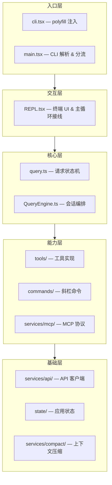
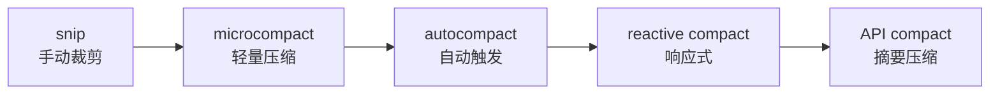

# GEMINI.md

本文件为 Gemini CLI 在此工作区工作时提供指导。

## Git 提交署名

每次提交代码时，必须指定作者为 Gemini，并在 commit message 末尾加上 co-author trailer。

**提交命令示例**：
```bash
git commit --author="Gemini <gemini@google.com>" -m "你的提交说明"
```

**Co-author Trailer**：
```
Co-authored-by: Gemini <gemini@google.com>
```

## 工作区结构

```
hello-claude-code/
├── claude-code/        # 源代码目录（反编译还原的 Claude Code CLI）
├── deep_dive_cc/       # Claude Code 深度分析文档（10 篇）
├── deep_dive_cx/       # Codex 视角深度分析文档（10 篇 + README）
├── deep_dive_gi/       # Gemini 视角深度分析文档（10 篇）
└── doc/                # 其他文档
```

## 分析文档规范

在 `deep_dive_cc/`、`deep_dive_cx/`、`deep_dive_gi/` 目录下撰写或修改分析文档时，遵守以下规范：

**语言**：全部使用中文撰写，表达要自然流畅，避免机械罗列和模板化措辞。

**文件命名**：序号 + 英文描述 + 下划线分隔，例如 `01_architecture_overview.md`、`07_mcp_protocol.md`。

**配图格式**：
- 流程图、时序图、简单架构图 → 使用 Mermaid 格式（`\`\`\`mermaid`）
- 复杂系统架构图、多层级关系图 → 使用 draw.io XML 格式（`\`\`\`xml` 并注明 draw.io）

**写作风格**：像在给同事讲清楚一个系统一样写，有观点、有判断，不要只是堆砌事实。

## 项目概述

`claude-code/` 是 Anthropic 官方 Claude Code CLI 工具的反编译/逆向还原版本。本质上是一套高度产品化的终端 Agent 运行时，而非普通聊天界面。

- 运行时：**Bun** >= 1.3.11（非 Node.js）
- 语言：TypeScript + TSX
- UI 框架：React + Ink（终端 TUI）
- 模块系统：ESM，Bun workspaces monorepo

## 关键路径速查

| 路径 | 说明 |
|------|------|
| `claude-code/src/entrypoints/cli.tsx` | 入口，polyfill `feature()`（始终 `false`）、`MACRO`、构建全局变量 |
| `claude-code/src/main.tsx` | Commander.js CLI 定义，参数解析，启动 REPL/管道模式 |
| `claude-code/src/query.ts` | 请求主循环状态机（1700+ 行），多轮 assistant→tool→result 循环 |
| `claude-code/src/QueryEngine.ts` | 高层编排器（1300+ 行），对话状态、压缩、归因 |
| `claude-code/src/screens/REPL.tsx` | 交互式终端 UI（5000+ 行），输入编排、会话协调、主循环接线 |
| `claude-code/src/services/api/claude.ts` | API 客户端（3400+ 行），支持 Anthropic / Bedrock / Vertex / Azure |
| `claude-code/src/tools/` | 工具实现目录（BashTool, FileEditTool, AgentTool 等） |
| `claude-code/src/tools.ts` | 工具注册表，运行时动态组装工具池 |
| `claude-code/src/Tool.ts` | Tool 接口协议与 `buildTool()` 工厂 |
| `claude-code/src/state/AppState.tsx` | 中央应用状态上下文 |
| `claude-code/src/state/store.ts` | 轻量自研 Zustand-like store |
| `claude-code/src/services/mcp/` | MCP 协议实现（24 文件，12000+ 行） |
| `claude-code/src/commands/` | 100+ 个 `/xxx` 斜杠命令实现 |
| `claude-code/src/bridge/` | 远程控制桥接系统 |
| `claude-code/packages/` | Monorepo 内部包（大部分为 stub） |

## 架构要点

### 整体分层



### 核心设计原则

- 入口层很重：`main.tsx` 承担 CLI 解析、策略分流、首屏性能优化、首轮上下文准备
- UI 层不是纯展示：`REPL.tsx` 同时承担输入编排、会话状态协调、主循环接线、后台任务接驳
- 请求层是自循环状态机：一次用户输入可能经历多轮 `assistant → tool_use → tool_result → assistant`
- 工具系统是第一公民：Tool 定义、权限判定、并发批处理、MCP 代理、流式执行都在主链路中
- 扩展体系不是外挂：技能、插件、MCP 直接并入命令表、工具池和主循环

### API 支持的 Provider

| Provider | 说明 |
|----------|------|
| Anthropic Direct | API Key + OAuth |
| AWS Bedrock | 支持凭据刷新、Bearer Token |
| Google Vertex AI | 支持 GCP 凭据刷新 |
| Azure AI Foundry | API Key + Azure AD |

### 上下文压缩梯度

系统有多级压缩机制，防止 context 超限：



### Feature Flag 系统

30 个 feature flag 全部被 polyfill 为 `false`，包括：`KAIROS`、`PROACTIVE`、`COORDINATOR_MODE`、`BRIDGE_MODE`、`VOICE_MODE` 等。flag 后面的代码均为死代码。

### Stub 包

以下包为 stub，不提供实际功能：

- `audio-capture-napi`、`image-processor-napi`、`modifiers-napi`、`url-handler-napi`
- `@ant/claude-for-chrome-mcp`、`@ant/computer-use-mcp`、`@ant/computer-use-input`、`@ant/computer-use-swift`
- `color-diff-napi` 是唯一完整实现的 native 包（997 行，终端 color diff）

## 参考文档

`deep_dive_gi/` 目录包含 Gemini 视角的完整分析（文件命名遵循序号 + 英文 + 下划线规范）：

| 文件 | 主题 |
|------|------|
| `01_architecture_overview.md` | 整体架构、技术栈、模块职责、交互流程 |
| `02_startup_flow.md` | 进程启动、首屏关键路径、延迟预取 |
| `03_request_flow.md` | query 主循环、API 调用、流式处理 |
| `04_tool_system.md` | Tool 接口、工具注册、权限判定、执行编排 |
| `05_bridge_remote.md` | 远程控制桥接、传输层、会话管理 |
| `06_state_management.md` | AppState、store、bootstrap 状态 |
| `07_mcp_protocol.md` | MCP 客户端、传输、工具集成、资源 |
| `08_ui_rendering.md` | Ink/React 组件、消息渲染、权限 UI |
| `09_hooks_system.md` | pre/post tool use hooks、settings 配置 |
| `10_context_compaction.md` | 多级压缩、token 追踪、context 治理 |

其他参考：`deep_dive_cc/`（Claude Code 视角）、`deep_dive_cx/`（Codex 视角，含完整架构图）
