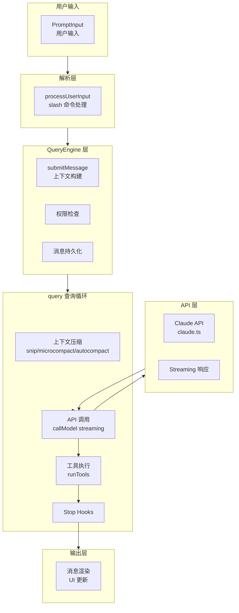
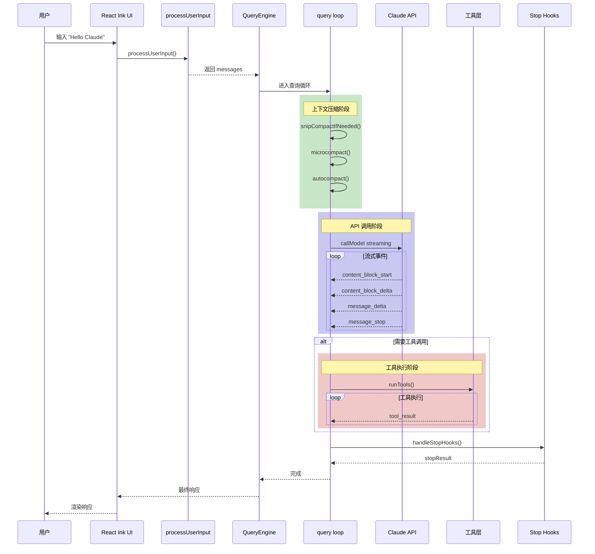

# Claude Code 源码分析：请求流程

## 1. 请求流程概览

当用户在 Claude Code 中输入一条消息时，请求经过以下处理流程：



## 2. 用户输入处理

### 2.1 processUserInput()

**位置**: `src/utils/processUserInput/processUserInput.ts`

处理用户输入的核心函数：

```typescript
export async function processUserInput({
  input,                      // 用户输入
  mode,                       // 'prompt' | 'bash' | 'local-jsx'
  setToolJSX,
  context,
  messages,
  uuid,
  isMeta,
  querySource,
}: ProcessUserInputParams): Promise<ProcessUserInputResult> {

  // 1. 检测 slash 命令
  if (input.startsWith('/')) {
    const { command, args } = parseSlashCommand(input)

    // 执行 slash 命令
    return await processSlashCommand(command, args, context)
  }

  // 2. 创建用户消息
  const userMessage = createUserMessage({
    content: typeof input === 'string' ? input : input[0].text,
    isMeta,
    uuid,
  })

  // 3. 添加工具结果附件
  const attachments = await getAttachmentMessages(...)

  // 4. 返回处理结果
  return {
    messages: [userMessage, ...attachments],
    shouldQuery: true,
    allowedTools: [],
    model: undefined,
    resultText: undefined,
  }
}
```

### 2.2 Slash 命令处理

**位置**: `src/utils/processUserInput/processSlashCommand.tsx`

```typescript
export async function processSlashCommand(
  commandName: string,
  args: string,
  context: ProcessUserInputContext,
): Promise<ProcessUserInputResult> {

  // 1. 查找命令
  const command = findCommand(commandName, context.options.commands)

  // 2. 根据类型处理
  switch (command.type) {
    case 'prompt':
      // 技能类型 - 展开为文本
      const prompt = await command.getPromptForCommand({ args }, context)
      return {
        messages: [createUserMessage({ content: prompt })],
        shouldQuery: true,
        ...
      }

    case 'local':
      // 本地命令 - 立即执行
      const result = await executeLocalCommand(command, args, context)
      return {
        messages: [createLocalCommandResultMessage(result)],
        shouldQuery: false,
        resultText: result,
      }

    case 'local-jsx':
      // JSX 命令 - 渲染 UI
      const jsxResult = await command.getJsx({ args }, context)
      return {
        messages: [],
        shouldQuery: false,
        setToolJSX: jsxResult,
      }
  }
}
```

## 3. 查询引擎 (QueryEngine)

### 3.1 submitMessage()

**位置**: `src/QueryEngine.ts`

QueryEngine 是对话管理的核心类：

```typescript
export class QueryEngine {
  private mutableMessages: Message[]
  private abortController: AbortController
  private permissionDenials: SDKPermissionDenial[]
  private readFileState: FileStateCache

  async *submitMessage(
    prompt: string | ContentBlockParam[],
    options?: { uuid?: string; isMeta?: boolean },
  ): AsyncGenerator<SDKMessage, void, unknown> {

    // 1. 构建工具使用上下文
    const toolUseContext = this.buildToolUseContext()

    // 2. 获取系统提示
    const { systemPrompt, userContext, systemContext } =
      await fetchSystemPromptParts({...})

    // 3. 处理用户输入
    const { messages: messagesFromUserInput, shouldQuery } =
      await processUserInput({
        input: prompt,
        mode: 'prompt',
        context: toolUseContext,
        ...
      })

    // 4. 持久化消息
    if (persistSession) {
      await recordTranscript(messages)
    }

    // 5. 如果不需要查询 (如 slash 命令)，返回结果
    if (!shouldQuery) {
      yield { type: 'result', subtype: 'success', result: resultText }
      return
    }

    // 6. 进入查询循环
    for await (const message of query({
      messages,
      systemPrompt,
      userContext,
      systemContext,
      canUseTool: wrappedCanUseTool,
      toolUseContext,
    })) {
      yield* this.normalizeAndYield(message)
    }

    // 7. 返回最终结果
    yield { type: 'result', subtype: 'success', ... }
  }
}
```

### 3.2 查询循环 (query.ts)

**位置**: `src/query.ts`

核心查询循环使用异步生成器实现：

```typescript
export async function* query(
  params: QueryParams,
): AsyncGenerator<StreamEvent | Message, Terminal> {

  let state: State = {
    messages: params.messages,
    toolUseContext: params.toolUseContext,
    turnCount: 1,
    ...
  }

  while (true) {
    // ═══════════════════════════════════════════════════════════
    // 阶段 1: 上下文压缩
    // ═══════════════════════════════════════════════════════════

    // 1.1 Snip (历史裁剪)
    if (feature('HISTORY_SNIP')) {
      const snipResult = snipModule!.snipCompactIfNeeded(messages)
      messages = snipResult.messages
    }

    // 1.2 Microcompact (微压缩)
    const microcompactResult = await deps.microcompact(messages, ...)
    messages = microcompactResult.messages

    // 1.3 Autocompact (自动压缩)
    const { compactionResult } = await deps.autocompact(messages, ...)
    if (compactionResult) {
      messages = buildPostCompactMessages(compactionResult)
    }

    // ═══════════════════════════════════════════════════════════
    // 阶段 2: API 调用 (流式)
    // ═══════════════════════════════════════════════════════════

    for await (const message of deps.callModel({
      messages: prependUserContext(messages, userContext),
      systemPrompt,
      signal: abortController.signal,
    })) {

      // 流式处理消息
      if (message.type === 'assistant') {
        yield message
        assistantMessages.push(message)

        // 提取工具调用
        const toolUseBlocks = message.message.content.filter(
          c => c.type === 'tool_use'
        )
        toolUseBlocks.push(...toolUseBlocks)
        needsFollowUp = toolUseBlocks.length > 0
      }

      // 流式工具执行
      if (streamingToolExecutor) {
        for (const result of streamingToolExecutor.getCompletedResults()) {
          yield result.message
        }
      }
    }

    // ═══════════════════════════════════════════════════════════
    // 阶段 3: 工具执行
    // ═══════════════════════════════════════════════════════════

    if (needsFollowUp) {
      const toolUpdates = streamingToolExecutor
        ? streamingToolExecutor.getRemainingResults()
        : runTools(toolUseBlocks, assistantMessages, canUseTool, context)

      for await (const update of toolUpdates) {
        yield update.message
      }
    }

    // ═══════════════════════════════════════════════════════════
    // 阶段 4: 附件处理
    // ═══════════════════════════════════════════════════════════

    // 获取队列中的命令附件
    for await (const attachment of getAttachmentMessages(...)) {
      yield attachment
    }

    // 内存预取附件
    const memoryAttachments = await pendingMemoryPrefetch.promise
    for (const att of memoryAttachments) {
      yield createAttachmentMessage(att)
    }

    // ═══════════════════════════════════════════════════════════
    // 阶段 5: 检查终止条件
    // ═══════════════════════════════════════════════════════════

    if (!needsFollowUp) {
      // 执行 stop hooks
      const stopHookResult = yield* handleStopHooks(...)
      if (stopHookResult.preventContinuation) {
        return { reason: 'completed' }
      }
      return { reason: 'completed' }
    }

    // 继续下一轮
    state = {
      ...state,
      messages: [...messages, ...assistantMessages, ...toolResults],
      turnCount: turnCount + 1,
    }
  }
}
```

## 4. API 调用 (claude.ts)

**位置**: `src/services/api/claude.ts`

### 4.1 API 请求构建

```typescript
async function* callModel(params: CallModelParams) {
  const {
    messages,
    systemPrompt,
    tools,
    signal,
  } = params

  // 构建请求
  const request: AnthropicMessageRequest = {
    model: params.model || getMainLoopModel(),
    messages: normalizeMessagesForAPI(messages),
    system: systemPrompt,
    tools: tools.map(t => ({
      name: t.name,
      description: t.description,
      input_schema: t.inputSchema,
    })),
    max_tokens: calculateMaxTokens(tools),
    stream: true,
  }

  // 发送请求
  const response = await client.messages.create(request, { signal })

  // 流式处理响应
  for await (const event of response.streamEventIterator) {
    yield* handleStreamEvent(event)
  }
}
```

### 4.2 流式事件处理

```typescript
function* handleStreamEvent(event: StreamEvent): Generator<SDKMessage> {
  switch (event.type) {
    case 'message_start':
      yield {
        type: 'stream_event',
        event: { type: 'message_start', message: event.message }
      }
      break

    case 'content_block_start':
      yield {
        type: 'assistant',
        message: { content: [event.content_block] }
      }
      break

    case 'content_block_delta':
      if (event.delta.type === 'text_delta') {
        yield {
          type: 'assistant',
          message: { content: [{ type: 'text', text: event.delta.text }] }
        }
      } else if (event.delta.type === 'thinking_delta') {
        yield {
          type: 'assistant',
          message: { content: [{ type: 'thinking', thinking: event.delta.thinking }] }
        }
      }
      break

    case 'message_delta':
      yield {
        type: 'stream_event',
        event: { type: 'message_delta', usage: event.usage, delta: event.delta }
      }
      break

    case 'message_stop':
      yield { type: 'stream_event', event: { type: 'message_stop' } }
      break
  }
}
```

## 5. 工具执行

### 5.1 runTools()

**位置**: `src/services/tools/toolOrchestration.ts`

```typescript
export async function* runTools(
  toolUseBlocks: ToolUseBlock[],
  assistantMessages: AssistantMessage[],
  canUseTool: CanUseToolFn,
  toolUseContext: ToolUseContext,
): AsyncGenerator<ToolUpdate> {

  // 按顺序执行工具
  for (const toolBlock of toolUseBlocks) {
    // 1. 查找工具
    const tool = findToolByName(tools, toolBlock.name)

    // 2. 检查权限
    const permissionResult = await canUseTool(
      tool,
      toolBlock.input,
      toolUseContext,
      assistantMessage,
      toolBlock.id,
    )

    if (permissionResult.behavior === 'deny') {
      yield {
        message: createToolRejectedMessage(toolBlock.id, permissionResult)
      }
      continue
    }

    // 3. 执行工具
    try {
      const result = await tool.call(
        toolBlock.input,
        toolUseContext,
        canUseTool,
        assistantMessage,
        (progress) => {
          yield { type: 'progress', toolUseID: toolBlock.id, data: progress }
        }
      )

      // 4. 返回结果
      yield {
        message: createToolResultMessage(toolBlock.id, result)
      }
    } catch (error) {
      yield {
        message: createToolErrorMessage(toolBlock.id, error)
      }
    }
  }
}
```

### 5.2 工具调用上下文

```typescript
export type ToolUseContext = {
  options: {
    commands: Command[]
    debug: boolean
    mainLoopModel: string
    tools: Tools
    mcpClients: MCPServerConnection[]
    isNonInteractiveSession: boolean
  }
  abortController: AbortController
  readFileState: FileStateCache
  getAppState(): AppState
  setAppState(f: (prev: AppState) => AppState): void
  // ... 更多字段
}
```

## 6. 消息类型系统

### 6.1 核心消息类型

**位置**: `src/types/message.ts`

```typescript
// 消息类型
type Message =
  | AssistantMessage
  | UserMessage
  | SystemMessage
  | ProgressMessage
  | AttachmentMessage
  | TombstoneMessage

interface AssistantMessage {
  type: 'assistant'
  uuid: string
  message: {
    role: 'assistant'
    content: ContentBlock[]
    stop_reason?: string
    usage?: Usage
  }
}

interface UserMessage {
  type: 'user'
  uuid: string
  message: {
    role: 'user'
    content: string | ContentBlock[]
  }
  isMeta?: boolean
  isCompactSummary?: boolean
}

interface SystemMessage {
  type: 'system'
  subtype: 'local_command' | 'compact_boundary' | 'api_error' | ...
  content: string
  ...
}
```

## 7. 请求流程时序图



## 8. 错误处理与恢复

### 8.1 API 错误恢复

```typescript
// prompt-too-long 恢复
if (isPromptTooLongMessage(lastMessage)) {
  // 1. 尝试 context collapse 排水
  if (contextCollapse) {
    const drained = contextCollapse.recoverFromOverflow(...)
    if (drained.committed > 0) {
      continue // 重试
    }
  }

  // 2. 尝试 reactive compact
  if (reactiveCompact) {
    const compacted = await reactiveCompact.tryReactiveCompact(...)
    if (compacted) {
      continue // 重试
    }
  }
}

// max_output_tokens 恢复
if (isWithheldMaxOutputTokens(lastMessage)) {
  // 增加 max_tokens 重试
  if (maxOutputTokensRecoveryCount < MAX_OUTPUT_TOKENS_RECOVERY_LIMIT) {
    maxOutputTokensOverride = ESCALATED_MAX_TOKENS
    continue
  }
}
```

### 8.2 工具错误处理

```typescript
try {
  const result = await tool.call(input, context, ...)
  yield { type: 'tool_result', content: result }
} catch (error) {
  if (error instanceof PermissionDeniedError) {
    yield { type: 'tool_result', is_error: true, content: 'Permission denied' }
  } else if (error instanceof ToolExecutionError) {
    yield { type: 'tool_result', is_error: true, content: error.message }
  }
}
```

---

*文档版本: 1.0*
*分析日期: 2026-03-31*
