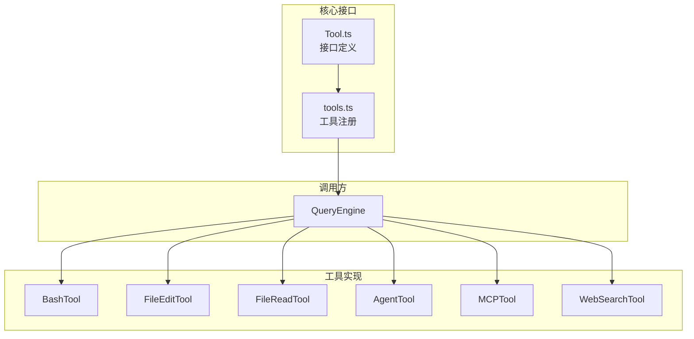
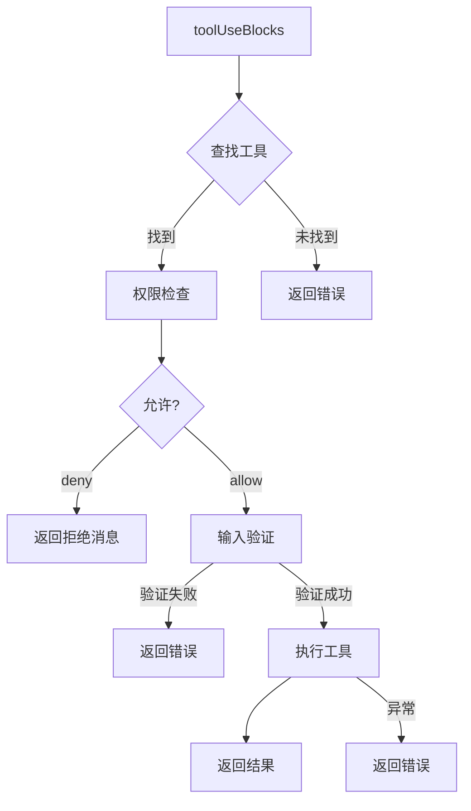
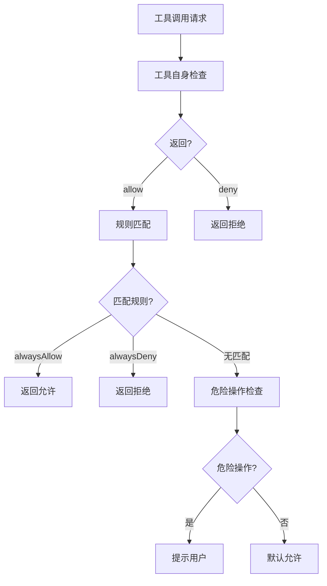

# Claude Code 源码分析：工具系统

## 1. 工具系统概述

工具系统是 Claude Code 与外部世界交互的核心机制，提供了文件操作、代码执行、Web 搜索等能力。



## 2. 工具接口定义

**位置**: `src/Tool.ts`

### 2.1 Tool 类型定义

```typescript
export type Tool<
  Input extends AnyObject = AnyObject,
  Output = unknown,
  P extends ToolProgressData = ToolProgressData,
> = {
  // 工具标识
  name: string
  aliases?: string[]  // 向后兼容的别名

  // 核心方法
  call(
    args: z.infer<Input>,
    context: ToolUseContext,
    canUseTool: CanUseToolFn,
    parentMessage: AssistantMessage,
    onProgress?: ToolCallProgress<P>,
  ): Promise<ToolResult<Output>>

  description(
    input: z.infer<Input>,
    options: {
      isNonInteractiveSession: boolean
      toolPermissionContext: ToolPermissionContext
      tools: Tools
    },
  ): Promise<string>

  // 输入输出模式
  inputSchema: Input
  inputJSONSchema?: ToolInputJSONSchema  // MCP JSON Schema 格式
  outputSchema?: z.ZodType<unknown>

  // 工具属性
  isConcurrencySafe(input: z.infer<Input>): boolean
  isReadOnly(input: z.infer<Input>): boolean
  isDestructive?(input: z.infer<Input>): boolean
  isEnabled(): boolean

  // 工具分类
  isMcp?: boolean
  isLsp?: boolean
  shouldDefer?: boolean  // 是否延迟加载 (ToolSearch)
  alwaysLoad?: boolean    // 始终加载，不受 ToolSearch 影响

  // 权限
  checkPermissions(
    input: z.infer<Input>,
    context: ToolUseContext,
  ): Promise<PermissionResult>

  // 渲染方法
  renderToolResultMessage(
    content: Output,
    progressMessagesForMessage: ProgressMessage<P>[],
    options: {...}
  ): React.ReactNode

  renderToolUseMessage(
    input: Partial<z.infer<Input>>,
    options: { theme: ThemeName; verbose: boolean; commands?: Command[] }
  ): React.ReactNode
}
```

### 2.2 ToolUseContext

工具执行的上下文环境：

```typescript
export type ToolUseContext = {
  options: {
    commands: Command[]
    debug: boolean
    mainLoopModel: string
    tools: Tools
    verbose: boolean
    thinkingConfig: ThinkingConfig
    mcpClients: MCPServerConnection[]
    isNonInteractiveSession: boolean
    agentDefinitions: AgentDefinitionsResult
  }
  abortController: AbortController
  readFileState: FileStateCache
  getAppState(): AppState
  setAppState(f: (prev: AppState) => AppState): void
  setToolJSX?: SetToolJSXFn
  addNotification?: (notif: Notification) => void
  sendOSNotification?: (opts: {...}) => void
  agentId?: AgentId
  agentType?: string
  messages: Message[]
  // ... 更多字段
}
```

### 2.3 工具构建器

```typescript
// 工具工厂函数
export function buildTool<D extends AnyToolDef>(def: D): BuiltTool<D> {
  return {
    ...TOOL_DEFAULTS,  // 默认实现
    userFacingName: () => def.name,
    ...def,
  } as BuiltTool<D>
}

// 默认值
const TOOL_DEFAULTS = {
  isEnabled: () => true,
  isConcurrencySafe: (_input?: unknown) => false,
  isReadOnly: (_input?: unknown) => false,
  isDestructive: (_input?: unknown) => false,
  checkPermissions: (input, _ctx) =>
    Promise.resolve({ behavior: 'allow', updatedInput: input }),
  toAutoClassifierInput: (_input?: unknown) => '',
  userFacingName: (_input?: unknown) => '',
}
```

## 3. 内置工具详解

### 3.1 工具列表

**位置**: `src/tools.ts`

```typescript
export function getAllBaseTools(): Tools {
  return [
    // 核心工具
    AgentTool,           // Agent 调用
    TaskOutputTool,       // 任务输出
    BashTool,            // Bash 执行
    FileEditTool,        // 文件编辑
    FileReadTool,        // 文件读取
    FileWriteTool,       // 文件写入
    GlobTool,            // Glob 匹配
    GrepTool,            // 文本搜索
    WebSearchTool,      // Web 搜索
    NotebookEditTool,    // Jupyter 编辑

    // 任务管理
    TaskStopTool,       // 停止任务
    TaskCreateTool,     // 创建任务
    TaskGetTool,        // 获取任务
    TaskUpdateTool,     // 更新任务
    TaskListTool,       // 列出任务

    // 其他工具
    WebFetchTool,       // Web 获取
    TodoWriteTool,      // Todo 写入
    LSPTool,            // LSP 语言服务
    ToolSearchTool,     // 工具搜索
    EnterPlanModeTool,  // 进入计划模式
    ExitPlanModeV2Tool, // 退出计划模式

    // 条件编译工具
    ...(feature('MONITOR_TOOL') ? [MonitorTool] : []),
    ...(feature('WORKFLOW_SCRIPTS') ? [WorkflowTool] : []),
    ...(feature('HISTORY_SNIP') ? [SnipTool] : []),
    ...(feature('AGENT_TRIGGERS') ? cronTools : []),
  ]
}
```

### 3.2 BashTool

**位置**: `src/tools/BashTool/BashTool.ts`

BashTool 是执行 Shell 命令的核心工具：

```typescript
export const BashTool = buildTool({
  name: 'Bash',
  description: async (input, options) => {
    // 返回工具描述
  },
  inputSchema: BashInputSchema,
  maxResultSizeChars: 10000,  // 默认 10k 字符限制

  async call(input: BashInput, context, canUseTool, parentMessage, onProgress) {
    const {
      command,
      timeout,
      workingDirectory,
      agentId,
    } = input

    // 1. 权限检查
    const permission = await canUseTool(this, input, context, parentMessage, toolUseId)
    if (permission.behavior === 'deny') {
      return { data: null, ... }
    }

    // 2. 创建 AbortController
    const childAbort = new AbortController()
    const timeoutId = setTimeout(() => childAbort.abort(), timeout || defaultTimeout)

    // 3. 执行命令
    try {
      const result = await execFile(command, {
        cwd: workingDirectory || context.options.cwd,
        signal: childAbort.signal,
        timeout,
      })

      // 4. 处理输出
      return {
        data: {
          stdout: result.stdout,
          stderr: result.stderr,
          exitCode: result.exitCode,
        }
      }
    } finally {
      clearTimeout(timeoutId)
    }
  },

  isConcurrencySafe: (input) => false,  // Bash 不是并发安全的
  isReadOnly: (input) => isReadOnlyBashCommand(input.command),

  // 分类 (用于自动模式安全分类器)
  toAutoClassifierInput: (input) => {
    if (isReadOnlyBashCommand(input.command)) {
      return ''  // 只读命令跳过
    }
    return input.command  // 返回命令用于分类
  }
})
```

### 3.3 FileEditTool

**位置**: `src/tools/FileEditTool/FileEditTool.ts`

文件编辑工具：

```typescript
export const FileEditTool = buildTool({
  name: 'Edit',
  aliases: ['Edit_file'],  // 向后兼容

  inputSchema: EditSchema,

  async call(input: EditInput, context, canUseTool, parentMessage, onProgress) {
    const { file_path, old_string, new_string, ... } = input

    // 1. 读取文件
    const content = await readFile(file_path)

    // 2. 验证 old_string 存在
    if (!content.includes(old_string)) {
      throw new Error(`old_string not found in file`)
    }

    // 3. 应用替换
    const newContent = content.replace(old_string, new_string)

    // 4. 写回文件
    await writeFile(file_path, newContent)

    return {
      data: {
        success: true,
        diff: computeDiff(content, newContent),
      }
    }
  },

  isConcurrencySafe: (input) => false,  // 文件编辑不是并发安全的
  isReadOnly: () => false,
  isDestructive: () => false,  // Edit 是非破坏性的 (总是创建备份)

  // 渲染
  renderToolResultMessage(content, progress, options) {
    return <EditResult diff={content.diff} />
  }
})
```

### 3.4 AgentTool

**位置**: `src/tools/AgentTool/AgentTool.ts`

Agent 工具用于启动子 Agent：

```typescript
export const AgentTool = buildTool({
  name: 'Agent',
  description: '启动一个 Agent 来帮助你完成任务',

  inputSchema: AgentInputSchema,

  async call(input: AgentInput, context, canUseTool, parentMessage, onProgress) {
    const {
      agentType,
      prompt,
      model,
      maxTurns,
      tools: allowedTools,
    } = input

    // 1. 加载 Agent 定义
    const agentDef = loadAgentDefinition(agentType)

    // 2. 创建子 Agent 上下文
    const subagentContext = createSubagentContext(context, {
      agentId: generateAgentId(),
      agentType,
    })

    // 3. 启动子 Agent 查询
    const subagentEngine = new QueryEngine({
      ...config,
      agentId: subagentContext.agentId,
      parentAgentId: context.agentId,
    })

    // 4. 流式处理结果
    for await (const message of subagentEngine.submitMessage(prompt)) {
      // 转发进度
      onProgress?.({ type: 'agent', message })
    }

    return {
      data: {
        agentId: subagentContext.agentId,
        result: extractResult(subagentEngine.getMessages()),
      }
    }
  }
})
```

### 3.5 WebSearchTool

**位置**: `src/tools/WebSearchTool/WebSearchTool.ts`

Web 搜索工具：

```typescript
export const WebSearchTool = buildTool({
  name: 'WebSearch',
  aliases: ['Search', 'Bing'],

  inputSchema: WebSearchSchema,

  async call(input: WebSearchInput, context, canUseTool, parentMessage, onProgress) {
    const { query, recency_days, num_results } = input

    // 1. 调用搜索 API
    const results = await searchAPI({
      query,
      recency_days,
      num_results: num_results || 10,
    })

    // 2. 格式化结果
    const formatted = results.map(r => ({
      title: r.title,
      url: r.url,
      snippet: r.snippet,
    }))

    return {
      data: {
        results: formatted,
        query,
      }
    }
  },

  isSearchOrReadCommand: () => ({ isSearch: true }),

  maxResultSizeChars: 15000,
})
```

## 4. 工具执行机制

### 4.1 工具编排 (toolOrchestration.ts)

**位置**: `src/services/tools/toolOrchestration.ts`



### 4.2 流式工具执行

**位置**: `src/services/tools/StreamingToolExecutor.ts`

对于支持流式输出的工具：

```typescript
export class StreamingToolExecutor {
  private pendingTools: ToolUseBlock[] = []
  private completedResults: ToolResult[] = []

  addTool(toolBlock: ToolUseBlock, assistantMessage: AssistantMessage) {
    this.pendingTools.push({ toolBlock, assistantMessage })

    // 异步执行
    this.executeTool(toolBlock, assistantMessage)
  }

  private async executeTool(
    toolBlock: ToolUseBlock,
    assistantMessage: AssistantMessage,
  ) {
    const tool = this.toolMap.get(toolBlock.name)

    try {
      // 流式执行
      for await (const progress of tool.call(
        toolBlock.input,
        this.context,
        this.canUseTool,
        assistantMessage,
        (p) => this.onProgress(toolBlock.id, p)
      )) {
        // 实时 yield 进度
        this.completedResults.push(progress)
      }
    } catch (error) {
      // 处理错误
      this.completedResults.push(createToolErrorMessage(toolBlock.id, error))
    }
  }

  getCompletedResults(): ToolResult[] {
    const results = this.completedResults
    this.completedResults = []
    return results
  }
}
```

## 5. 工具权限系统

### 5.1 权限检查流程

**位置**: `src/utils/permissions/permissions.ts`



### 5.2 权限模式

```typescript
export type PermissionMode =
  | 'default'      // 默认 - 询问危险操作
  | 'bypass'       // 绕过 - 所有操作自动允许
  | 'plan'          // 计划模式 - 更严格的检查
  | 'auto'          // 自动模式 - 无询问

// 权限上下文
export type ToolPermissionContext = {
  mode: PermissionMode
  additionalWorkingDirectories: Map<string, AdditionalWorkingDirectory>
  alwaysAllowRules: ToolPermissionRulesBySource
  alwaysDenyRules: ToolPermissionRulesBySource
  alwaysAskRules: ToolPermissionRulesBySource
  isBypassPermissionsModeAvailable: boolean
  shouldAvoidPermissionPrompts?: boolean
}
```

## 6. MCP 工具集成

### 6.1 MCP 工具包装

**位置**: `src/services/mcp/`

MCP 服务器提供的工具被包装为 Claude Code 工具：

```typescript
// 从 MCP 服务器加载工具
async function loadMCPTools(connection: MCPServerConnection): Promise<Tool[]> {
  const tools = await connection.listTools()

  return tools.map(mcpTool => {
    // 包装为 Claude Code Tool
    return buildTool({
      name: `mcp__${connection.name}__${mcpTool.name}`,
      description: mcpTool.description,
      inputSchema: convertJSONSchemaToZod(mcpTool.inputSchema),

      async call(input, context, canUseTool, parentMessage, onProgress) {
        // 1. 调用 MCP 服务器
        const result = await connection.callTool(mcpTool.name, input)

        // 2. 格式化结果
        return {
          data: result,
          mcpMeta: {
            _meta: result._meta,
            structuredContent: result.structuredContent,
          }
        }
      },

      isMcp: true,
      mcpInfo: { serverName: connection.name, toolName: mcpTool.name },
    })
  })
}
```

### 6.2 MCP 资源读取

```typescript
// ListMcpResourcesTool
export const ListMcpResourcesTool = buildTool({
  name: 'ListMcpResources',
  description: '列出 MCP 服务器提供的资源',

  async call(input, context, canUseTool) {
    const resources: ServerResource[] = []

    // 从所有 MCP 连接收集资源
    for (const client of context.options.mcpClients) {
      const clientResources = await client.listResources()
      resources.push(...clientResources)
    }

    return { data: { resources } }
  }
})

// ReadMcpResourceTool
export const ReadMcpResourceTool = buildTool({
  name: 'ReadMcpResource',
  description: '读取 MCP 服务器上的资源',

  async call(input: { uri: string }, context, canUseTool) {
    // 解析 URI 找到对应的 MCP 连接
    const { serverName, resourcePath } = parseResourceUri(input.uri)
    const client = findMCPClient(context.options.mcpClients, serverName)

    // 读取资源
    const content = await client.readResource(input.uri)

    return { data: { content, mimeType: content.mimeType } }
  }
})
```

## 7. 工具搜索 (ToolSearch)

### 7.1 延迟加载机制

```typescript
// 当工具设置了 shouldDefer: true 时
export const HeavyTool = buildTool({
  name: 'HeavyTool',
  shouldDefer: true,  // 不在初始提示中加载

  // 模型需要先调用 ToolSearch 来启用这个工具
})
```

### 7.2 ToolSearchTool

```typescript
export const ToolSearchTool = buildTool({
  name: 'ToolSearch',
  description: '搜索可用的工具',

  async call(input: { query: string }, context) {
    // 搜索所有标记为 shouldDefer 的工具
    const deferredTools = tools.filter(t => t.shouldDefer)

    const matches = deferredTools.filter(t =>
      matchesQuery(t.name, t.description, input.query)
    )

    return {
      data: {
        tools: matches.map(t => ({
          name: t.name,
          description: t.description,
          // 返回使工具可调用的信息
        }))
      }
    }
  }
})
```

## 8. 工具结果渲染

### 8.1 渲染方法

```typescript
// 每个工具可以自定义渲染
renderToolResultMessage(
  content: Output,
  progressMessagesForMessage: ProgressMessage<P>[],
  options: {
    style?: 'condensed'
    theme: ThemeName
    tools: Tools
    verbose: boolean
    isTranscriptMode?: boolean
  }
): React.ReactNode

// 示例: BashTool 渲染
renderToolResultMessage(content, progress, options) {
  const { stdout, stderr, exitCode } = content

  return (
    <Box flexDirection="column">
      {stdout && <Text>{stdout}</Text>}
      {stderr && <Text color="red">{stderr}</Text>}
      <Text dimColor>Exit code: {exitCode}</Text>
    </Box>
  )
}
```

---

*文档版本: 1.0*
*分析日期: 2026-03-31*
