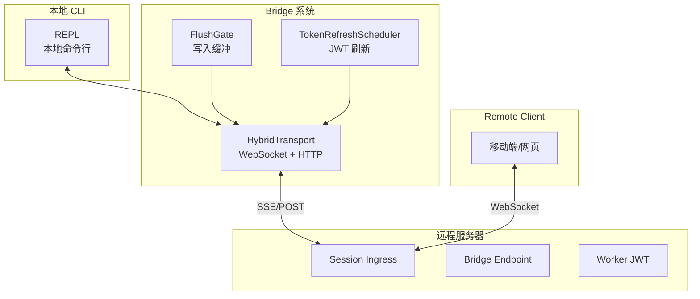
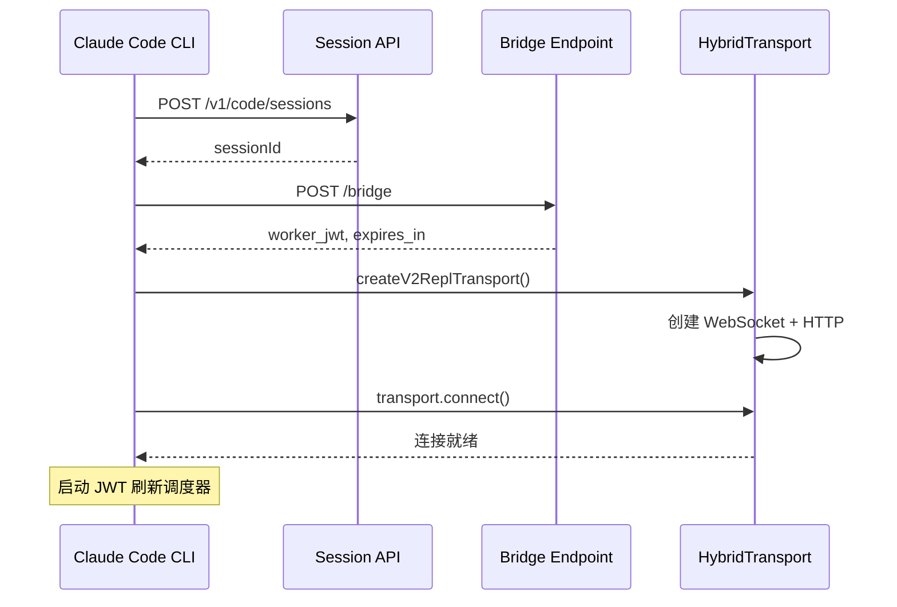
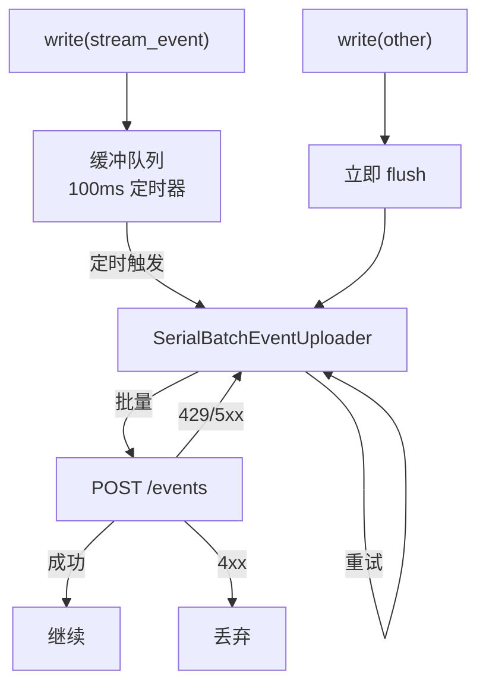
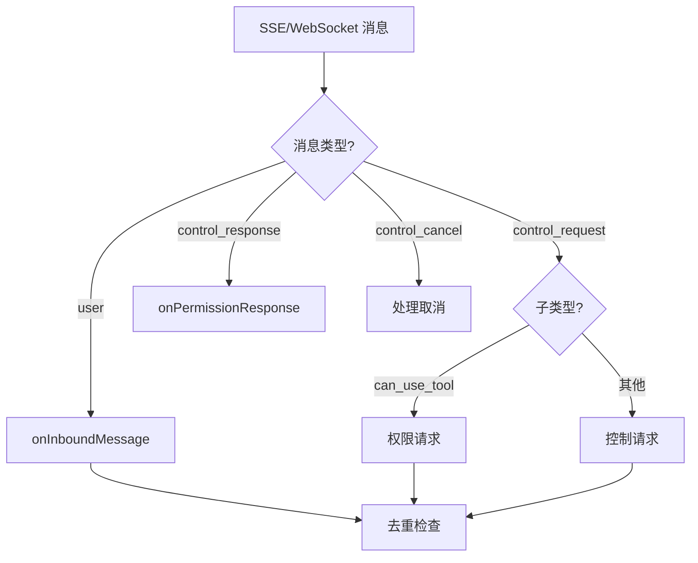
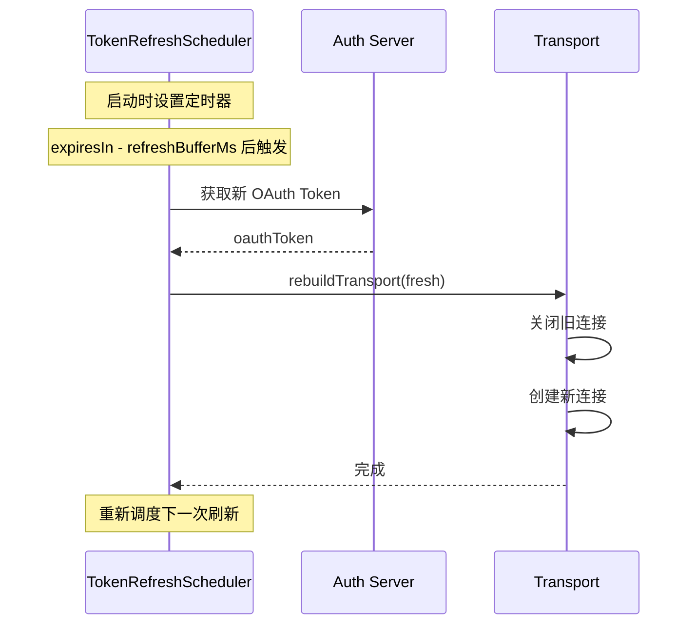
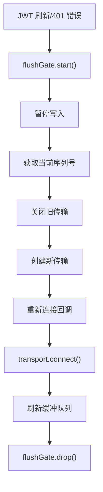
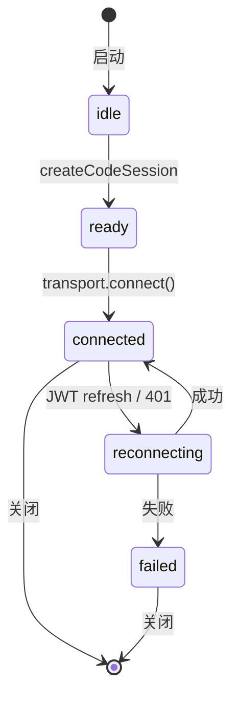

# Claude Code 源码分析：桥接系统 (Bridge)

## 1. 桥接系统概述

桥接系统使 Claude Code 能够通过远程客户端（如移动端 Web 应用）进行控制，实现远程会话功能。



## 2. 远程桥接核心

**位置**: `src/bridge/remoteBridgeCore.ts`

### 2.1 EnvLessBridge 初始化流程



### 2.2 凭证获取

```typescript
// 获取远程桥接凭证
async function fetchRemoteCredentials(
  sessionId: string,
  baseUrl: string,
  accessToken: string,
  timeoutMs: number,
): Promise<RemoteCredentials | null> {
  const response = await axios.post(
    `${baseUrl}/bridge`,
    { session_id: sessionId },
    {
      headers: {
        Authorization: `Bearer ${accessToken}`,
        'Content-Type': 'application/json',
        'anthropic-version': ANTHROPIC_VERSION,
      },
      timeout: timeoutMs,
    }
  )

  return {
    worker_jwt: response.data.worker_jwt,
    expires_in: response.data.expires_in,
    api_base_url: response.data.api_base_url,
    worker_epoch: response.data.worker_epoch,
  }
}
```

## 3. 传输层实现

### 3.1 HybridTransport

**位置**: `src/cli/transports/HybridTransport.ts`

混合传输：WebSocket 用于读取，HTTP POST 用于写入。



### 3.2 SerialBatchEventUploader

**位置**: `src/cli/transports/SerialBatchEventUploader.ts`

串行批量上传器：

```typescript
export class SerialBatchEventUploader<T> {
  private queue: T[][] = []
  private inFlight: boolean = false

  constructor(private config: {
    maxBatchSize: number
    maxQueueSize: number
    baseDelayMs: number
    maxDelayMs: number
    maxConsecutiveFailures?: number
    send: (batch: T[]) => Promise<void>
  }) {}

  async enqueue(items: T[]): Promise<void> {
    // 背压检查
    if (this.queueLength > this.config.maxQueueSize) {
      await this.drain()
    }

    this.queue.push(items)
  }

  async flush(): Promise<void> {
    while (this.queue.length > 0) {
      const batch = this.queue.shift()!
      await this.sendWithRetry(batch)
    }
  }
}
```

## 4. 消息处理

### 4.1 入口消息处理

**位置**: `src/bridge/bridgeMessaging.ts`



### 4.2 服务器控制请求

```typescript
export async function handleServerControlRequest(
  req: SDKControlRequest,
  handlers: {
    transport: ReplBridgeTransport
    sessionId: string
    onInterrupt?: () => void
    onSetModel?: (model: string) => void
    onSetMaxThinkingTokens?: (tokens: number | null) => void
    onSetPermissionMode?: (mode: PermissionMode) => {...}
  }
): Promise<void> {

  switch (req.request.subtype) {
    case 'interrupt':
      handlers.onInterrupt?.()
      break

    case 'set_model':
      handlers.onSetModel?.(req.request.model)
      break

    case 'set_permission_mode':
      handlers.onSetPermissionMode?.(req.request.mode)
      break

    case 'update_max_thinking_tokens':
      handlers.onSetMaxThinkingTokens?.(req.request.max_tokens)
      break
  }
}
```

## 5. JWT 刷新机制

### 5.1 Token 刷新调度

**位置**: `src/bridge/jwtUtils.ts`



### 5.2 认证失败恢复

```typescript
async function recoverFromAuthFailure(): Promise<void> {
  authRecoveryInFlight = true
  onStateChange?.('reconnecting', 'JWT expired — refreshing')

  try {
    // 刷新 OAuth token
    const stale = getAccessToken()
    if (onAuth401) await onAuth401(stale ?? '')

    const oauthToken = getAccessToken() ?? stale
    if (!oauthToken) {
      onStateChange?.('failed', 'JWT refresh failed: no OAuth token')
      return
    }

    // 获取新凭证
    const fresh = await fetchRemoteCredentials(
      sessionId,
      baseUrl,
      oauthToken,
      cfg.http_timeout_ms,
    )

    // 重建传输
    await rebuildTransport(fresh, 'auth_401_recovery')
  } finally {
    authRecoveryInFlight = false
  }
}
```

## 6. 传输重建

### 6.1 重建流程



### 6.2 FlushGate

**位置**: `src/bridge/flushGate.ts`

在传输重建期间缓冲写入：

```typescript
export class FlushGate<T> {
  private queue: T[] = []
  private active: boolean = false

  start() {
    this.active = true
  }

  enqueue(...items: T[]): boolean {
    if (!this.active) return false  // 不在门内，直接发送

    this.queue.push(...items)
    return true  // 已入队
  }

  end(): T[] {
    this.active = false
    const items = this.queue
    this.queue = []
    return items
  }

  drop() {
    this.active = false
    this.queue = []
  }
}
```

## 7. 桥接状态

### 7.1 状态定义

```typescript
export type BridgeState =
  | 'idle'           // 初始状态
  | 'ready'          // 凭证获取完成
  | 'connected'      // 传输已连接
  | 'reconnecting'   // 重连中
  | 'failed'         // 失败
```

### 7.2 状态转换



## 8. 历史记录同步

### 8.1 历史记录上传

```typescript
async function flushHistory(msgs: Message[]): Promise<void> {
  // 过滤可上传的消息
  const eligible = msgs.filter(isEligibleBridgeMessage)

  // 限制大小
  const capped = eligible.length > initialHistoryCap
    ? eligible.slice(-initialHistoryCap)
    : eligible

  const events = toSDKMessages(capped).map(m => ({
    ...m,
    session_id: sessionId,
  }))

  // 发送
  await transport.writeBatch(events)
}
```

### 8.2 消息去重

```typescript
// 最近发送的 UUID (用于识别服务器回显)
const recentPostedUUIDs = new BoundedUUIDSet(cfg.uuid_dedup_buffer_size)

// 最近接收的 UUID (用于识别重复消息)
const recentInboundUUIDs = new BoundedUUIDSet(cfg.uuid_dedup_buffer_size)

function writeMessages(messages: Message[]) {
  const filtered = messages.filter(m =>
    isEligibleBridgeMessage(m) &&
    !initialMessageUUIDs.has(m.uuid) &&
    !recentPostedUUIDs.has(m.uuid)
  )

  // 添加到已发送
  for (const msg of filtered) {
    recentPostedUUIDs.add(msg.uuid)
  }

  // 发送
  transport.writeBatch(filtered)
}
```

## 9. 会话归档

### 9.1 关闭时归档

```typescript
async function teardown(): Promise<void> {
  tornDown = true
  refresh.cancelAll()

  // 发送空闲状态
  transport.reportState('idle')
  void transport.write(makeResultMessage(sessionId))

  // 归档会话
  let status = await archiveSession(
    sessionId,
    baseUrl,
    token,
    orgUUID,
    cfg.teardown_archive_timeout_ms,
  )

  // 关闭传输
  transport.close()
}
```

---

*文档版本: 1.0*
*分析日期: 2026-03-31*
