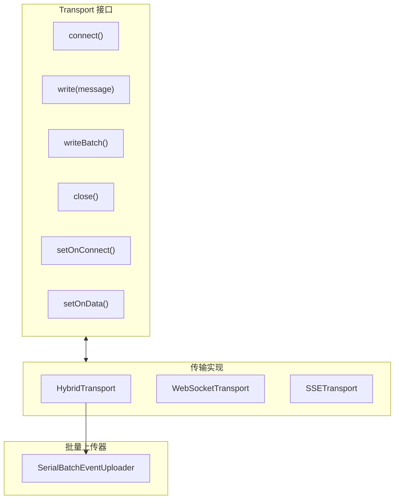
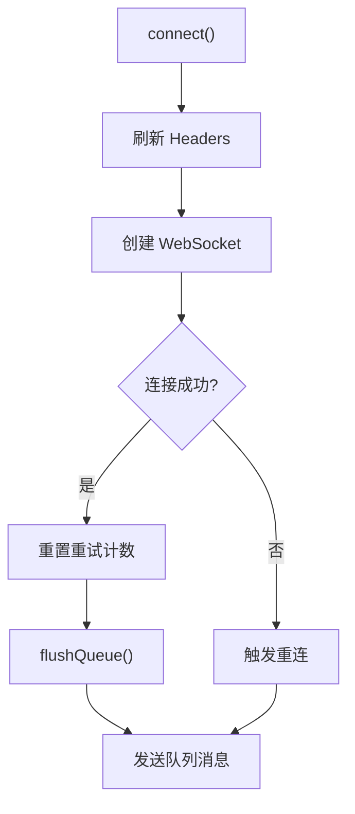
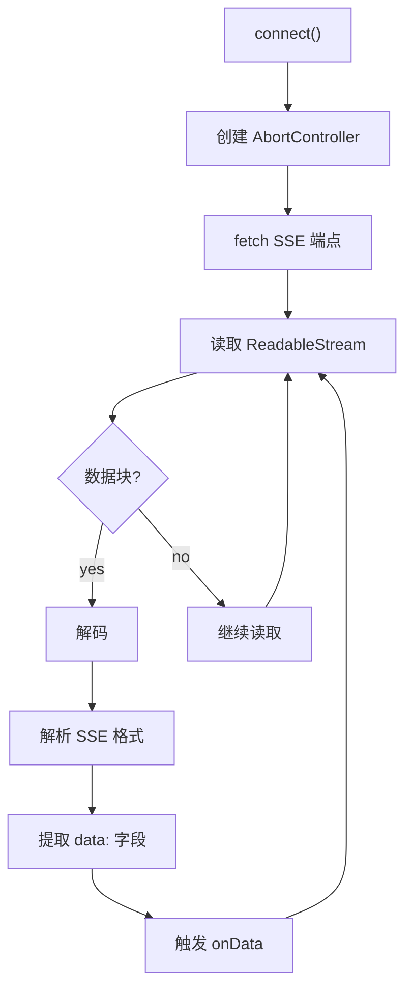
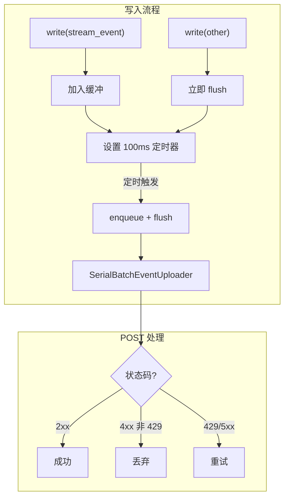
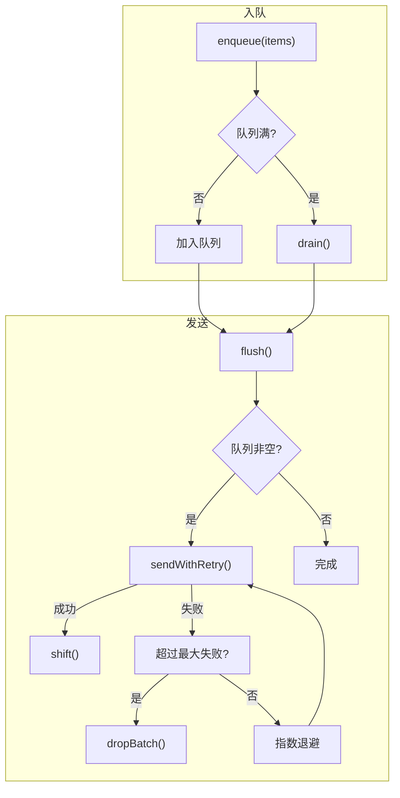
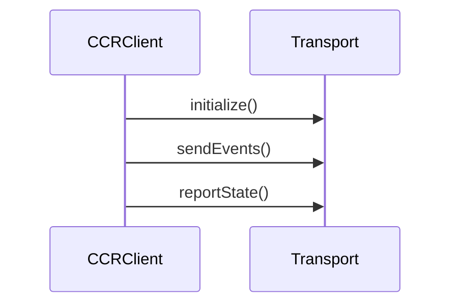
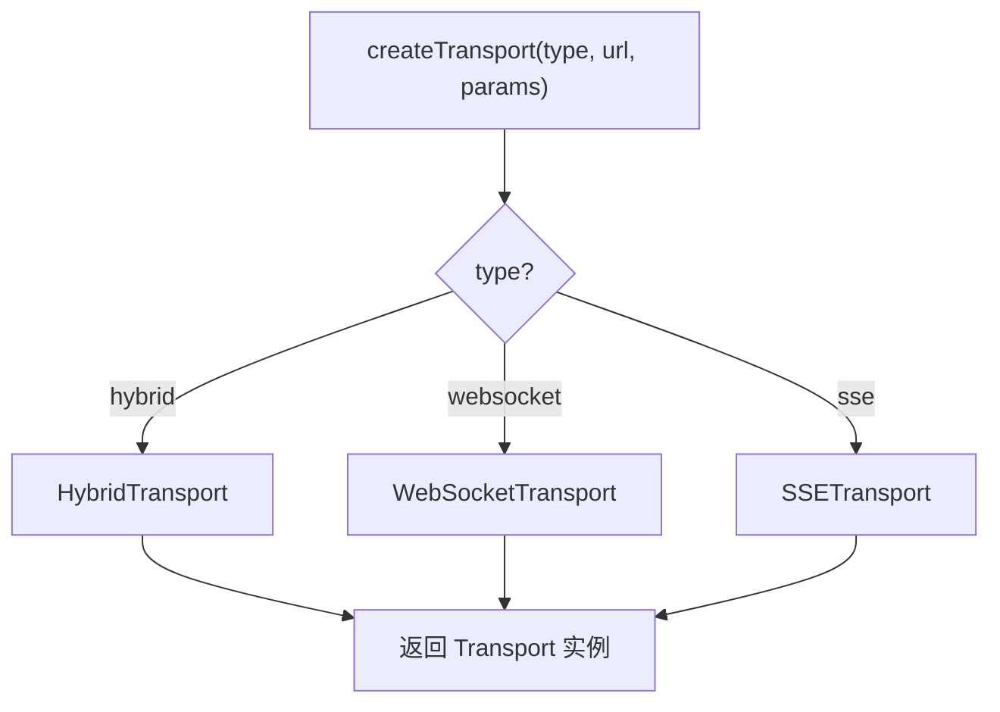
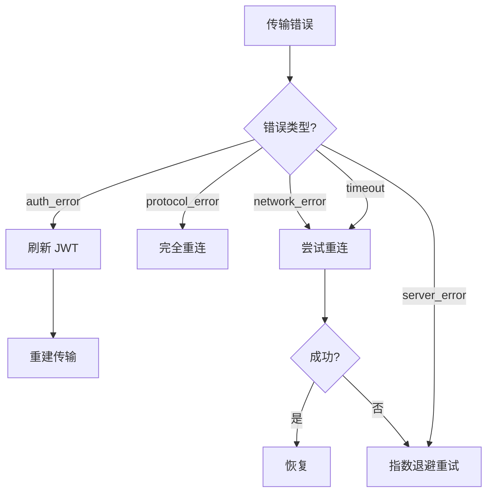

# Claude Code 源码分析：传输系统

## 1. 传输系统概述

传输系统负责 Claude Code 与后端服务之间的通信，支持多种传输协议。



## 2. 传输接口定义

**位置**: `src/cli/transports/transport.ts`

```typescript
export interface Transport {
  // 连接管理
  connect(): void
  close(): void

  // 写入
  write(message: StdoutMessage): Promise<void>
  writeBatch(messages: StdoutMessage[]): Promise<void>

  // 回调设置
  setOnConnect(handler: () => void): void
  setOnData(handler: (data: string) => void): void
  setOnClose(handler: (code?: number) => void): void
  setOnError(handler: (error: Error) => void): void

  // 状态
  getLastSequenceNum(): number
  reportState(state: 'idle' | 'running' | 'requires_action'): void
}
```

## 3. WebSocket 传输

**位置**: `src/cli/transports/WebSocketTransport.ts`

### 3.1 基本实现



### 3.2 重连机制

```typescript
private handleReconnect(): void {
  if (this.reconnectAttempts >= this.options?.maxReconnectAttempts ?? 5) {
    this.onClose?.(1006)  // 异常关闭
    return
  }

  // 指数退避
  const delay = Math.min(
    1000 * 2 ** this.reconnectAttempts,
    30000  // 最大 30 秒
  )

  this.reconnectTimer = setTimeout(() => {
    this.reconnectAttempts++
    this.connect()
  }, delay)
}
```

## 4. SSE 传输

**位置**: `src/cli/transports/SSETransport.ts`

### 4.1 SSE 客户端实现



## 5. 混合传输 (HybridTransport)

**位置**: `src/cli/transports/HybridTransport.ts`

### 5.1 设计原理



### 5.2 实现细节

```typescript
export class HybridTransport extends WebSocketTransport {
  private postUrl: string
  private uploader: SerialBatchEventUploader<StdoutMessage>
  private streamEventBuffer: StdoutMessage[] = []

  // 写入消息
  async write(message: StdoutMessage): Promise<void> {
    if (message.type === 'stream_event') {
      // 缓冲流事件
      this.streamEventBuffer.push(message)
      if (!this.streamEventTimer) {
        this.streamEventTimer = setTimeout(
          () => this.flushStreamEvents(),
          BATCH_FLUSH_INTERVAL_MS
        )
      }
      return
    }

    // 非流事件: 立即 flush 缓冲 + POST
    await this.uploader.enqueue([...this.takeStreamEvents(), message])
    return this.uploader.flush()
  }

  // 单次 HTTP POST
  private async postOnce(events: StdoutMessage[]): Promise<void> {
    const sessionToken = getSessionIngressAuthToken()

    const response = await axios.post(
      this.postUrl,
      { events },
      {
        headers: {
          Authorization: `Bearer ${sessionToken}`,
          'Content-Type': 'application/json',
        },
        timeout: POST_TIMEOUT_MS,
      }
    )

    if (response.status >= 200 && response.status < 300) {
      return  // 成功
    }

    if (response.status >= 400 && response.status < 500 && response.status !== 429) {
      return  // 永久失败
    }

    throw new Error(`POST failed with ${response.status}`)  // 可重试
  }
}
```

## 6. 批量事件上传器

**位置**: `src/cli/transports/SerialBatchEventUploader.ts`

### 6.1 核心功能



### 6.2 发送与重试

```typescript
private async sendWithRetry(batch: T[]): Promise<void> {
  let attempts = 0

  while (true) {
    try {
      await this.config.send(batch)
      return  // 成功
    } catch (error) {
      attempts++

      // 计算延迟: 指数退避 + 抖动
      const baseDelay = Math.min(
        this.config.baseDelayMs * 2 ** attempts,
        this.config.maxDelayMs
      )
      const jitter = (Math.random() - 0.5) * 2 * this.config.jitterMs
      const delay = baseDelay + jitter

      await sleep(delay)
    }
  }
}
```

## 7. CCR 客户端

**位置**: `src/cli/transports/ccrClient.ts`

CCR (Cloud Code Runtime) 是远程执行协议：



## 8. Worker 状态上传器

**位置**: `src/cli/transports/WorkerStateUploader.ts`

### 8.1 后台状态报告

```typescript
export class WorkerStateUploader {
  private pending: StateUpdate[] = []
  private timer: ReturnType<typeof setInterval> | null = null

  constructor(private transport: Transport) {
    // 定期发送状态
    this.timer = setInterval(() => {
      this.flush()
    }, 1000)
  }

  push(update: StateUpdate): void {
    this.pending.push(update)
  }

  private async flush(): Promise<void> {
    if (this.pending.length === 0) return

    const updates = this.pending.splice(0, this.pending.length)

    await this.transport.write({
      type: 'worker_state',
      updates,
    })
  }
}
```

## 9. 传输工厂

**位置**: `src/cli/transports/transportUtils.ts`



## 10. 错误处理与恢复

### 10.1 错误类型

```typescript
enum TransportErrorType {
  NETWORK_ERROR = 'network_error',
  TIMEOUT = 'timeout',
  AUTH_ERROR = 'auth_error',      // 401
  PROTOCOL_ERROR = 'protocol_error', // 409
  SERVER_ERROR = 'server_error',  // 5xx
}
```

### 10.2 恢复策略



---

*文档版本: 1.0*
*分析日期: 2026-03-31*
