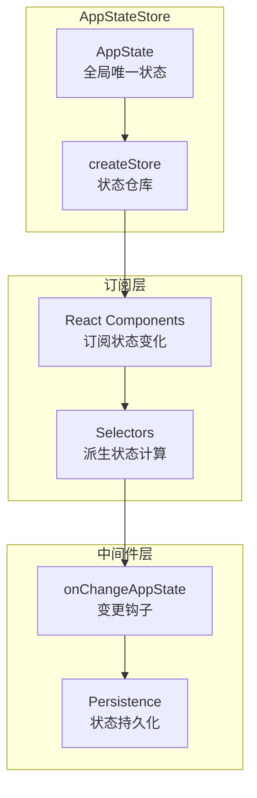
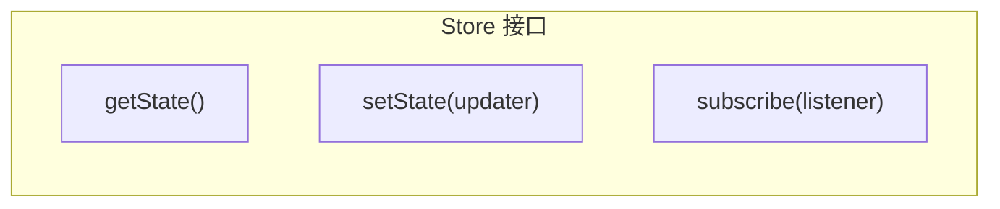
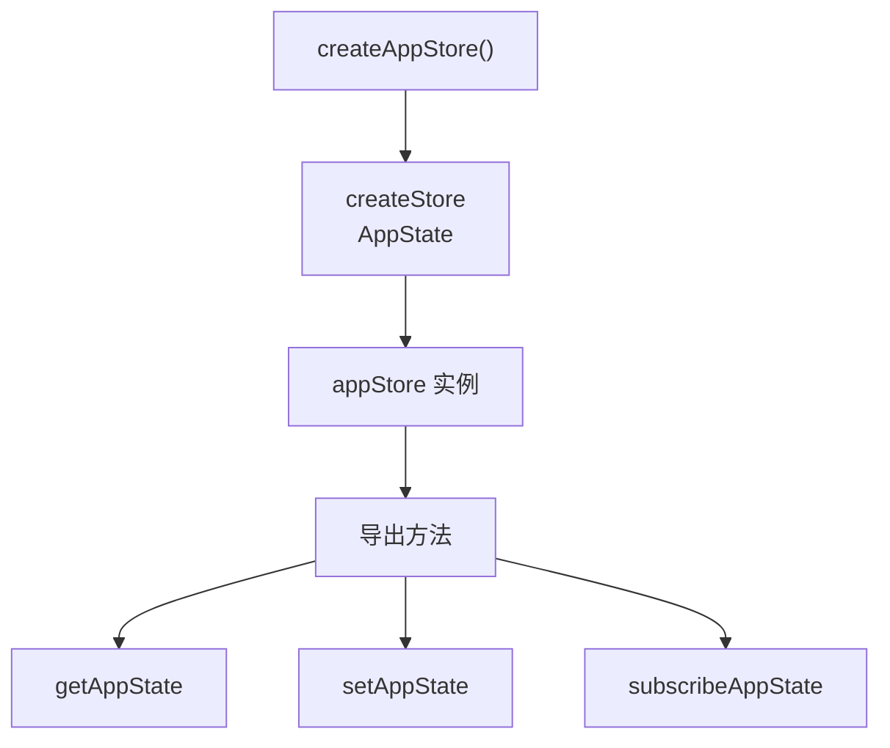
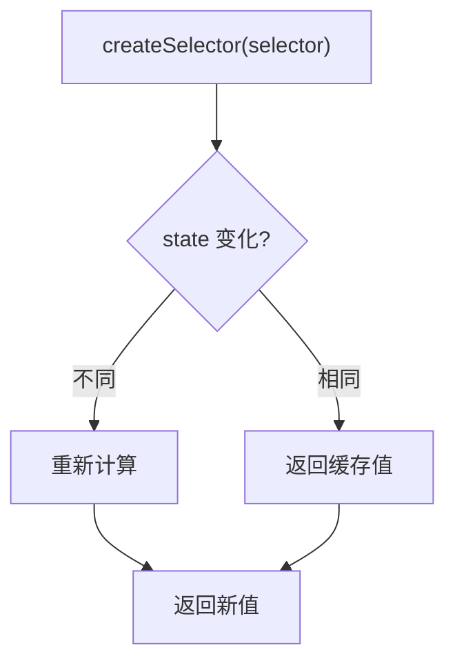
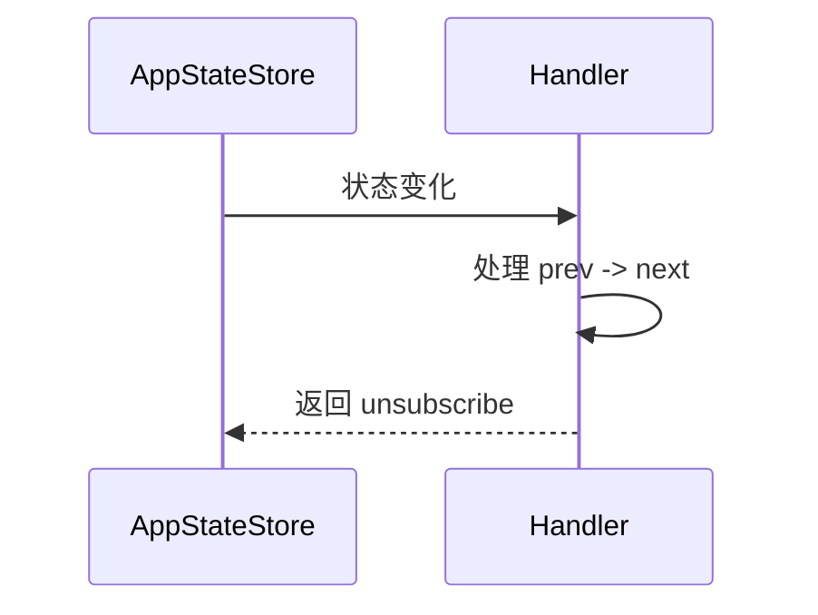
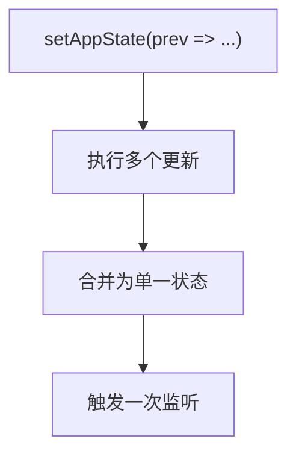
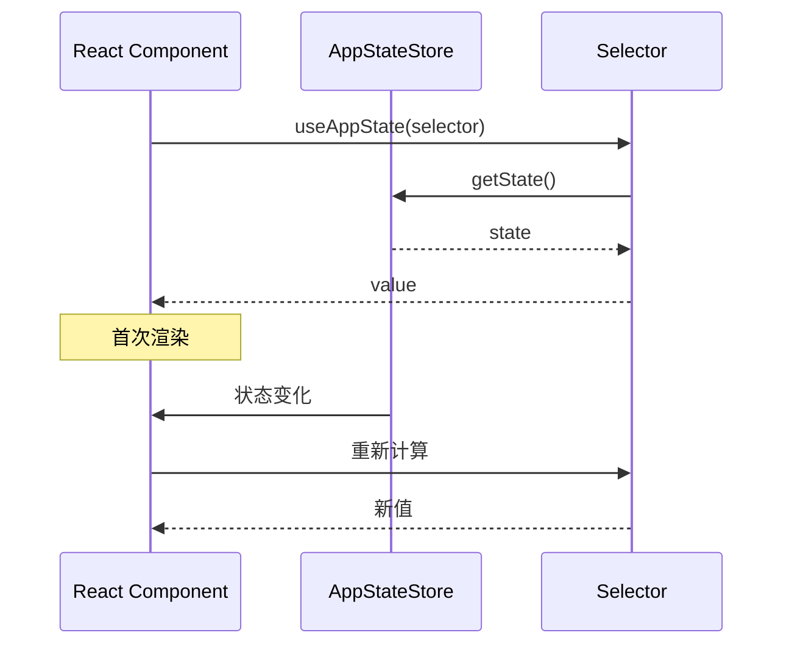
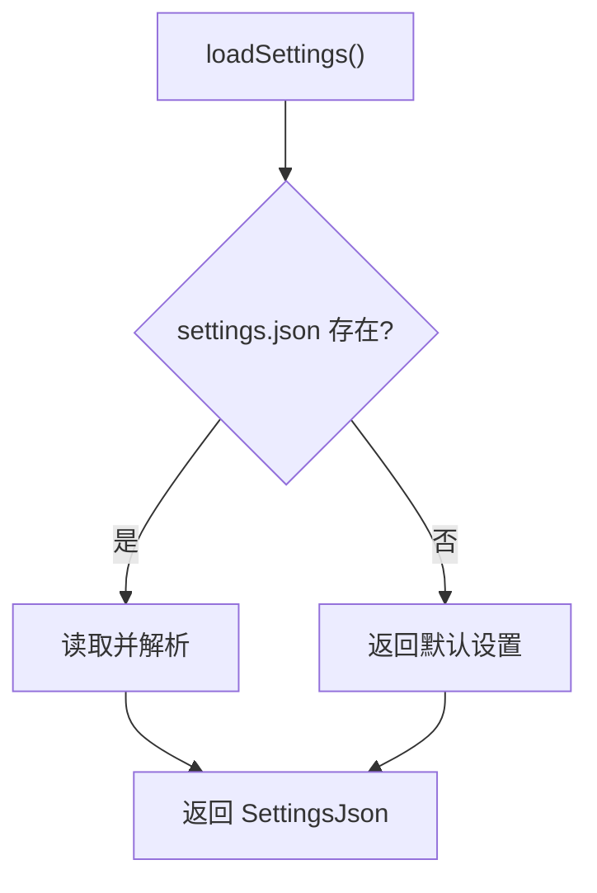

# Claude Code 源码分析：状态管理系统

## 1. 状态管理概述

Claude Code 使用自定义的状态管理系统来管理应用状态，采用类似 Redux 的不可变更新模式。



## 2. AppState 定义

**位置**: `src/state/AppStateStore.ts`

### 2.1 核心状态结构

```typescript
export type AppState = DeepImmutable<{
  // ── 设置 ────────────────────────────────────────────────────
  settings: SettingsJson                    // 用户设置
  verbose: boolean                          // 详细输出模式
  mainLoopModel: ModelSetting              // 主循环模型
  mainLoopModelForSession: ModelSetting    // 会话级模型覆盖

  // ── 视图状态 ────────────────────────────────────────────────
  statusLineText: string | undefined      // 状态栏文本
  expandedView: 'none' | 'tasks' | 'teammates'  // 扩展视图
  isBriefOnly: boolean                     // 简洁模式
  coordinatorTaskIndex: number            // 协调任务索引
  viewSelectionMode: 'none' | 'selecting-agent' | 'viewing-agent'

  // ── 工具权限 ────────────────────────────────────────────────
  toolPermissionContext: ToolPermissionContext

  // ── 任务系统 ────────────────────────────────────────────────
  tasks: TaskState[]

  // ── MCP ────────────────────────────────────────────────────
  mcp: {
    clients: MCPServerConnection[]
    commands: Command[]
    tools: Tools
    resources: Record<string, ServerResource[]>
    installationErrors: PluginError[]
  }

  // ── 桥接 ───────────────────────────────────────────────────
  replBridgeEnabled: boolean
  replBridgeExplicit: boolean
  replBridgeConnected: boolean
  replBridgeSessionActive: boolean
  replBridgeReconnecting: boolean
  replBridgeConnectUrl: string | undefined
  replBridgeSessionUrl: string | undefined
  replBridgeEnvironmentId: string | undefined

  // ── 特性 ────────────────────────────────────────────────────
  agent: string | undefined
  kairosEnabled: boolean                  // Assistant 模式
  remoteSessionUrl: string | undefined
  remoteConnectionStatus: 'connecting' | 'connected' | 'reconnecting' | 'disconnected'
  remoteBackgroundTaskCount: number

  // ── 推测执行 ────────────────────────────────────────────────
  speculation: SpeculationState

  // ── 文件历史 ────────────────────────────────────────────────
  fileHistory: FileHistoryState

  // ── 归因 ───────────────────────────────────────────────────
  attribution: AttributionState

  // ── 主题 ───────────────────────────────────────────────────
  theme: ThemeName
  terminalTheme: TerminalTheme | undefined
}>
```

### 2.2 DeepImmutable 类型

```typescript
// 深度不可变类型
type DeepImmutable<T> = {
  readonly [K in keyof T]: T[K] extends object
    ? DeepImmutable<T[K]>
    : T[K]
}
```

## 3. Store 实现

**位置**: `src/state/store.ts`

### 3.1 Store 接口



### 3.2 Store 实现

```typescript
export function createStore<S>(initialState: S): Store<S> {
  let state = initialState
  const listeners = new Set<Listener>()

  return {
    getState(): S {
      return state
    },

    setState(updater: (prev: S) => S): void {
      const newState = updater(state)

      // 引用比较优化
      if (newState === state) {
        return
      }

      state = newState

      // 通知所有监听器
      for (const listener of listeners) {
        listener()
      }
    },

    subscribe(listener: Listener): Unsubscribe {
      listeners.add(listener)
      return () => listeners.delete(listener)
    }
  }
}
```

## 4. AppStateStore

**位置**: `src/state/AppStateStore.ts`

### 4.1 创建 Store



### 4.2 初始状态

```typescript
const createInitialState = (): AppState => ({
  // 设置
  settings: getInitialSettings(),
  verbose: false,
  mainLoopModel: 'claude-sonnet-4-5',
  mainLoopModelForSession: 'claude-sonnet-4-5',

  // 视图
  expandedView: 'none',
  isBriefOnly: false,
  coordinatorTaskIndex: -1,
  viewSelectionMode: 'none',
  footerSelection: null,

  // 权限
  toolPermissionContext: getEmptyToolPermissionContext(),

  // 任务
  tasks: [],

  // MCP
  mcp: {
    clients: [],
    commands: [],
    tools: [],
    resources: {},
    installationErrors: [],
  },

  // 桥接
  replBridgeEnabled: false,
  replBridgeExplicit: false,
  replBridgeConnected: false,
  replBridgeSessionActive: false,
  replBridgeReconnecting: false,

  // 特性
  kairosEnabled: false,
  remoteConnectionStatus: 'disconnected',
  remoteBackgroundTaskCount: 0,

  // 推测
  speculation: IDLE_SPECULATION_STATE,

  // 文件历史
  fileHistory: createEmptyFileHistoryState(),

  // 归因
  attribution: createEmptyAttributionState(),
})
```

## 5. 状态选择器

**位置**: `src/state/selectors.ts`

### 5.1 选择器工厂



### 5.2 常用选择器

```typescript
// 任务选择器
export const selectTasks = (state: AppState) => state.tasks
export const selectTaskById = (state: AppState, id: string) =>
  state.tasks.find(t => t.id === id)

// MCP 选择器
export const selectMcpTools = (state: AppState) => state.mcp.tools
export const selectMcpClients = (state: AppState) => state.mcp.clients

// 桥接选择器
export const selectBridgeState = (state: AppState) => ({
  enabled: state.replBridgeEnabled,
  connected: state.replBridgeConnected,
  sessionActive: state.replBridgeSessionActive,
})

// 模型选择器
export const selectMainLoopModel = (state: AppState) =>
  state.mainLoopModel ?? state.settings.model
```

## 6. 状态变更处理

**位置**: `src/state/onChangeAppState.ts`

### 6.1 变更钩子



### 6.2 特定变更处理

```typescript
// 任务变更处理
export function onTasksChange(handler: (tasks: TaskState[]) => void): () => void {
  return onAppStateChange((prev, next) => {
    if (prev.tasks !== next.tasks) {
      handler(next.tasks)
    }
  })
}

// MCP 工具变更处理
export function onMcpToolsChange(handler: (tools: Tools) => void): () => void {
  return onAppStateChange((prev, next) => {
    if (prev.mcp.tools !== next.mcp.tools) {
      handler(next.mcp.tools)
    }
  })
}
```

## 7. 状态更新模式

### 7.1 不可变更新

```typescript
// 添加任务
setAppState(prev => ({
  ...prev,
  tasks: [...prev.tasks, newTask]
}))

// 更新任务
setAppState(prev => ({
  ...prev,
  tasks: prev.tasks.map(t =>
    t.id === taskId ? { ...t, status: 'running' } : t
  )
}))

// 删除任务
setAppState(prev => ({
  ...prev,
  tasks: prev.tasks.filter(t => t.id !== taskId)
}))
```

### 7.2 批量更新



## 8. React 集成

### 8.1 Hook



## 9. 持久化

### 9.1 设置持久化

**位置**: `src/utils/settings/settings.ts`



### 9.2 会话持久化

**位置**: `src/utils/sessionStorage.ts`

```typescript
interface SessionData {
  messages: Message[]
  taskState: TaskState[]
  // ...
}

// 保存会话
export async function saveSession(data: SessionData): Promise<void> {
  const sessionPath = getSessionPath()

  await writeFile(
    sessionPath,
    JSON.stringify(data),
    { mode: 'fsync' }
  )
}

// 恢复会话
export async function loadSession(): Promise<SessionData | null> {
  const sessionPath = getSessionPath()

  if (!existsSync(sessionPath)) {
    return null
  }

  const content = await readFile(sessionPath, 'utf-8')
  return JSON.parse(content)
}
```

## 10. 状态调试

### 10.1 状态快照

```typescript
// 获取状态快照用于调试
export function getStateSnapshot(): string {
  const state = appStore.getState()
  return JSON.stringify(state, null, 2)
}

// 状态变更日志
export function enableStateLogging(): void {
  appStore.subscribe(() => {
    const state = appStore.getState()
    console.debug('[State]', JSON.stringify(state, null, 2))
  })
}
```

---

*文档版本: 1.0*
*分析日期: 2026-03-31*
