# Claude Code 源码分析：Hooks 系统

## 1. Hooks 系统概述

Hooks 系统允许用户在关键生命周期点注入自定义逻辑，实现扩展和定制。

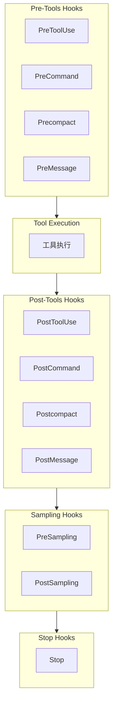

## 2. Hook 类型定义

**位置**: `src/types/hooks.ts`

### 2.1 核心 Hook 类型

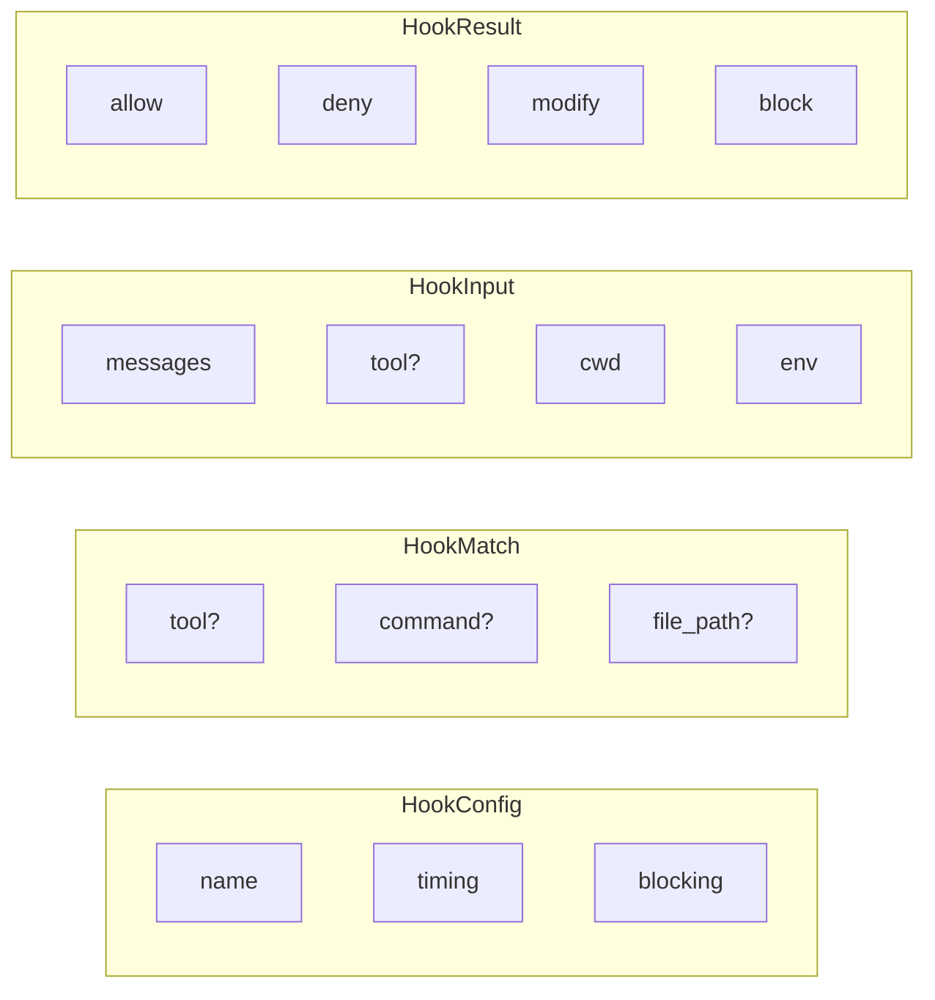

### 2.2 Hook 阶段

```typescript
export type HookPhase =
  | 'pre_tool_use'
  | 'post_tool_use'
  | 'pre_command'
  | 'post_command'
  | 'pre_compact'
  | 'post_compact'
  | 'pre_sampling'
  | 'post_sampling'
  | 'pre_message'
  | 'post_message'
  | 'stop'
```

## 3. Hook 注册

**位置**: `src/utils/hooks/hookRegistry.ts`

### 3.1 Hook 配置格式

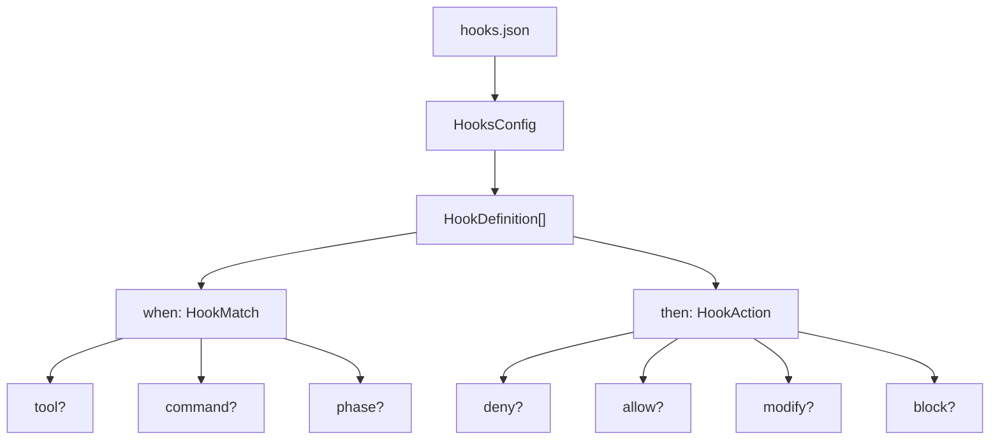

### 3.2 Hook 注册表

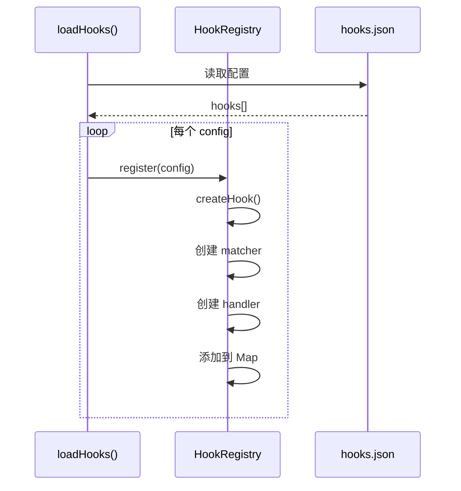

## 4. PreToolUse Hook

### 4.1 执行流程

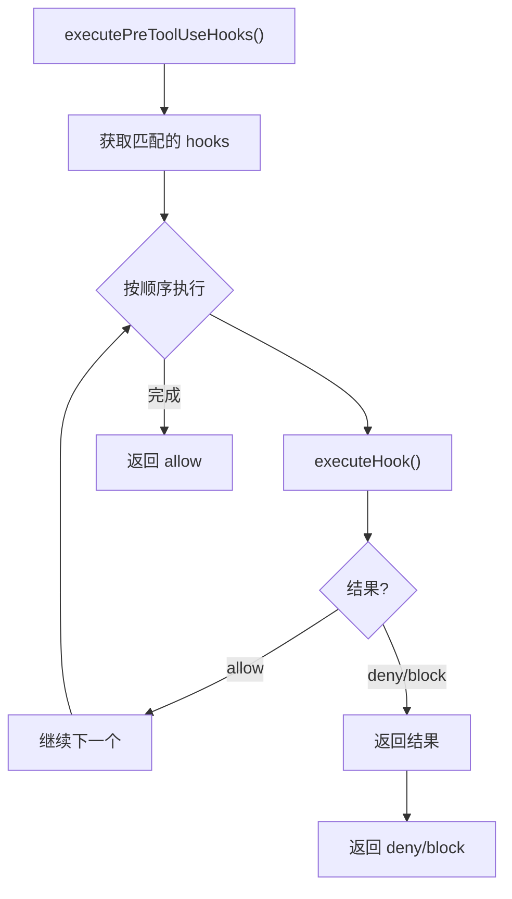

### 4.2 工具输入修改

```typescript
// Hook 配置示例
{
  "name": "force-git-readonly",
  "when": {
    "tool": ["Bash(git *)"]
  },
  "then": {
    "modify": {
      "input": {
        "command": "${input.command} --no-edit"
      }
    }
  }
}
```

## 5. PostToolUse Hook

### 5.1 执行流程

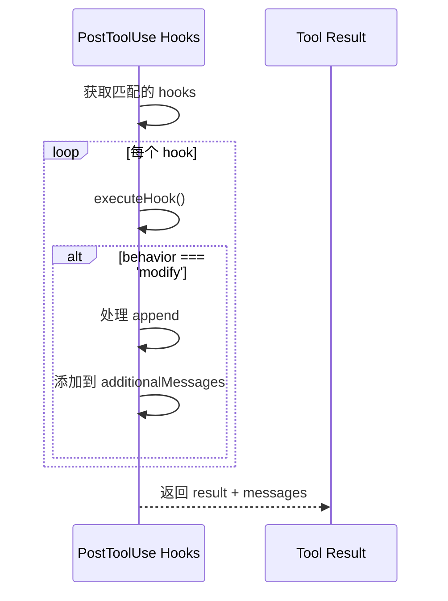

## 6. Stop Hooks

### 6.1 Stop Hook 类型

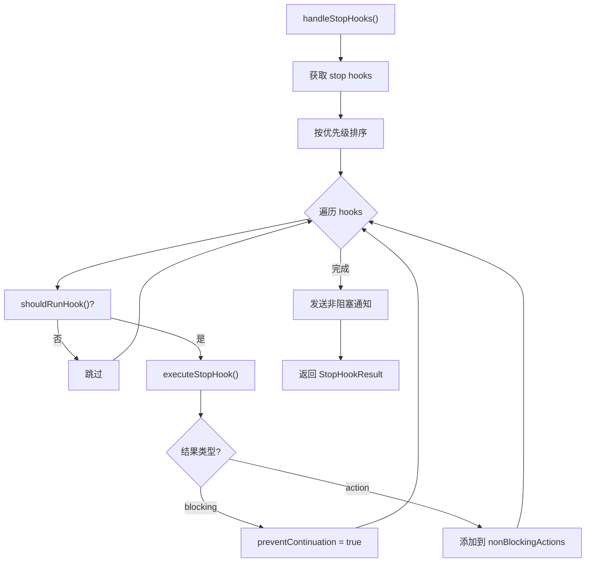

### 6.2 Stop Hook 条件

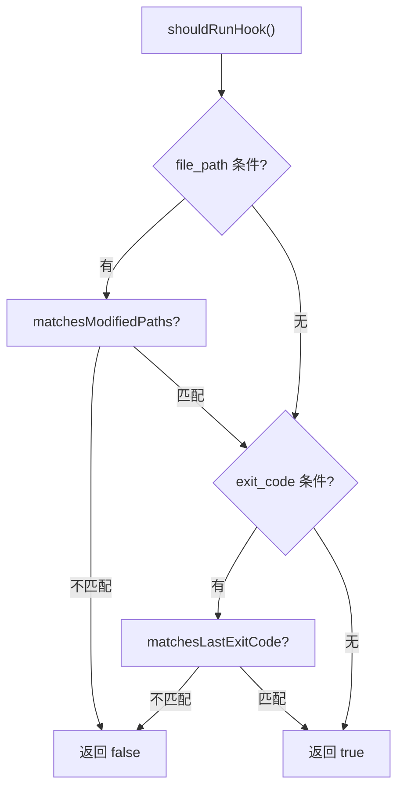

## 7. Sampling Hooks

### 7.1 PreSampling Hook

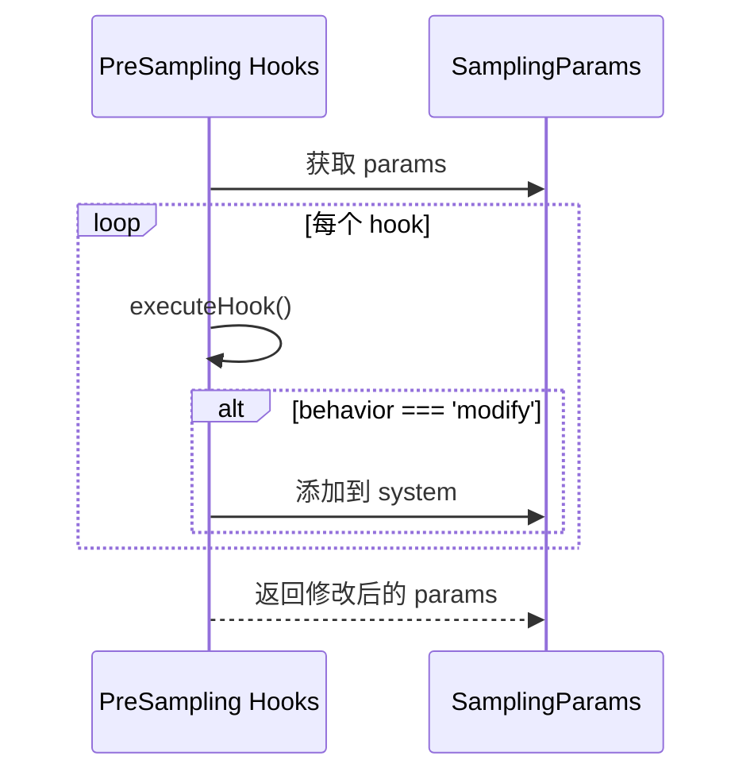

### 7.2 PostSampling Hook

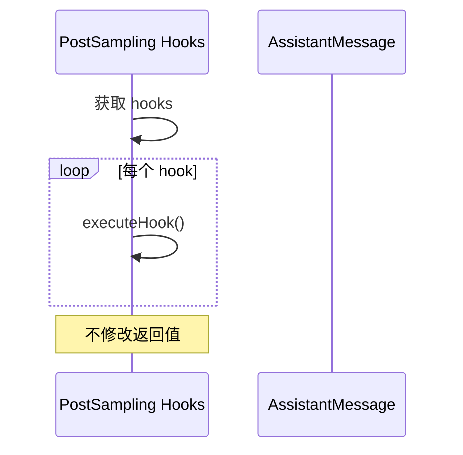

## 8. Hook 错误处理

### 8.1 错误策略

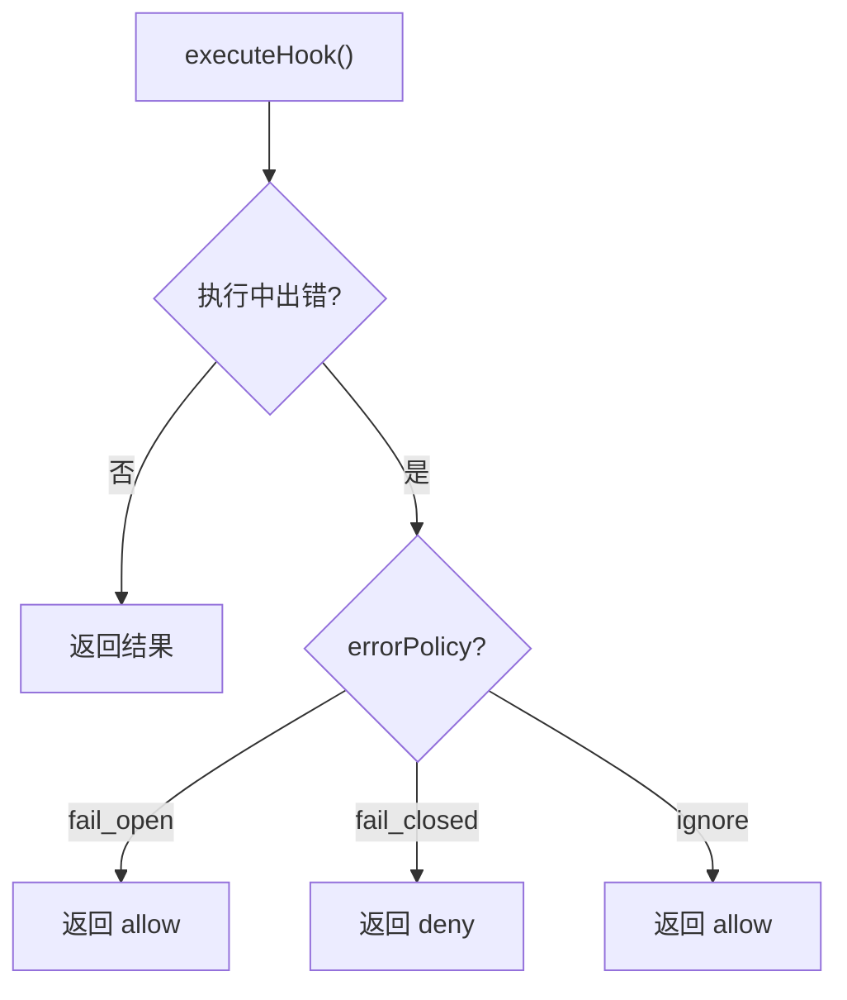

### 8.2 超时处理

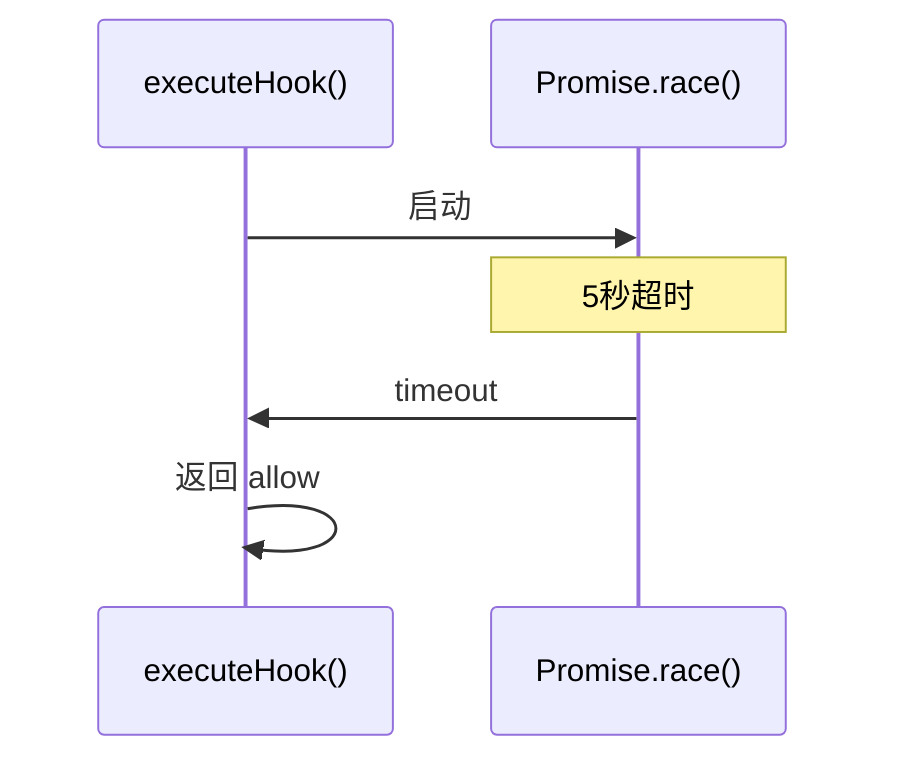

## 9. Hook 调试

### 9.1 调试模式

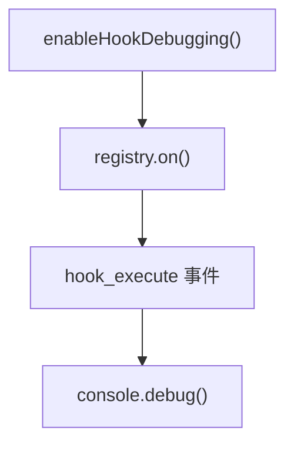

### 9.2 Hook 日志

```typescript
// 记录 hook 执行
logEvent('hook_executed', {
  hook_name: hook.name,
  hook_phase: phase,
  tool_name: input.tool?.name,
  behavior: result.behavior,
  duration_ms: duration,
})
```

---

*文档版本: 1.0*
*分析日期: 2026-03-31*
