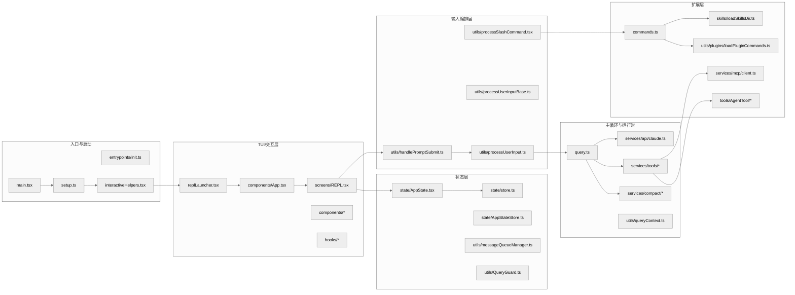

# `src` 工程架构全景

本文给出 `src/` 目录的分层结构、主执行链路和核心抽象，用于建立整套源码的总地图。

## 1. 架构分层图

## 2. 架构主线

这张图可以按三段主线理解：

1. `Entry` 负责把进程带到可运行状态。
2. `UI / State / Input` 负责把交互态输入转成运行时消息与上下文。
3. `Runtime / Extension` 负责模型请求、工具执行、扩展接入与平台能力汇聚。

最短主线可以概括为：

> 入口层拉起会话，REPL 层接收输入，`query()` 驱动模型与工具，扩展层为命令和工具总线持续注入能力。

## 3. 目录结构

### 3.1 入口层

关键文件：

- `src/main.tsx`
- `src/setup.ts`
- `src/entrypoints/init.ts`
- `src/interactiveHelpers.tsx`

职责：

- 解析 CLI 语义与启动模式。
- 初始化 feature flags、环境变量、信任边界、遥测、插件/技能预注册。
- 构建首个 `AppState`。
- 决定走交互 REPL、非交互 print/SDK、恢复会话、远程连接还是其他分支。

核心判断：

- 这层不只是“把参数传进去”。
- 它会主动做性能优化，例如顶层 side effect 预取、延迟预取、信任后再做的上下文加载。
- 它会决定系统的“运行人格”：交互式、非交互式、远程、Agent、worktree、tmux、assistant mode 等。

### 3.2 UI 层

关键文件：

- `src/replLauncher.tsx`
- `src/components/App.tsx`
- `src/screens/REPL.tsx`
- `src/hooks/*`
- `src/components/*`

职责：

- 管理终端界面渲染。
- 挂接 Providers、统计器、对话框、通知、输入框。
- 把“用户输入”和“query 主循环”接到一起。
- 管理前台会话、后台任务、远程会话、收件箱、邮箱桥接等交互行为。

一个非常重要的事实：

`REPL.tsx` 不是纯视图层，而是“交互控制器”。它内部同时做了：

- 工具池与命令池合并。
- `onSubmit` 到 `handlePromptSubmit` 的桥接。
- `onQueryImpl` 到 `query()` 的驱动。
- 流式消息落地、进度消息替换、背景会话切换、队列调度、空闲通知等。

### 3.3 状态层

关键文件：

- `src/state/store.ts`
- `src/state/AppState.tsx`
- `src/state/AppStateStore.ts`
- `src/utils/messageQueueManager.ts`
- `src/utils/QueryGuard.ts`

职责：

- 保存整个 REPL 运行时状态。
- 提供 React 上下文订阅与外部订阅能力。
- 管理输入队列与 query 活跃状态。

这层的设计思想不是 Redux 风格“重 reducer”，而是：

- 用非常薄的 store 实现高性能订阅。
- 把复杂逻辑分散到 hooks 与 runtime helper。
- 保证同一套状态机制既能服务 UI，也能服务工具、Agent、SDK/非交互路径。

### 3.4 输入编排层

关键文件：

- `src/utils/handlePromptSubmit.ts`
- `src/utils/processUserInput/processUserInput.ts`
- `src/utils/processUserInput/processSlashCommand.tsx`

职责：

- 解析 prompt/bash/slash 三种输入。
- 处理图片、附件、粘贴内容、动态技能提示。
- 决定是否直接本地执行、是否入队、是否进入 query。
- 把 `/command` 的 `allowedTools / model / effort / shouldQuery` 结果反向注入主链路。

### 3.5 主循环与请求层

关键文件：

- `src/query.ts`
- `src/services/api/claude.ts`
- `src/services/tools/toolOrchestration.ts`
- `src/services/tools/toolExecution.ts`
- `src/services/compact/*`

职责：

- 执行多轮会话推理。
- 构建发送给模型的消息、系统提示词和工具 schema。
- 在收到 `tool_use` 时执行工具，再把 `tool_result` 喂回下一轮。
- 在上下文过长时做多级压缩与恢复。
- 在错误、fallback、token budget、stop hooks、MCP 异常场景下继续维持会话一致性。

这个层是全工程的“内核”。

### 3.6 扩展层

关键文件：

- `src/commands.ts`
- `src/skills/loadSkillsDir.ts`
- `src/utils/plugins/loadPluginCommands.ts`
- `src/services/mcp/client.ts`
- `src/tools/AgentTool/*`

职责：

- 命令扩展：让 `/xxx` 能从内建命令、插件命令、技能命令、工作流命令动态合并。
- 工具扩展：让模型工具既能来自内建工具，也能来自 MCP server。
- Agent 扩展：让模型能启动另一个模型执行单元作为子代理。

## 4. 为什么 `main.tsx`、`REPL.tsx`、`query.ts` 特别大

这是这套工程的第一个阅读难点。它们大，不是因为“代码组织差”，而是因为它们处在三个真正的汇聚点：

### `src/main.tsx`

它汇聚了：

- CLI 参数解析
- 预取策略
- 信任/权限模式
- 启动模式分流
- 插件/技能/agent 预注册
- REPL 启动

### `src/screens/REPL.tsx`

它汇聚了：

- 输入框行为
- 队列处理
- query 事件消费
- UI 反馈
- 背景任务与远程会话
- 记忆、消息回放、恢复、通知

### `src/query.ts`

它汇聚了：

- 上下文裁剪
- API 调用
- streaming 事件解释
- tool_use 处理
- 错误恢复
- 递归继续

从架构上说，这三个文件分别对应：

- 入口编排器
- 交互控制器
- 对话执行引擎

## 5. 工程中的四个统一抽象

## 5.1 `Message`

消息不是单一的“用户/助手”两类，而是一组统一运行时事件。

它至少承载：

- `user`
- `assistant`
- `progress`
- `attachment`
- `system`
- `tombstone`
- `tool_use_summary`

好处：

- UI 渲染、transcript 持久化、query 递归、工具执行都可以围绕同一消息总线工作。

代价：

- 你必须接受“很多系统信号也长得像消息”。

## 5.2 `Tool`

`src/Tool.ts` 里的 Tool 不是简单函数，它是一份完整能力定义，通常包含：

- 名称与别名
- `inputSchema` / `outputSchema`
- 描述与 prompt 展示逻辑
- 并发安全判断
- 输入校验
- 调用函数
- 权限相关元信息

这使得工具不仅能被调用，还能被：

- 注入系统提示词
- 拼装成 API tool schema
- 做权限判定
- 做并发批处理
- 做结果裁剪与格式化

## 5.3 `Command`

命令系统把内建命令、技能命令、插件命令统一成 `Command` 抽象。一个命令既可以：

- 直接本地执行
- 返回消息并继续 query
- 覆盖当前 turn 的 `allowedTools / model / effort`

所以 `/xxx` 本质上是“进入主循环前的一层 DSL”。

## 5.4 `ToolUseContext`

这是全项目最关键的运行时对象之一，位于 `src/Tool.ts:158` 附近。它把下面这些东西绑到一起：

- 当前 tools/commands/mcpClients
- 当前 model/thinkingConfig
- `abortController`
- `readFileState`
- `getAppState / setAppState`
- 消息数组
- in-progress tool IDs
- response length、stream mode、notification 等 UI/统计回调

可以把它理解成：

> “一次 query 及其子工具执行的上下文宇宙”

## 6. 架构上最关键的三条主线

## 6.1 启动主线

`main.tsx -> setup.ts -> interactiveHelpers.tsx -> replLauncher.tsx -> REPL.tsx`

它解决的问题是：

- 什么时候读取安全敏感上下文。
- 什么时候弹 trust/onboarding。
- 什么时候创建 Ink root。
- 什么时候再启动延迟预取。

## 6.2 输入主线

`PromptInput -> handlePromptSubmit -> processUserInput -> processSlashCommand/processTextPrompt -> onQuery`

它解决的问题是：

- 用户现在输入的到底是什么模式。
- 如果当前 query 正在运行，要不要排队、要不要打断。
- 如果是 slash command，要不要本地执行还是进入模型。

## 6.3 请求主线

`onQueryImpl -> query() -> callModel -> tool_use -> runTools -> query() 继续`

它解决的问题是：

- 模型请求如何构造。
- 工具结果如何回流。
- 上下文过长、输出超限、权限阻塞时如何恢复。

## 7. 分层间依赖关系的设计特点

## 7.1 不是“严格单向依赖”，而是“受控汇聚”

例如：

- `REPL.tsx` 会直接感知 query、队列、任务、bridge、mailbox。
- `main.tsx` 会直接引入大量服务与工具初始化逻辑。

这说明项目追求的是：

- 关键路径少跳转
- 启动与运行时成本可控
- 编译期 dead-code elimination 友好

而不是学院式纯洁分层。

## 7.2 大量 feature flag 参与了架构成形

代码里的 `feature('KAIROS')`、`feature('COORDINATOR_MODE')`、`feature('CONTEXT_COLLAPSE')` 等并不是简单开关。

它们直接决定：

- 模块是否懒加载
- 字符串是否进入 bundle
- 功能是否存在于当前发行版
- 某些依赖是否会造成循环引用

所以这套架构实际上是“基础骨架 + 多套可裁剪能力组合”。

## 7.3 工程非常在意缓存稳定性

大量代码会为了 prompt cache 稳定而做出看似啰嗦的处理，例如：

- 避免随机临时文件路径污染工具描述。
- 在 fork subagent 时继承父系统提示词与工具数组，追求 cache-identical prefix。
- 通过 prompt cache break detection 监控 cache read 是否异常下降。

这说明这套系统把“高上下文 Agent 成本控制”当成一等问题。

## 7.4 `0402.md` 里的规模数字应按运行时口径理解

`doc/0402.md` 里那组“`53` 个核心工具 / `87` 个 slash command / `148` 个 UI 组件 / `87` 个 hooks”的价值，不在于给源码树做文件统计，而在于提醒读者：

- Claude Code 的能力面有几套非常明确的注册表。
- 这些数字描述的是某个 build / runtime slice，而不是当前反编译仓库里的原始文件数。

代码里最明确的两个“规模口径锚点”是：

- `src/tools.ts#getAllBaseTools()`：内建工具总表，后续再由 `getTools()`、deny rule、simple mode、REPL mode 继续裁剪。
- `src/commands.ts#COMMANDS()`：内建 slash command 注册表，之后 `getCommands()` 还会再并入 skill dir、bundled skills、plugin commands。

这意味着：

- “核心工具数”对应的是工具注册表，不是 `src/tools/**` 目录下有多少文件。
- “slash command 数”对应的是命令注册表，不是 `src/commands/**` 下有多少目录。

而 UI 与 hooks 的情况更分散：

- UI 能力分布在 `src/components/*`、`src/screens/*`、`src/ink/*`。
- hooks 分布在 `src/hooks/*`，但当前反编译树里还混有 wrapper、shim、lazy-loader 与部分生成产物。

因此 `0402.md` 里的这组数字更适合被理解为：

> Claude Code 在某个产品构建切面上的能力规模快照，而不是这份 reverse-engineered 仓库的源码文件快照。

## 7.5 “三层门控”在代码里就是注册表层裁剪

`0402.md` 提到的“三层门控”在源码里不是抽象说法，而是直接体现在命令和工具注册表上。

### 编译时门控

最外层是 build-time `feature('...')`：

- `src/tools.ts` 里大量工具通过 `feature('HISTORY_SNIP')`、`feature('UDS_INBOX')`、`feature('WORKFLOW_SCRIPTS')` 等决定是否进入 `getAllBaseTools()`。
- `src/commands.ts` 里 `/ultraplan`、`/bridge`、`/voice`、`/buddy`、`/peers` 等命令也都先过一层 `feature(...)`。
- `src/main.tsx` 里 `KAIROS`、`COORDINATOR_MODE`、`BRIDGE_MODE` 等模块甚至在 import 层就被 dead-code elimination 裁掉。

这一层决定的是：

- 功能是否进 bundle
- 字符串和模块是否存在
- 外部构建里是不是连壳都没有

### 用户类型门控

第二层是 `process.env.USER_TYPE === 'ant'`：

- `src/tools.ts` 里 `ConfigTool`、`TungstenTool`、`REPLTool` 等是 ant-only。
- `src/commands.ts` 里 `INTERNAL_ONLY_COMMANDS` 只有 ant 用户才会并入可见命令表。
- `src/tools/AgentTool/AgentTool.tsx` 里 remote isolation 的 schema 说明也带有 ant-only 分支。

这一层决定的是：

- 同一份代码在内部用户与外部用户面前暴露不同能力面
- 某些能力在外部构建中即便保留了结构，也不会成为可见产品面

### 远程配置门控

第三层是 GrowthBook / Statsig 远程门控：

- `src/main.tsx` 启动时会初始化 `GrowthBook`。
- 运行时大量逻辑通过 `getFeatureValue_CACHED_MAY_BE_STALE('tengu_*')` 或 `checkStatsigFeatureGate_CACHED_MAY_BE_STALE(...)` 决定可见性与行为。
- 典型例子包括：
  - `/ultrareview` 依赖 `tengu_review_bughunter_config`
  - bridge 轮询与版本约束依赖 `tengu_bridge_poll_interval_config`、`tengu_bridge_min_version`
  - coordinator scratchpad 依赖 `tengu_scratch`
  - ant 模型别名覆写依赖 `tengu_ant_model_override`

因此同一份源码的真实能力面并不是单值，而是：

> build-time 裁剪 + 用户类型裁剪 + 远程配置裁剪 共同决定的结果。

`tengu_*` 也是当前树里最稳定、最密集的内部命名痕迹。与其把这些能力理解成一组零散彩蛋，不如把它们理解成被多层门控包裹的“条件性子系统”。

## 8. 关键源码锚点

推荐先建立下面这些锚点：

| 主题 | 代码锚点 | 为什么重要 |
| --- | --- | --- |
| 入口前置 side effects | `src/main.tsx:1-20` | 解释为什么启动前就做 profile / keychain / MDM 预取 |
| 延迟预取 | `src/main.tsx:382-431` | 解释首屏后再做哪些后台工作 |
| setup 主逻辑 | `src/setup.ts:56-381` | 解释 cwd、hooks、worktree、prefetch、started beacon |
| REPL 启动 | `src/replLauncher.tsx:12-21` | 解释 App + REPL 的装配关系 |
| App providers | `src/components/App.tsx` | 解释 Provider 包装层 |
| ToolUseContext | `src/Tool.ts:158-260` | 理解后续所有工具与 query 代码 |
| REPL 查询接线 | `src/screens/REPL.tsx:2661-2803` | 交互路径中的 query 核心入口 |
| query 主循环 | `src/query.ts:241-460` | 理解请求前半段状态机 |
| tool batch 执行 | `src/query.ts:1363-1409` | 理解 tool_use 如何回流 |
| 请求构造 | `src/services/api/claude.ts:1358-1833` | 理解系统提示词、缓存、beta header、streaming 请求 |

## 9. 源码阅读顺序

推荐的阅读顺序如下：

1. 先把 `main.tsx` 当“启动 orchestrator”读，不要试图一次看完所有分支。
2. 再把 `REPL.tsx` 只盯住三段：初始化、`onSubmit`、`onQueryImpl`。
3. 然后直接读 `query.ts`，把它当状态机而不是普通函数。
4. 最后再回到 `tools.ts`、`commands.ts`、`loadSkillsDir.ts`、`AgentTool.tsx` 看扩展体系。

## 10. 总结

`src` 的架构核心不是目录，而是一个统一运行时：

- `main.tsx` 负责把系统带到可运行状态。
- `REPL.tsx` 负责把交互接入运行时。
- `query.ts` 负责驱动模型与工具的多轮协作。
- `Tool / Command / AppState / Message / ToolUseContext` 则构成了整个系统共享的协议层。

后续的启动、请求、工具、Agent 与 MCP 机制都围绕这组主线展开。
