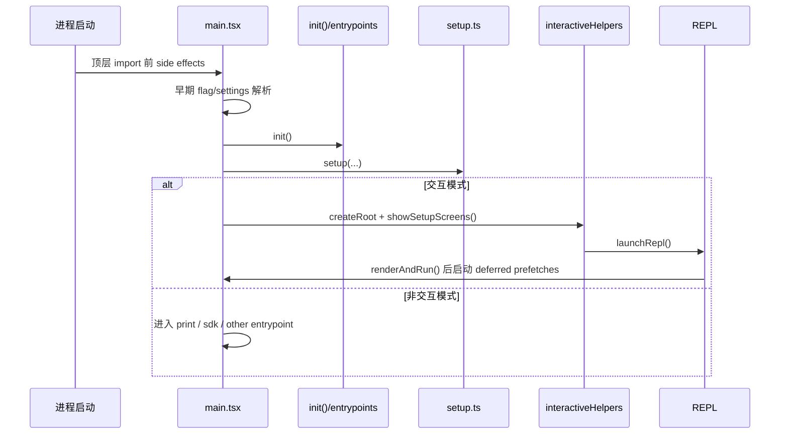

# 启动流程详解

## 1. 为什么启动流程值得单独讲

这个项目的启动阶段远不只是“parse argv 然后 render REPL”。源码里把启动拆成了多个阶段，每个阶段都带着明确目的：

- 缩短首屏时间。
- 避免在用户确认 trust 之前读取危险上下文。
- 把一些异步预取藏在用户尚未输入的时间窗口里。
- 在交互模式与非交互模式之间做严格分流。
- 让会话、插件、技能、MCP、worktree、tmux、telemetry 都在合适的时机上线。

## 2. 总体时序图

## 3. 阶段 0：比普通 import 更早的预取

关键代码：`src/main.tsx:1-20`

这里最值得注意的是顶部注释和三个顶层 side effect：

- `profileCheckpoint('main_tsx_entry')`
- `startMdmRawRead()`
- `startKeychainPrefetch()`

它们在其余重型 imports 之前执行，意图非常明确：

1. 先打启动性能埋点。
2. 尽早启动 MDM 读取。
3. 尽早启动 keychain/API key 读取。

这意味着启动团队已经观察到：

- 模块求值本身就很重。
- 某些平台相关读取是阻塞型的。
- 如果等到后面需要用时再同步读取，会拖慢首屏或 trust 后处理。

### 3.1 这类写法体现了什么

体现了两个工程判断：

- 启动性能已经细化到“几十毫秒级”的竞争。
- `main.tsx` 被当成启动编排器，而不是单纯入口文件。

## 4. 阶段 1：早期 settings / entrypoint 判定

关键代码：

- `src/main.tsx:498-516` `eagerLoadSettings()`
- `src/main.tsx:517-540` `initializeEntrypoint()`

### 4.1 为什么要“提前加载 settings”

`eagerLoadSettings()` 会在 `init()` 之前解析：

- `--settings`
- `--setting-sources`

原因是这些设置会影响后续初始化本身。如果等到后面再加载，会出现：

- 初始化已经按默认设置走完。
- 之后才发现真实 settings 需要不同策略。

源码注释明确说明了这一点：要让 settings 从初始化一开始就生效。

### 4.2 entrypoint 的真正用途

`initializeEntrypoint()` 会根据：

- 是否 `mcp serve`
- 是否 GitHub Action
- 是否交互模式

设置 `CLAUDE_CODE_ENTRYPOINT`，用于后续：

- 遥测归因
- 行为分流
- 某些上下文或权限逻辑的区分

也就是说，这不是一个普通字符串，而是“本次运行的身份标签”。

## 5. 阶段 2：`init()` 做基础初始化

关键文件：`src/entrypoints/init.ts`

虽然本轮主分析更多聚焦 `main.tsx` / `setup.ts`，但启动链里 `init()` 是必经层。它通常负责：

- 基础环境初始化。
- 遥测/全局状态基础搭建。
- 某些必须在 setup 之前完成的全局准备。

阅读上可以把它理解成：

> “真正进入业务启动前的 runtime bootstrap”

## 6. 阶段 3：`setup()` 负责把运行环境搭好

关键代码：`src/setup.ts:56-381`

这是真正的“会话级启动装配器”。

## 6.1 setup 的总职责

`setup()` 入参已经说明很多问题：

- `cwd`
- `permissionMode`
- `allowDangerouslySkipPermissions`
- `worktreeEnabled`
- `tmuxEnabled`
- `customSessionId`
- `messagingSocketPath`

说明 setup 不是单纯做环境变量处理，而是建立一整个“运行会话”。

## 6.2 最先处理的是基础安全与会话 ID

关键代码：

- `src/setup.ts:69-79` Node 版本检查
- `src/setup.ts:81-84` `switchSession(asSessionId(customSessionId))`

意义：

- 确保运行时版本下限。
- 把会话 ID 在尽早阶段稳定下来，避免后续存储与 telemetry 混乱。

## 6.3 再处理消息通道与 teammate 快照

关键代码：

- `src/setup.ts:86-110`

这里会在非 bare 模式下：

- 启动 UDS messaging server。
- 捕获 teammate mode snapshot。

源码注释特别强调：

- UDS server 要在任何 hook 运行前就绑定好。
- 因为 SessionStart hook 之类的逻辑可能立即读取 `process.env`。

这说明启动顺序并不是随意排列，而是被 hooks 生态倒逼出来的。

## 6.4 终端恢复逻辑说明这是一个“侵入式终端产品”

关键代码：`src/setup.ts:112-158`

这里会：

- 检查并恢复 iTerm2 backup
- 检查并恢复 Terminal.app backup

这一段告诉我们两个事实：

1. 这个项目不是简单 stdout/stderr CLI，而是会改终端行为或依赖终端特性。
2. 因此它必须在异常中断后恢复用户环境。

## 6.5 `setCwd()` 与 hooks 快照必须非常早

关键代码：

- `src/setup.ts:160-166`
- `src/setup.ts:171-172`

顺序是：

1. `setCwd(cwd)`
2. `captureHooksConfigSnapshot()`
3. `initializeFileChangedWatcher(cwd)`

这里的注释非常关键：

- 必须先设置 cwd。
- 否则 hooks 会从错误目录加载。

这说明 hooks 系统高度依赖项目目录，并且 setup 已经把“项目根上下文”当成所有后续逻辑的基础。

## 6.6 worktree 是 setup 的一级公民

关键代码：`src/setup.ts:174-285`

如果启用 `--worktree`，setup 会做一整套流程：

1. 判断当前是否在 git 仓库，或是否存在 WorktreeCreate hook。
2. 计算 slug。
3. 如有需要切换到主仓库根目录。
4. 创建 worktree。
5. 可选创建 tmux session。
6. `process.chdir(worktreePath)` 并重新 `setCwd()`。
7. 更新 originalCwd / projectRoot / worktree state。
8. 清理 memory cache，重新捕获 hooks/settings 视图。

### 6.6.1 为什么这段放在 `getCommands()` 之前

源码注释明确写了：

> 这一步必须发生在 `getCommands()` 之前，否则 `/eject` 不可用。

这说明命令系统本身就依赖 worktree 语义，也再次证明命令、项目根和启动顺序是耦合的。

## 7. 阶段 4：setup 中的后台任务与预取

关键代码：

- `src/setup.ts:287-304`
- `src/setup.ts:306-381`

### 7.1 setup 里只保留“首轮之前必须注册”的后台任务

例如：

- `initSessionMemory()`
- `initContextCollapse()`
- `lockCurrentVersion()`

这类逻辑虽然叫后台任务，但它们的注册时机必须早，否则第一轮 query 就可能拿不到相关能力。

### 7.2 命令预热被故意提前

`src/setup.ts:321-323` 会在适当条件下执行：

- `void getCommands(getProjectRoot())`

说明：

- 命令加载成本不低。
- 插件/技能/工作流的命令来源比较复杂。
- 因此要尽早把 command cache 热起来。

### 7.3 插件 hooks、commit attribution、file access hooks、team memory watcher 都在这里挂

这些都说明 setup 的职责是：

> 不是启动 UI，而是把“本次 session 的基础设施总线”搭起来。

### 7.4 `initSinks()` 和 `tengu_started`

关键代码：

- `src/setup.ts:371`
- `src/setup.ts:378`

顺序是：

1. `initSinks()` 先把 error/analytics sink 挂上。
2. 立刻发 `tengu_started`。

注释说得很清楚：

- 这是 session success rate 的分母事件。
- 必须在任何可能抛错的复杂逻辑之前尽早发送。

这类代码体现了生产系统思维，而不是纯功能思维。

## 8. 阶段 5：交互模式下创建 Ink root 与 setup screens

关键代码：`src/main.tsx:2211-2242`

交互模式下：

1. `getRenderContext(false)`
2. 动态 import `createRoot`
3. `root = await createRoot(...)`
4. `showSetupScreens(...)`

这个顺序说明：

- 要先创建终端渲染上下文。
- 再显示 onboarding/trust 等 setup screens。
- REPL 本体是在 setup screens 之后才真正启动。

## 9. `showSetupScreens()` 是启动中的“信任边界闸门”

关键代码：`src/interactiveHelpers.tsx:104-297`

它负责的事情远比“弹欢迎页”多：

- Onboarding
- TrustDialog
- MCP `mcp.json` 审批
- 外部 `CLAUDE.md` include 警告
- 应用完整 config environment variables
- 在 trust 之后初始化 telemetry
- Grove policy dialog
- 自定义 API key 审批
- bypass permissions 模式确认
- auto mode opt-in
- dev channels dialog
- Claude in Chrome onboarding

### 9.1 这里最关键的安全语义

在 trust 未建立前：

- 某些系统上下文不会预取。
- 某些环境变量不会完整应用。
- 某些外部 include 不会直接信任。

也就是说：

> trust dialog 并不是 UI 装饰，而是 runtime 的安全分界线。

### 9.2 trust 之后会发生什么

源码里能看到几个明确动作：

- `void getSystemContext()` 现在可以做了。
- `applyConfigEnvironmentVariables()` 现在可以做了。
- `setImmediate(() => initializeTelemetryAfterTrust())`

这三个动作特别能体现设计哲学：

- 上下文需要 trust。
- 环境变量需要 trust。
- 遥测也要等 trust 后再完全初始化，以免错过受信任配置。

## 10. 阶段 6：REPL 真正启动

关键代码：`src/replLauncher.tsx:12-21`

`launchRepl()` 的职责很纯粹：

- 懒加载 `App`
- 懒加载 `REPL`
- 用 `<App><REPL /></App>` 组合之后交给 `renderAndRun()`

这说明入口层与 UI 层的边界还是清晰的：

- 启动决策在 `main.tsx`
- 渲染包装在 `replLauncher.tsx`
- Provider 装配在 `components/App.tsx`
- 交互控制在 `REPL.tsx`

## 11. 阶段 7：首屏完成后再做 deferred prefetch

关键代码：

- `src/main.tsx:382-431` `startDeferredPrefetches()`
- `src/interactiveHelpers.tsx:98-102` `renderAndRun()`

`renderAndRun()` 的顺序是：

1. `root.render(element)`
2. `startDeferredPrefetches()`
3. `await root.waitUntilExit()`
4. `await gracefulShutdown(0)`

### 11.1 这一步非常重要

它说明 setup 里的预取与这里的 deferred prefetch 是故意分层的：

- setup 负责“首屏前必须具备”的能力。
- deferred prefetch 负责“首屏后可以慢慢补齐”的能力。

### 11.2 deferred prefetch 里做了什么

`startDeferredPrefetches()` 包括：

- `initUser()`
- `getUserContext()`
- `prefetchSystemContextIfSafe()`
- `getRelevantTips()`
- Bedrock / Vertex 凭证预取
- `countFilesRoundedRg()`
- analytics gates 初始化
- 官方 MCP URL 预取
- model capabilities 刷新
- settings / skill change detector 初始化

这基本就是：

> 把首轮输入体验所需但不阻塞首屏的工作，全部藏到首屏之后。

## 12. 交互模式与非交互模式的差异

## 12.1 非交互模式会跳过什么

- Trust dialog
- Ink root
- setup screens
- 很多纯 REPL 优化与 UI 预取

例如 `prefetchSystemContextIfSafe()` 明确写了：

- 非交互模式可直接认为执行环境已可信。

## 12.2 为什么要分得这么细

因为非交互模式的优化目标完全不同：

- 不需要首屏渲染体验。
- 更关心总执行延迟和可脚本化。
- 不应被交互式 onboarding、hooks UI、终端恢复逻辑拖慢。

## 13. 启动流程中的典型设计模式

## 13.1 “先小后大”

先做：

- 轻量的身份标记
- 关键安全边界
- 必要的会话状态

再做：

- UI
- 延迟预取
- 各种增强能力

## 13.2 “trust 后再解锁能力”

这是本项目启动流程最清晰的安全设计之一。

## 13.3 “首屏关键路径与首轮关键路径分开”

setup screens / Ink 首屏只是第一层目标。

用户真正关心的是：

- 首屏快不快。
- 第一条消息发出去后快不快。

因此源码把很多预取拆成：

- setup 前
- setup 中
- 首屏后

三段。

## 13.4 “生产监控优先级很高”

从 `profileCheckpoint`、`tengu_started`、startup timer、frame timing log、telemetry-after-trust 可以看出：

- 这套系统极其重视启动可观测性。

## 14. 启动链路关键文件地图

| 文件 | 启动角色 |
| --- | --- |
| `src/main.tsx` | 总入口与模式分流 |
| `src/entrypoints/init.ts` | runtime bootstrap |
| `src/setup.ts` | 会话级环境初始化 |
| `src/interactiveHelpers.tsx` | setup screens、render context、renderAndRun |
| `src/replLauncher.tsx` | App + REPL 装配 |
| `src/components/App.tsx` | Provider 包装层 |

## 15. 本文结论

这套启动流程的核心不是“把 REPL 打开”，而是：

1. 先用极早期 side effects 抢占性能关键路径。
2. 用 `setup()` 建立会话环境、hooks、worktree、prefetch 基础设施。
3. 用 `showSetupScreens()` 建立 trust 边界并完成交互式 gating。
4. 再进入 REPL。
5. 首屏之后才补做剩余预取。

这也是为什么后续阅读请求链路时，你会发现很多逻辑都依赖启动阶段已经准备好的：

- `cwd`
- `AppState`
- hooks snapshot
- command cache
- permission mode
- trust state
- telemetry sinks

没有这条启动主线，后面的 query 主循环就无法稳定运行。
