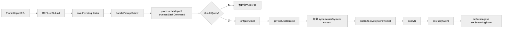

# REPL 与状态管理

本文聚焦交互模式下的控制中心，即 `REPL.tsx` 周边的状态、事件和消息流。

## 1. 为什么 `REPL.tsx` 是理解全工程的第二入口

交互模式下的运行控制中心是：

- `src/screens/REPL.tsx`

因为它负责：

- 接收用户输入
- 管理消息列表
- 构造 `ToolUseContext`
- 调用 `handlePromptSubmit`
- 驱动 `query()`
- 处理流式消息
- 接驳后台任务、远程会话、队列、收件箱、邮箱桥接

它可以视为：

> “交互式会话控制器 + TUI 视图容器”

## 2. 最外层组件树

关键代码：

- `src/replLauncher.tsx:12-21`
- `src/components/App.tsx`

整体装配大致如下：

### 2.1 `App.tsx` 的作用

`src/components/App.tsx` 虽然很薄，但它说明：

- 性能指标、统计、AppState 上下文是整个 REPL 的基础 Provider。
- 这些东西不是挂在单个局部组件上，而是全局会话级能力。

## 3. 自研 store 的设计

关键代码：`src/state/store.ts`

这个 store 很薄，核心只有：

- `getState`
- `setState`
- `subscribe`

并且 `setState` 只有在 `Object.is(next, prev)` 为 false 时才通知。

### 3.1 为什么不用重型状态库

从源码风格可以看出原因：

- 这个项目有大量高频小更新，例如 streaming progress、tool status、消息追加、任务状态变化。
- 很多上下文不仅供 React 使用，还供 query、tools、agents、SDK 直接调用。
- 因此需要的是：
  - 极低抽象成本
  - 低订阅开销
  - 易于在 React 外部复用

## 4. `AppState` 是系统总状态表

关键代码：

- `src/state/AppState.tsx`
- `src/state/AppStateStore.ts`

### 4.1 `AppStateProvider` 做了什么

`AppStateProvider` 会：

- 用 `createStore(initialState ?? getDefaultAppState(), onChangeAppState)` 创建 store。
- 把 store 挂入 React Context。
- 订阅 settings change 并应用设置变更。
- 包装 `MailboxProvider` 与 `VoiceProvider`。

### 4.2 `AppState` 包含哪些重要模块

从 `AppStateStore.ts` 可以看出它不是一个简单的 UI state，而是运行时总状态：

- `toolPermissionContext`
- `mcp`
- `tasks`
- `plugins`
- `agentDefinitions`
- `fileHistory`
- `attribution`
- `notifications`
- `todos`
- `promptSuggestion`
- `elicitation`
- `effortValue`
- `fastMode`
- `advisorModel`
- `bridge callbacks`

这说明 REPL 不是“一个组件”，而是“整个会话操作系统的前端外壳”。

## 5. REPL 初始化时会装配哪些关键能力

关键代码锚点：

- `src/screens/REPL.tsx:808`
- `src/screens/REPL.tsx:811`
- `src/screens/REPL.tsx:832-833`
- `src/screens/REPL.tsx:3889`
- `src/screens/REPL.tsx:4040`

初始化阶段至少会装上这些 hook：

- `useSwarmInitialization(...)`
- `useMergedTools(...)`
- `useMergedCommands(...)`
- `useQueueProcessor(...)`
- `useMailboxBridge(...)`
- `useInboxPoller(...)`

### 5.1 这意味着什么

REPL 初始化不是单纯加载一个输入框，而是在建立多个“交互通道”：

- 本地输入通道
- 命令/工具池通道
- 后台任务通知通道
- 收件箱通道
- 邮箱桥接通道
- agent swarm 通道

## 6. 工具池和命令池是在 REPL 内合并的

关键代码：

- `src/screens/REPL.tsx:811`
- `src/screens/REPL.tsx:832-833`

逻辑大意：

- `useMergedTools(combinedInitialTools, mcp.tools, toolPermissionContext)`
- 先把本地命令与插件命令合并
- 再把结果与 MCP 命令合并

说明：

- REPL 持有的是“当前会话可见能力”的最终视图。
- 命令与工具都不是静态常量，它们会随着插件、MCP、权限上下文变化而变化。

## 7. `onQueryEvent`：流式消息怎么落到 UI

关键代码：`src/screens/REPL.tsx:2584-2660`

这段代码是 REPL 接收 query streaming 结果的关键入口。

### 7.1 它做了什么

- 调用 `handleMessageFromStream(...)`
- 根据消息类型更新 `messages`
- 对 compact boundary 做特殊处理
- 对部分 ephemeral progress 做“替换最后一条”而不是追加
- 更新 response length、spinner mode、streaming tool uses、thinking 状态
- 处理 tombstone 消息，删除旧消息并同步 transcript

### 7.2 为什么要替换 ephemeral progress

源码注释给了非常直白的解释：

- `Sleep` / `Bash` 之类的 progress 每秒都可能来一条。
- 如果全部 append，消息数组和 transcript 会迅速膨胀。

这类实现说明 REPL 层不仅显示消息，还必须承担消息膨胀控制。

## 8. `onQueryImpl`：交互式主线程 query 入口

关键代码：`src/screens/REPL.tsx:2661-2803`

这是整个交互链路里最重要的一段。

## 8.1 它的职责不是“调一下 query”

它在真正调用 `query()` 前后做了很多事：

1. IDE 集成准备。
2. 项目 onboarding 完成标记。
3. 首条真实用户消息触发 session title 生成。
4. 把 slash command 限制出来的 `additionalAllowedTools` 写回 store。
5. 处理 `shouldQuery === false` 的短路场景。
6. 生成 `ToolUseContext`。
7. 根据 `effort` 覆写 query 级 `getAppState()`。
8. 并行加载：
   - bypass/auto mode 检查
   - 默认 system prompt
   - userContext
   - systemContext
9. 拼装最终 system prompt。
10. 调用 `query(...)`。
11. 消费 query 事件并更新 UI。

### 8.2 `ToolUseContext` 是在这里按 turn 构造的

`src/screens/REPL.tsx:2746-2755` 表明：

- query 不是拿一个全局固定 context。
- 每一轮都要根据最新 messages、abortController、model、store 中的 mcp/tools 重新计算。

这保证了：

- MCP 中途连上工具后，新 turn 可以立刻看见。
- slash command 改了 model/allowedTools 后，新 turn 立即生效。

## 9. `onSubmit`：用户点击回车后到底发生什么

关键代码：`src/screens/REPL.tsx:3488-3519`

主线程路径是：

1. 等待 pending hooks。
2. 调用 `handlePromptSubmit({...})`。
3. 把 `queryGuard`、`commands`、`messagesRef.current`、`mainLoopModel`、`onQuery`、`canUseTool` 等都传进去。

真正的输入编排逻辑下放给 `handlePromptSubmit`，而 REPL 负责把当前会话环境一并打包进去。

## 10. 队列处理为什么放在 REPL 而不是 query

关键代码：

- `src/screens/REPL.tsx:3861-3889`
- `src/screens/REPL.tsx:3889-3893`

REPL 中定义了 `executeQueuedInput(...)`，然后交给：

- `useQueueProcessor({ executeQueuedInput, hasActiveLocalJsxUI, queryGuard })`

这说明：

- 队列是交互层概念。
- query 只关心“现在这一轮该跑什么”。
- 至于“当前 query 正在忙，新的 prompt 要不要排队”，这是 REPL 的职责。

## 11. REPL 还承担后台任务与远程会话入口

关键代码：

- `src/screens/REPL.tsx:3994-4019`
- `src/screens/REPL.tsx:4040-4043`

### 11.1 `handleIncomingPrompt`

REPL 可以接受：

- teammate message
- tasks mode item
- mailbox bridge 消息

然后将其转成新的用户消息，直接触发 `onQuery(...)`。

但它也会先检查：

- `queryGuard.isActive`
- 队列里是否已有用户 prompt/bash

这说明系统把“用户显式输入”优先级放得更高。

### 11.2 `useMailboxBridge`

表示 REPL 并不只从输入框接收消息，也能从外部桥接通道接收消息。

## 12. REPL 中大量 `ref` 与稳定 callback 的真正意义

关键代码：

- `src/screens/REPL.tsx:3537-3545`
- `src/screens/REPL.tsx:3608-3621`

这些注释非常值得认真读，因为它们不是小优化，而是“长期会话内存治理”。

例如源码明确写到：

- `messages` 变化太频繁，如果让 `onSubmit` 跟着重建，会导致旧 REPL scope 被闭包引用，形成内存滞留。
- 用 `onSubmitRef` 保持某些 prop-drilled callback 稳定，能显著减少长会话下的内存保留。

这说明：

- REPL 的设计目标并不是“能工作就行”。
- 它明确在面向多百轮、多千轮会话进行内存优化。

## 13. REPL 内部状态与运行时状态的边界

可以把 REPL 的状态分成两类：

### 13.1 纯 UI 状态

例如：

- 输入框内容
- 光标位置
- 是否显示 selector/dialog
- streamMode

### 13.2 会话运行时状态

例如：

- `messages`
- `abortController`
- `queuedCommands`
- `toolPermissionContext`
- `tasks`
- `mcp tools`

前者主要服务渲染，后者则直接影响 query、tools、agents。

## 14. REPL 不是孤立页面，而是会话总线枢纽

从结构上看，REPL 同时连着：

- `AppState`
- `messageQueueManager`
- `QueryGuard`
- `query()`
- `ToolUseContext`
- 后台 Agent 任务
- 远程 session
- bridge / mailbox
- transcript logging

因此它更像：

> “交互式主线程调度中心”

## 15. 一次完整交互在 REPL 中的流动图

## 16. REPL 上还挂着几套容易被低估的前台子系统

`doc/0402.md` 里提到的 `Bridge`、`Voice`、`BUDDY`、`Inbox`，并不是落在仓库边角的彩蛋；它们大多直接挂在 REPL 外壳和 `AppState` 上。

### 16.1 Bridge 不是一个对话框，而是一条双向远程控制链

关键代码：

- `src/state/AppStateStore.ts`
- `src/commands/bridge/bridge.tsx`
- `src/bridge/replBridge.ts`

从 `AppStateStore.ts` 可以直接看到一整套 `replBridge*` 状态：

- `replBridgeEnabled`
- `replBridgeConnected`
- `replBridgeSessionActive`
- `replBridgeReconnecting`
- `replBridgeConnectUrl`
- `replBridgeSessionUrl`
- `replBridgeEnvironmentId`
- `replBridgeSessionId`

`/remote-control` 命令本身并不执行桥接逻辑，它做的是：

1. 修改 `replBridgeEnabled` / `replBridgeExplicit` 之类的状态位。
2. 让 `REPL.tsx` 中的 bridge hook 去真正建立连接。

`src/bridge/replBridge.ts` 则给出了这条链的真实边界：

- 注册环境
- 创建 bridge session
- 建立 ingress WebSocket
- 同步消息与 SDK message
- 转发 control request / response
- 处理 reconnect、heartbeat、teardown

所以 `Bridge` 的代码级定义不是“生成一个二维码给网页扫”，而是：

> 把本地 REPL 变成 claude.ai / code 侧 session 的双向 worker。

### 16.2 Voice 是一套原生音频链路，不是输入框小功能

关键代码：

- `src/state/AppState.tsx`
- `src/context/voice.tsx`
- `src/hooks/useVoiceIntegration.tsx`
- `src/services/voice.ts`

`AppStateProvider` 会在 `feature('VOICE_MODE')` 打开时包裹 `VoiceProvider`，这说明语音不是单个组件状态，而是会话级 Provider。

`context/voice.tsx` 维护的是一份独立 voice store：

- `voiceState`
- `voiceError`
- `voiceInterimTranscript`
- `voiceAudioLevels`
- `voiceWarmingUp`

`useVoiceIntegration.tsx` 把按键事件、输入框插入、interim transcript、光标锚点拼成完整的 push-to-talk 体验；`services/voice.ts` 则负责真正的录音后端：

- 优先 native `audio-capture-napi`
- Linux 下可退回 `arecord`
- 再不行则退回 `sox rec`

所以 `0402.md` 里“Voice 原生语音交互引擎”这个判断在代码层是站得住的，至少当前树里保留了完整的 Provider、hook 和 native audio service 结构。

### 16.3 Buddy / Companion 仍有完整前台与 prompt 痕迹，但命令入口在当前树里不完整

关键代码：

- `src/buddy/CompanionSprite.tsx`
- `src/buddy/companion.ts`
- `src/buddy/prompt.ts`
- `src/screens/REPL.tsx`
- `src/commands/buddy/index.ts`

REPL 会直接渲染：

- `CompanionSprite`
- `CompanionFloatingBubble`

`AppStateStore.ts` 里也有配套状态：

- `companionReaction`
- `companionPetAt`

`buddy/prompt.ts` 进一步说明它不只是 UI 装饰。`getCompanionIntroAttachment()` 会把 companion 信息以 attachment 注入给主模型，并明确要求主模型：

- 不要假装自己就是 companion
- 用户在和 companion 说话时，主模型只做最小让位

但当前反编译树里 `src/commands/buddy/index.ts` 是一个 auto-generated stub。也就是说：

- companion 的 sprite、状态、prompt 注入链仍然存在
- `/buddy` 这个命令入口在当前仓库快照里并不是完整实现

因此 `BUDDY` 更准确的代码结论是：

> 前台子系统和 prompt 接缝还在，但命令层实现并未在当前反编译树中完整保留。

### 16.4 Inbox 不是单一路径，而是内存邮箱、文件邮箱和 UDS 接缝并存

关键代码：

- `src/context/mailbox.tsx`
- `src/utils/mailbox.ts`
- `src/utils/teammateMailbox.ts`
- `src/setup.ts`
- `src/utils/udsMessaging.ts`

REPL 最外层会包 `MailboxProvider`。这里的 `Mailbox` 是一个进程内消息队列，用来承接：

- teammate message
- system message
- task notification
- tick 类信号

而真正持久化的 teammate inbox 在 `teammateMailbox.ts`：

- 存储路径是 `~/.claude/teams/<team>/inboxes/<agent>.json`
- 写入时有 `.lock` 文件保证并发安全
- unread / read 标记都是文件级状态

这说明当前树里可明确验证的“跨会话通信”底座首先是：

> 基于文件的 teammate mailbox，而不是抽象消息总线。

与此同时，`UDS_INBOX` 这条线也真实存在：

- `setup.ts` 会在 feature 打开时调用 `startUdsMessaging(...)`
- `main.tsx` 支持 `messagingSocketPath`
- `commands.ts` / `tools.ts` 会在 `UDS_INBOX` 打开时注册 `peers` 命令和 `ListPeersTool`

但当前仓库里的 `src/utils/udsMessaging.ts` 是 stub。也就是说：

- UDS 入口、命令门控和启动缝合点都还在
- 真正能从当前树完整读通并验证的 durable inbox 机制，仍是文件邮箱这条链

## 17. 源码阅读顺序

推荐优先关注以下区段：

1. 初始化 hook 区域：看 REPL 挂了哪些能力。
2. `onSubmit`：看用户输入如何进入系统。
3. `onQueryEvent`：看流式响应如何落到 UI。
4. `onQueryImpl`：看 UI 如何拼出一次 query。
5. 队列与 incoming prompt：看会话如何接纳非输入框来源的消息。

## 18. 总结

`REPL.tsx` 的核心价值不是“渲染聊天窗口”，而是把整个交互运行时协调起来：

- `AppState` 负责全局会话状态。
- REPL 负责把输入、队列、query、后台任务、远程会话连接起来。
- `onQueryImpl` 是交互主线程进入 query 引擎的桥。
- `onQueryEvent` 是 query 结果回流到 UI 的桥。

输入链路与 `query()` 主循环都通过 REPL 这一层接入交互运行时。
