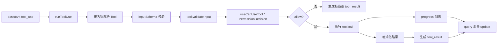

# 工具系统与权限机制

## 1. 为什么工具系统是这套工程的主轴

在这套代码里，模型不是“只会输出文本”，而是被设计成一个会持续调用工具的 Agent。

因此工具系统必须同时解决：

1. 工具如何定义与暴露给模型。
2. 工具如何校验输入。
3. 工具调用前如何判定权限。
4. 哪些工具可以并发，哪些必须串行。
5. 工具结果如何回流进消息流。
6. MCP 工具、Agent 工具、内建工具如何统一。

这套能力主要分布在：

- `src/Tool.ts`
- `src/tools.ts`
- `src/hooks/useCanUseTool.tsx`
- `src/services/tools/toolOrchestration.ts`
- `src/services/tools/toolExecution.ts`
- `src/services/tools/StreamingToolExecutor.ts`

## 2. `Tool.ts`：工具协议层

关键代码：

- `src/Tool.ts:123-138` `ToolPermissionContext`
- `src/Tool.ts:158-260` `ToolUseContext`
- `src/Tool.ts:358-362`
- `src/Tool.ts:783` `buildTool(...)`

## 2.1 `ToolPermissionContext`

这不是一个简单的“允许/拒绝”布尔值，而是一整组权限环境：

- `mode`
- `additionalWorkingDirectories`
- `alwaysAllowRules`
- `alwaysDenyRules`
- `alwaysAskRules`
- `isBypassPermissionsModeAvailable`
- `shouldAvoidPermissionPrompts`
- `awaitAutomatedChecksBeforeDialog`
- `prePlanMode`

这说明权限系统不是单点判断，而是一个上下文敏感的策略系统。

## 2.2 `ToolUseContext`

这是工具调用时最核心的运行时上下文，前文已提到。它把下面这些东西放在一起：

- 可见 tools/commands
- 当前 model 与 thinking config
- mcp clients / resources
- app state getter/setter
- messages
- read file cache
- response / stream / notification 回调
- agent 相关上下文

所以一个工具不仅能拿到输入，还能拿到整个 turn 宇宙。

## 2.3 `buildTool()` 的意义

`buildTool()` 的存在说明工具定义不是随意对象，而是一个标准化 DSL。

它能统一填补：

- 默认行为
- schema 能力
- 调用接口
- 展示属性

这样所有工具才能被同一套 orchestration 系统消费。

## 3. `tools.ts`：工具池装配器

关键文件：`src/tools.ts`

这层负责三件事：

1. 返回所有内建基础工具。
2. 根据权限上下文过滤工具。
3. 把 MCP 工具与内建工具合并成最终 tool pool。

### 3.1 `getAllBaseTools()`

会把大量工具注册进来，例如：

- Bash / PowerShell
- 读写编辑文件
- WebFetch / WebSearch
- Todo / Task
- MCP 相关
- SkillTool
- AgentTool
- 计划模式工具

这意味着模型看到的 tool list 本身就代表了“产品能力边界”。

### 3.2 `getTools(permissionContext)`

它会根据：

- deny 规则
- simple mode
- REPL mode
- `isEnabled()`

筛掉不可用工具。

### 3.3 `assembleToolPool(permissionContext, mcpTools)`

这一步很重要，因为它不仅合并工具，还会做去重与顺序稳定。

顺序稳定的意义在于：

- 工具 schema 序列化顺序会影响 prompt cache。

## 4. REPL 中的工具池不是静态常量

关键代码：`src/screens/REPL.tsx:811`

REPL 通过 `useMergedTools(...)` 把：

- 初始工具
- MCP 动态工具
- 当前权限上下文

组合成“当前 turn 实际可见的工具池”。

这表示工具系统是运行时可变的，而不是进程启动时一次性决定。

## 5. 权限判定：`useCanUseTool`

关键文件：`src/hooks/useCanUseTool.tsx`

这是工具调用前权限判定的总入口。

## 5.1 输入输出形态

大致形态是：

```ts
async (tool, input, toolUseContext, assistantMessage, toolUseID, forceDecision?)
  => Promise<PermissionDecision>
```

返回结果通常是：

- `allow`
- `deny`
- `ask`
- 被取消

## 5.2 它不只是弹权限框

源码逻辑表明它会做：

- 构造 permission context
- 调用 `hasPermissionsToUseTool`
- 记录 classifier 自动批准/拒绝
- 某些 auto mode 拒绝通知
- 协调 coordinator / swarm worker 的权限流
- speculative bash classifier grace period
- 最后才落到交互式 permission dialog

也就是说权限路径大致是：

> 静态规则 -> 自动化判断 -> 协调模式特判 -> 交互式确认

## 6. 工具执行总编排：`runTools()`

关键代码：`src/services/tools/toolOrchestration.ts:19-82`

`runTools()` 的职责不是直接执行单个工具，而是对一批 `tool_use` block 做批处理编排。

## 6.1 批处理策略

通过 `partitionToolCalls(...)`，它会把工具调用分成：

- 并发安全批
- 非并发安全批

判定依据是：

- 找到对应 tool
- 用 `inputSchema.safeParse(...)` 解析输入
- 调用工具自己的 `isConcurrencySafe(parsedInput.data)`

### 6.1.1 为什么这个判断放在工具定义里

因为并发安全不是全局固定属性，常常与输入有关。

例如：

- 读文件通常并发安全
- 写文件、改状态、执行 shell 可能不安全

## 6.2 并发批与串行批的差异

### 并发批

- 用 `all(...)` 并行跑
- 收集 context modifier
- 等整批结束后再按 tool block 顺序应用 context modifier

### 串行批

- 逐个 `runToolUse(...)`
- 每个工具的 context 修改立刻生效

这里非常讲究一致性：

- 并发工具可以一起跑，但它们对共享上下文的修改不能乱序。

## 7. `runToolUse()`：单个工具调用生命周期

关键代码：`src/services/tools/toolExecution.ts:337-489`

流程大致是：

1. 根据 `toolUse.name` 在当前 tool pool 中找工具。
2. 如果找不到，再尝试通过 deprecated alias 找基础工具。
3. 如果仍找不到，生成 `tool_result` 错误消息。
4. 如果 query 已 aborted，返回 cancel tool_result。
5. 否则进入 `streamedCheckPermissionsAndCallTool(...)`。

### 7.1 为什么未知工具也要返回 `tool_result`

因为模型对话协议要求：

- `tool_use` 之后要有对应 `tool_result`

否则消息链会不匹配，下一轮会更糟。

## 8. `streamedCheckPermissionsAndCallTool()`：把 progress 与结果合并成一个异步流

关键代码：`src/services/tools/toolExecution.ts:492-570`

这里用一个 `Stream<MessageUpdateLazy>` 做了桥接：

- 工具执行过程中发 progress message
- 工具结束后再发最终 result message

这样 query 主循环只需要消费一个统一的异步迭代器。

## 9. `checkPermissionsAndCallTool()`：真正的工具调用主体

关键代码：`src/services/tools/toolExecution.ts:599-720` 以及其后续主体

这段逻辑至少包含：

1. Zod `inputSchema` 校验
2. tool 级 `validateInput`
3. 权限判定
4. hook 前后处理
5. 真正执行 tool.call
6. 格式化结果
7. 错误分类
8. 生成 `tool_result`

### 9.1 输入 schema 校验非常早

如果 `safeParse` 失败：

- 会生成结构化错误提示。
- 对 deferred tool 还会补充 “schema not sent hint”。

### 9.1.1 为什么有 “schema not sent hint”

因为某些延迟加载工具如果没被送入 prompt，模型可能会把数组/数字等参数错误地生成为字符串。

系统会提示模型：

- 先调用 ToolSearch 之类的机制把这个工具 schema 加载进 prompt，再重试。

这属于非常典型的“面向 LLM 失配模式”的工程补丁。

## 10. 流式工具执行器：`StreamingToolExecutor`

关键文件：`src/services/tools/StreamingToolExecutor.ts`

它的存在说明：

- 工具调用已经不是“等模型回答完再统一执行”。
- 系统希望在 streaming 过程中边接收边调度工具。

它通常管理：

- queued
- executing
- completed
- yielded

并处理：

- sibling cancellation
- bash error 后的传播
- interruptibility
- discard 旧结果

## 11. 权限与工具执行的完整图



## 12. MCP 工具与普通工具是如何统一的

从 orchestration 角度看，MCP 工具并没有完全特殊化：

- 依然会变成 `Tool` 抽象。
- 依然会经过同样的 permission / input validation / result formatting 主链路。

它们的特殊性主要体现在：

- 实际调用落到 `services/mcp/client.ts`
- 可能需要 OAuth / session / URL elicitation 处理

这是一种很好的架构结果：

- 扩展能力没有破坏内核协议。

## 13. AgentTool 为什么也是工具系统的一部分

`AgentTool` 虽然启动的是子代理，但从模型主循环视角，它依然只是一个 Tool。

这意味着：

- 模型调用 AgentTool 与调用 BashTool 在协议层没有本质区别。
- 子代理只是工具系统的一种高级能力。

这也是整个工程能做到“模型调用模型”的根本原因。

## 14. 工具结果为什么最终还是消息

无论是普通工具、MCP 工具还是 AgentTool，最终都会生成消息流中的一环：

- `tool_result`
- `progress`
- `attachment`

这样 query 主循环就可以继续复用统一消息协议，而不用为每种工具单独设计回流通道。

## 15. 关键源码锚点

| 主题 | 代码锚点 | 说明 |
| --- | --- | --- |
| 权限上下文定义 | `src/Tool.ts:123-138` | Tool 权限环境的结构 |
| ToolUseContext | `src/Tool.ts:158-260` | 工具运行时上下文 |
| 批处理入口 | `src/services/tools/toolOrchestration.ts:19-82` | 工具批编排 |
| 并发安全分区 | `src/services/tools/toolOrchestration.ts:91-115` | 为什么有并发批与串行批 |
| 单工具执行 | `src/services/tools/toolExecution.ts:337-489` | 单个 tool_use 的生命周期 |
| progress 流桥接 | `src/services/tools/toolExecution.ts:492-570` | progress 与结果如何统一成 async iterable |
| 输入校验 | `src/services/tools/toolExecution.ts:599-720` | safeParse + validateInput |
| 权限入口 | `src/hooks/useCanUseTool.tsx` | allow / deny / ask 决策链 |

## 16. 本文结论

工具系统是这套工程的执行总线：

- `Tool.ts` 定义协议。
- `tools.ts` 组装当前可见能力。
- `useCanUseTool` 决定“能不能执行”。
- `runTools` / `runToolUse` 决定“怎样安全执行”。
- `tool_result` 再把执行结果送回 query。

因此从架构角度看，工具不是模型的附属物，而是整个 Agent Runtime 的第一公民。
