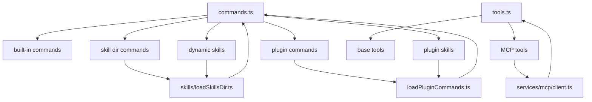

# 扩展体系：技能、插件与 MCP

## 1. 这套工程为什么扩展能力这么强

因为它没有把“扩展”做成边缘插件，而是把扩展直接接进了两条核心总线：

1. 命令总线
2. 工具总线

于是：

- 技能会变成 slash command
- 插件会贡献命令、技能、hooks、agent
- MCP server 会贡献工具、资源，甚至在 SDK 模式下同进程运行

这也是为什么 `src/commands.ts`、`src/skills/loadSkillsDir.ts`、`src/utils/plugins/loadPluginCommands.ts`、`src/services/mcp/client.ts` 都必须放在一篇里讲。

## 2. 命令装配总入口：`commands.ts`

关键代码：

- `src/commands.ts:225-254` `INTERNAL_ONLY_COMMANDS`
- `src/commands.ts:258-346` `COMMANDS()`
- `src/commands.ts:449-469` `loadAllCommands(...)`
- `src/commands.ts:476-517` `getCommands(cwd)`

## 2.1 `COMMANDS()` 是内建命令表

它包含大量 built-in `/xxx` 命令，例如：

- `/clear`
- `/compact`
- `/config`
- `/memory`
- `/model`
- `/review`
- `/permissions`
- `/tasks`
- `/mcp`

并且会受 feature flags 与用户类型影响。

## 2.2 `getCommands(cwd)` 不是简单返回内建列表

它会合并：

- bundled skills
- builtin plugin skills
- skill directory commands
- workflow commands
- plugin commands
- plugin skills
- built-in commands
- dynamic skills

也就是说，用户最终能输入的 `/xxx` 命令集合，是运行时动态拼出来的。

## 3. 技能系统：`loadSkillsDir.ts`

关键代码：

- `src/skills/loadSkillsDir.ts:270-400` `createSkillCommand(...)`
- `src/skills/loadSkillsDir.ts:923-975` `addSkillDirectories(...)`
- `src/skills/loadSkillsDir.ts:981-983` `getDynamicSkills()`
- `src/skills/loadSkillsDir.ts:997-1035` `activateConditionalSkillsForPaths(...)`

## 3.1 技能本质上会被编译成 `Command`

`createSkillCommand(...)` 会把技能 frontmatter + Markdown 内容转成统一的 `Command` 对象，并挂上：

- `name`
- `description`
- `allowedTools`
- `argumentHint`
- `argNames`
- `whenToUse`
- `version`
- `model`
- `disableModelInvocation`
- `userInvocable`
- `context`
- `agent`
- `effort`

这很关键，因为它说明：

- 技能不是另一套 DSL。
- 技能就是一种特殊来源的 prompt command。

## 3.2 技能 prompt 生成时做了哪些事

`getPromptForCommand(args, toolUseContext)` 里会做：

- 拼上 `Base directory for this skill`
- 参数替换
- 替换 `${CLAUDE_SKILL_DIR}`
- 替换 `${CLAUDE_SESSION_ID}`
- 如非 MCP 来源技能，还会执行技能 Markdown 内的 shell 注入

这使技能具备很强的上下文感知能力。

## 3.3 为什么 MCP 技能被特别防护

源码明确写了：

- MCP skills 是 remote and untrusted
- 不允许执行其 Markdown 里的 inline shell commands

这说明技能扩展虽强，但系统明确区分本地可信技能与远程不可信技能。

## 4. 动态技能发现不是启动时一次性完成

关键代码：`src/skills/loadSkillsDir.ts:923-975`

`addSkillDirectories(dirs)` 允许系统在运行过程中动态加载新的 skill 目录。

典型场景：

- 文件操作触发了新的 skill dir discovery
- 目录更深的 skill 覆盖浅层 skill

这解释了为什么命令表并非静态，也解释了 REPL 里为什么要有 `useMergedCommands(...)`。

## 5. 条件技能：按文件路径激活

关键代码：`src/skills/loadSkillsDir.ts:997-1035`

条件技能的逻辑是：

- skill frontmatter 声明 `paths`
- 当用户对某些文件进行操作时，系统把文件路径喂给 `activateConditionalSkillsForPaths(...)`
- 命中的 skill 会被移入 dynamic skills

这说明技能系统不仅是“手动 `/skill` 调用”，还是一种：

> 基于当前工作集的条件化提示词注入系统

## 6. 插件系统：`loadPluginCommands.ts`

关键代码：

- `src/utils/plugins/loadPluginCommands.ts:102-130` 收集 markdown
- `src/utils/plugins/loadPluginCommands.ts:135-167` skill 目录转换
- `src/utils/plugins/loadPluginCommands.ts:169-213` 目录转命令
- `src/utils/plugins/loadPluginCommands.ts:218-402` `createPluginCommand(...)`
- `src/utils/plugins/loadPluginCommands.ts:414-420` `getPluginCommands()`

## 6.1 插件命令与插件技能都归一成 Markdown -> Command

插件目录里的 Markdown 文件会被扫描，然后：

- 普通 `.md` 作为 plugin command
- `SKILL.md` 目录结构作为 plugin skill

这和本地技能系统高度统一。

## 6.2 命名空间设计

插件命令的名字会根据：

- plugin 名
- 相对路径命名空间
- 文件名或 skill 目录名

拼成类似：

- `pluginName:foo`
- `pluginName:namespace:skill`

这样既避免重名，又保留了来源信息。

## 6.3 插件 prompt 在生成时会做变量替换

包括：

- `${CLAUDE_PLUGIN_ROOT}`
- `${CLAUDE_PLUGIN_DATA}`
- `${CLAUDE_SKILL_DIR}`
- `${CLAUDE_SESSION_ID}`
- `${user_config.X}`

并且：

- 对敏感 user config 不会把秘密直接放进 prompt

这说明插件系统既追求能力，又兼顾安全边界。

## 6.4 插件命令也支持 shell 注入

和技能类似，插件命令/技能最终也能通过 `executeShellCommandsInPrompt(...)` 把局部 shell 输出并入 prompt。

所以从执行效果看，插件是一等扩展，不是薄外壳。

## 7. MCP 客户端：把外部能力接入工具系统

关键文件：`src/services/mcp/client.ts`

从搜索结果可以看到它同时支持多种 transport：

- `stdio`
- `sse`
- `http`
- `claudeai-proxy`
- `ws`
- SDK in-process transport

这意味着 MCP 在这套系统里并不是“一个简单 HTTP adapter”，而是完整的多传输协议能力层。

## 8. MCP 工具调用如何处理复杂异常

关键代码：`src/services/mcp/client.ts:2813-3026`

`callMCPToolWithUrlElicitationRetry(...)` 体现了 MCP 接入的工程深度。

### 8.1 它会处理 `UrlElicitationRequiredError`

流程是：

1. 调用 MCP tool。
2. 如果收到 `-32042 UrlElicitationRequired`：
   - 提取 elicitation 列表
   - 先跑 elicitation hooks
   - SDK/print 模式走 `handleElicitation`
   - REPL 模式则排入 `AppState.elicitation.queue`
3. 用户或 hook 接受后重试 tool call

这说明 MCP 工具调用并不是“一次函数调用”，而可能插入新的用户交互。

## 8.2 普通 MCP tool call 还带 timeout、progress、auth/session 恢复

关键代码：`src/services/mcp/client.ts:3029-3245`

`callMCPTool(...)` 会做：

- 自定义超时 race
- 30 秒一轮的长任务进度日志
- SDK progress 转换成 `mcp_progress`
- 处理 401 -> `McpAuthError`
- 处理 session expired -> 清缓存并抛 `McpSessionExpiredError`

这说明 MCP 客户端层不仅接协议，还负责连接生命周期治理。

## 9. SDK 模式下还支持 in-process MCP

关键代码：`src/services/mcp/client.ts:3262-3335`

`setupSdkMcpClients(...)` 会：

- 用 `SdkControlClientTransport`
- 建立同进程 client
- 拉取 capabilities
- 拉取 tools
- 生成 connected/failed 的 MCPServerConnection

这很重要，因为它让：

- REPL 模式的外部 MCP
- SDK 模式的同进程 MCP

都能统一注入同一套工具系统。

## 10. 扩展体系总图

## 11. 这套扩展体系的设计优点

## 11.1 协议统一

技能、插件、MCP 没有各搞一套调用协议，而是最终落到：

- `Command`
- `Tool`
- `Message`

这让主循环可以保持稳定。

## 11.2 来源隔离

源码里会保留：

- source
- loadedFrom
- pluginInfo
- marketplace/repository 元数据

这有利于：

- 权限策略
- telemetry
- UI 来源展示

## 11.3 运行期可增量变化

命令和工具池都能在运行时变化：

- 新 MCP server 连上
- 动态技能被激活
- 插件热更新

因此扩展系统不是“启动时注册完就不变”的传统插件系统，而是动态能力系统。

## 12. 关键源码锚点

| 主题 | 代码锚点 | 说明 |
| --- | --- | --- |
| 命令合并 | `src/commands.ts:449-517` | 各类命令源如何汇总 |
| 技能命令化 | `src/skills/loadSkillsDir.ts:270-400` | skill frontmatter 与 prompt 生成 |
| 动态技能 | `src/skills/loadSkillsDir.ts:923-1035` | 目录发现与条件激活 |
| 插件命令生成 | `src/utils/plugins/loadPluginCommands.ts:218-402` | plugin markdown -> Command |
| MCP URL elicitation | `src/services/mcp/client.ts:2813-3026` | 需要用户打开 URL 时的处理 |
| MCP tool call | `src/services/mcp/client.ts:3029-3245` | timeout/progress/auth/session |
| SDK MCP | `src/services/mcp/client.ts:3262-3335` | 同进程 MCP 接入 |

## 13. 本文结论

这套扩展体系的核心价值在于：

- 不是把插件附着在系统边缘。
- 而是把技能、插件、MCP 直接并入命令表、工具池和主循环。

因此扩展能力并不是“锦上添花”，而是这套 Agent Runtime 的组成部分。
