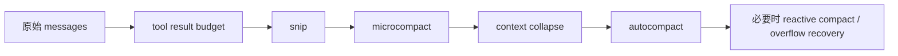

# 性能、缓存与上下文治理专题

## 1. 这篇为什么重要

如果只读功能代码，很容易忽略一个事实：

这套工程的大量复杂度并不是“业务功能”，而是为了控制下面几类真实成本：

- 启动延迟
- 首轮响应延迟
- 长会话内存增长
- prompt cache 失效带来的 token 成本
- 上下文膨胀导致的请求失败
- streaming 与工具执行带来的资源泄露

因此，这篇专题的目标是把散落在各处的“工程性设计”串起来。

## 2. 启动性能：把工作拆成三个窗口

## 2.1 顶层 side effect 窗口

关键代码：`src/main.tsx:1-20`

这里提前做：

- `profileCheckpoint`
- `startMdmRawRead()`
- `startKeychainPrefetch()`

本质上是在争取：

- “模块求值期间并行做别的事”

## 2.2 setup 窗口

关键代码：`src/setup.ts:287-381`

这里做的是：

- 首轮 query 前必须准备的注册与预热
- 但尽量不阻塞 REPL 首屏的东西

例如：

- `getCommands(...)` 预热
- plugin hooks 加载
- attribution hooks 注册
- sink 初始化

## 2.3 首屏后 deferred prefetch 窗口

关键代码：`src/main.tsx:382-431`

这里专门把：

- `getUserContext`
- `getSystemContext`
- `countFilesRoundedRg`
- analytics gates
- model capabilities

推迟到首屏之后。

### 2.3.1 这说明项目的性能优化目标很明确

它区分了：

- 进程可运行
- REPL 首屏可见
- 首轮输入性能准备充分

而不是把所有初始化糊成一坨。

## 3. prompt cache 稳定性是一级设计目标

关键代码：

- `src/main.tsx:445-456`
- `src/services/api/claude.ts:1358-1728`
- `src/services/api/promptCacheBreakDetection.ts`

## 3.1 为什么一个 settings 临时文件路径都要做 content hash

`src/main.tsx:445-456` 的注释非常典型：

- 如果临时 settings 路径用随机 UUID，每个进程都会不同。
- 这个路径会进入工具描述。
- 工具描述参与 prompt cache key。
- 结果是缓存前缀频繁失效。

所以它刻意使用 content-hash-based path。

这类代码很能代表全工程的工程哲学：

> 任何会污染 prompt 前缀的“看似无关细节”都值得修正。

## 3.2 `claude.ts` 里大量 header / beta latch 也是为 cache 稳定

关键代码：`src/services/api/claude.ts:1405-1698`

这里有很多“sticky-on latch”：

- AFK mode header
- fast mode header
- cache editing header
- thinking clear latch

目的都是：

- 一旦这个 header 在本 session 某时刻开始发送，就尽量继续稳定发送
- 避免 session 中途来回切换导致 prompt cache key 波动

## 3.3 prompt cache break detection

`services/api/promptCacheBreakDetection.ts` 专门跟踪：

- system prompt 是否变了
- tool schema 是否变了
- cache read 是否突然掉太多
- cached microcompact 是否是“合法下降”而不是异常失效

这说明团队并不只“希望缓存命中”，而是把缓存失效当作可观测故障来监控。

## 4. 上下文治理不是单一压缩，而是梯度体系

关键代码：`src/query.ts:396-468`

系统对上下文的处理顺序是：

1. tool result budget
2. `snip`
3. `microcompact`
4. `context collapse`
5. `autocompact`
6. 之后还有 reactive compact 参与恢复

## 4.1 梯度图

## 4.2 `snip` 的角色

它是轻量级、偏“先切一点历史”的策略。

优点：

- 成本低
- 对当前上下文侵入较小

## 4.3 `microcompact` 的角色

它更偏向：

- 对特定 tool results 做细粒度压缩
- 某些场景使用 cached microcompact / cache editing

这比整段摘要更精细，也更利于 prompt cache 复用。

## 4.4 `context collapse` 的角色

它不是简单生成一条摘要消息，而是维护一种 collapse store / projection 视图。

优势在于：

- 对长会话更稳定
- 可在多轮中持续重用 collapse 结果

## 4.5 `autocompact` 的角色

它是更强的一步：

- 当 token 窗口真正逼近阈值时，生成 post-compact messages

这是重手段。

## 4.6 reactive compact / overflow recovery

这类恢复策略会在真实 API overflow 或 prompt-too-long 后参与补救。

也就是说，系统不是只做“预防式压缩”，还做“失败后的恢复式压缩”。

## 5. REPL 层对内存与 GC 非常敏感

关键代码：

- `src/screens/REPL.tsx:2608-2627`
- `src/screens/REPL.tsx:3537-3545`
- `src/screens/REPL.tsx:3608-3621`
- `src/screens/REPL.tsx:3657-3688`

## 5.1 替换 ephemeral progress 而不是持续 append

原因：

- 某些 progress 每秒一条
- 全部 append 会让 messages 与 transcript 爆炸

## 5.2 大量 stable callback / ref 是为了防闭包保留

注释里明确提到：

- 不稳定 callback 会让旧 REPL render scope 被下游组件引用住
- 长会话下会明显增加内存占用

## 5.3 rewind 时还要清 microcompact/context collapse 状态

因为如果只回滚消息而不重置这些缓存态：

- 新的会话视图会引用旧的 tool_use_ids 或 collapsed state
- 导致严重不一致

## 6. `claude.ts` 对 streaming 资源泄漏有专门防护

关键代码：

- `src/services/api/claude.ts:1515-1526`
- 以及后续 cleanup 注释

源码明确写到：

- Response 持有 native TLS/socket buffers
- 这些不在 V8 heap 里
- 必须显式 cancel/release

这说明作者并不是泛泛而谈“避免泄漏”，而是针对 Node/SDK 真实行为做了防护。

## 7. query checkpoints 是贯穿式观测点

关键代码：

- `src/query.ts`
- `src/services/api/claude.ts`
- `src/screens/REPL.tsx:2767-2810`

常见 checkpoint 包括：

- `query_fn_entry`
- `query_snip_start/end`
- `query_microcompact_start/end`
- `query_autocompact_start/end`
- `query_api_streaming_start/end`
- `query_tool_execution_start/end`
- `query_context_loading_start/end`

意义：

- 可以把一次 turn 拆成多个阶段分析瓶颈。

## 8. transcript 与持久化也被当成性能/稳定性问题处理

例如 `QueryEngine.ts` 里会：

- 对 assistant 消息 transcript write 采用 fire-and-forget
- 对 compact boundary 前的 preserved tail 做提前 flush
- 在结果返回前做最后 flush

这说明 transcript 不是“顺便记一下”，而是会直接影响：

- resume 正确性
- SDK 进程被上层杀掉时的数据完整性

## 9. 这套系统的性能设计关键词

可以总结为：

- 提前预取
- 延迟预取
- 缓存稳定
- 分层压缩
- 渐进恢复
- 稳定闭包
- 显式资源释放
- 埋点可观测

## 10. 关键源码锚点

| 主题 | 代码锚点 | 说明 |
| --- | --- | --- |
| 顶层启动优化 | `src/main.tsx:1-20` | 启动最早期 side effects |
| deferred prefetch | `src/main.tsx:382-431` | 首屏后预取 |
| settings 路径稳定化 | `src/main.tsx:445-456` | 避免随机路径破坏 prompt cache |
| 上下文治理阶梯 | `src/query.ts:396-468` | snip / microcompact / collapse / autocompact |
| API request cache 相关组装 | `src/services/api/claude.ts:1358-1728` | system blocks、betas、cache editing |
| prompt cache break detection | `src/services/api/promptCacheBreakDetection.ts` | 缓存异常监控 |
| REPL 内存控制 | `src/screens/REPL.tsx:2608-2627`, `3537-3621` | progress 替换与稳定 callback |
| stream 资源释放 | `src/services/api/claude.ts:1515-1526` | native 资源 cleanup |

## 11. 本文结论

这套工程最值得学习的地方之一，不是某个功能，而是它如何把“长期运行的 Agent 会话”当成一类需要精细治理的系统：

- 启动要分阶段。
- 缓存要稳定。
- 上下文要分层压缩。
- 闭包、stream、transcript 都要防泄漏与防失真。

从这些代码能看出来，这不是 demo 级 CLI，而是被真实长会话、真实成本、真实故障模式打磨过的运行时。
