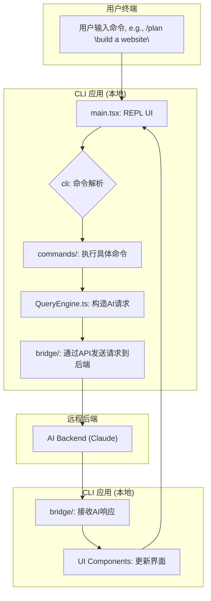

# 1. 工程架构分析

本报告旨在详细剖析 `claude-code` 项目 `src` 目录下的源代码，以揭示其整体工程架构、设计思想和核心模块职责。

## 1.1. 项目概览与技术栈

根据代码库的结构和文件类型，可以确定该项目是一个功能丰富的**命令行工具 (CLI)**。其核心是作为一个智能前端，与一个强大的后端AI服务（推测为Claude）进行交互。

项目采用了现代化的技术栈来构建复杂的终端用户界面 (TUI)：

-   **语言**: **TypeScript**，为项目提供了静态类型检查，增强了代码的健壮性和可维护性。
-   **UI框架**: **React** 结合 **Ink** 库。这是一个创新的选型，允许开发者使用React的声明式组件模型来构建和渲染交互式的命令行界面，极大地超越了传统CLI的文本交互模式。
-   **核心逻辑**: **Node.js** 环境作为CLI的运行基础。

## 1.2. 核心目录职责

项目的 `src` 目录结构清晰，职责分离，体现了良好的模块化设计。

| 目录 | 核心职责 |
| :--- | :--- |
| `main.tsx` | **应用主入口**。这是启动整个交互式CLI应用的起点，负责渲染根React/Ink组件。 |
| `cli/` | **CLI底层功能**。处理核心的命令行功能，如输入/输出流、参数解析、安全字符串化等。 |
| `bridge/` | **通信桥梁**。这是项目的关键部分，负责本地CLI与远程AI后端服务之间的所有通信。它处理API请求、会话管理、认证 (JWT)、数据传输和状态同步。 |
| `commands/` | **命令实现**。包含了用户可以执行的所有命令（如 `/plan`, `/review`, `/commit`）的具体逻辑。每个子目录通常对应一个命令，实现了高度的模块化。 |
| `components/` | **UI组件库**。存放所有在终端界面中使用的可复用React/Ink组件，如对话框、输入框、状态条等。 |
| `buddy/` | **AI伙伴/精灵**。根据`CompanionSprite.tsx`等文件名推断，这部分负责实现一个可视化的AI助手或吉祥物，为用户提供动态的、生动的交互反馈。 |
| `QueryEngine.ts`| **查询引擎**。封装了处理用户查询的核心逻辑。它负责构建发送给AI的prompt，通过`bridge`模块与AI模型交互，并处理返回的结果。 |
| `ink/` | **Ink定制与辅助**。存放与Ink库相关的自定义封装或辅助函数，以更好地支持项目的UI需求。 |
| `tasks/` | **任务管理**。定义和管理可以在后台执行的、更复杂的、多步骤的任务。 |
| `tools/` | **外部工具集成**。定义了AI可以调用的外部工具，扩展了AI模型的能力边界。 |

## 1.3. 高层交互流程

该CLI应用的核心工作流是一个“读取-评估-打印”循环（REPL），但功能远比传统的REPL强大。一个典型的交互流程如下：

**流程说明**:

1.  **用户输入**: 用户在终端内输入一个命令，例如 `/plan "build a website"`。
2.  **UI接收**: `main.tsx` 中运行的REPL界面捕获用户输入。
3.  **命令解析**: `cli` 模块解析输入，识别出是 `/plan` 命令和对应的参数。
4.  **命令执行**: 程序调用 `/commands/plan` 目录下的逻辑来处理该命令。
5.  **构造请求**: `plan` 命令的逻辑会使用 `QueryEngine.ts` 来准备一个结构化的请求，这个请求将被发送给AI模型。
6.  **发送请求**: `bridge` 模块将此请求（可能包括代码上下文、用户问题等）安全地发送到远程的AI后端。
7.  **AI处理**: 后端AI服务（Claude）处理这个请求，并生成一个响应。
8.  **接收响应**: `bridge` 模块异步地接收到AI的响应。
9.  **更新UI**: 响应数据被传递给相应的UI组件，最终在终端上渲染出结果（例如，一个详细的计划步骤），从而完成整个交互闭环。

## 1.4. 总结

`claude-code` 项目是一个设计精良的现代CLI应用。它通过将React/Ink用于终端UI，实现了丰富和动态的用户体验。其架构核心是清晰的模块化和关注点分离，特别是通过`bridge`模块将本地应用逻辑与远程AI服务解耦，并通过`commands`目录实现了可扩展的命令系统。这种架构既保证了本地应用响应的灵活性，又能够充分利用云端强大的AI能力。
