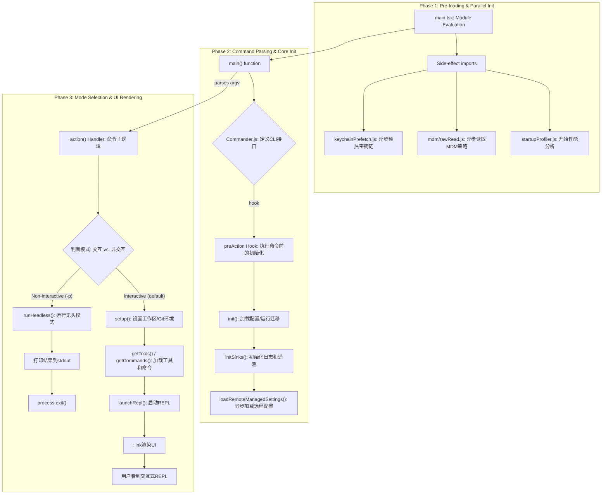

# 2. 启动流程分析

本报告详细描述了 `claude-code` 应用从用户在命令行执行 `claude` 到交互式REPL（Read-Eval-Print Loop）界面完全启动的整个流程。启动过程经过精心设计，通过并行化和延迟加载来优化性能，尽快向用户呈现可用界面。

## 2.1. 启动流程概览

启动流程可以分为三个主要阶段：

1.  **预加载与并行初始化**：在评估主模块 `main.tsx` 时，立即触发一系列非阻塞的后台任务。
2.  **命令解析与核心初始化**：使用`Commander.js`库解析命令行参数，并通过 `preAction` 钩子在执行任何命令前完成核心服务的初始化。
3.  **模式判断与UI渲染**：根据用户参数（如 `-p`）判断应进入交互模式还是非交互模式，并最终渲染UI或直接输出结果。

## 2.2. 详细启动步骤

以下是启动流程的详细分解，并附有流程图。

### 步骤详解：

1.  **Phase 1: 预加载与并行初始化 (入口: `main.tsx` 模块加载)**
    *   **并行任务**: 当Node.js加载 `main.tsx` 模块时，代码顶部的 `import` 语句会立即触发三个关键的异步任务，它们与后续模块的加载并行执行，极大地缩短了启动的阻塞时间。
        *   `profileCheckpoint`: 标记启动过程的开始，用于性能测量。
        *   `startMdmRawRead`: 开始在后台读取系统的移动设备管理（MDM）策略，这对于企业环境下的配置至关重要。
        *   `startKeychainPrefetch`: 开始在后台读取macOS钥匙串或Windows凭据管理器中的敏感信息（如OAuth令牌），避免后续的同步读取阻塞事件循环。

2.  **Phase 2: 命令解析与核心初始化 (入口: `main()` 函数)**
    *   **CLI接口定义**: `main()` 函数中，使用 `@commander-js/extra-typings` 库构建了完整的命令行接口，定义了 `claude` 主命令及其所有的选项（如 `-p`, `--model`, `-c` 等）和子命令。
    *   **特殊参数处理**: 在 `Commander.js` 解析之前，代码会手动检查 `process.argv` 中是否存在如 `ssh <host>` 或 `cc://` 这样的特殊指令。如果存在，它会重写 `argv` 并将这些指令转换为内部状态，以便主REPL能够以全功能模式处理它们，而不是将它们作为受限的子命令，这是一种非常优雅的设计。
    *   **`preAction` 钩子**: 这是初始化的核心。`Commander.js` 在执行任何命令的 `action` 之前会触发此钩子。这确保了只有在需要执行实际工作时才进行重量级的初始化，而像 `claude --help` 这样的命令则可以快速响应。
    *   **核心初始化 (`init()`)**: `preAction` 钩子中会调用 `src/entrypoints/init.js` 中的 `init` 函数。这个函数负责：
        *   运行数据迁移 (`runMigrations`)，以确保用户的旧配置能与新版本兼容。
        *   加载所有配置源（全局、项目、本地、环境变量、命令行参数）。
        *   初始化遥测（Telemetry）和特性开关（GrowthBook）。
        *   开始异步加载企业远程配置 (`loadRemoteManagedSettings`)。

3.  **Phase 3: 模式选择与UI渲染 (入口: `action()` 处理器)**
    *   **`action()` 处理器**: 当用户提供了prompt（或无prompt直接回车）时，`Commander.js` 会执行为 `claude` 主命令注册的 `action` 处理器。
    *   **环境设置 (`setup()`)**: 调用 `src/setup.js` 中的 `setup` 函数。此函数根据需要（例如，`--worktree` 模式）准备或更改当前工作目录（`cwd`），并建立与Git环境相关的上下文。
    *   **加载工具和命令**: 调用 `getTools()` 和 `getCommands()` 来加载所有可用的工具和斜杠命令。
    *   **模式判断**:
        *   **交互模式 (默认)**: 如果没有 `-p` 或 `--print` 等非交互标志，程序会调用 `launchRepl()`。这个函数使用 `Ink` 库来渲染 `src/components/App.tsx` React根组件，从而在终端中构建出功能丰富的交互式REPL界面。
        *   **非交互模式 (`--print`)**: 如果检测到 `-p` 标志，程序会调用 `runHeadless()`。它会执行查询，将最终结果直接输出到 `stdout`，然后通过 `process.exit()` 退出。这对于将 `claude` 集成到脚本或管道中非常有用。

## 2.3. 总结

`claude-code` 的启动流程是一个高度优化的过程。它通过在模块加载时启动并行I/O任务，并利用 `preAction` 钩子延迟重量级初始化，最大限度地减少了用户感知的启动延迟。对特殊命令行参数的智能处理和对交互/非交互模式的清晰分离，共同构成了一个既强大又灵活的CLI应用基础。