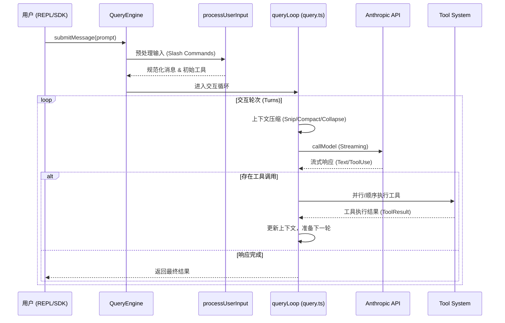

# 03. 请求处理流分析

本报告深入剖析 `claude-code` 如何处理用户输入，从接收指令到模型交互、工具执行及最终响应的完整生命周期。

## 3.1. 核心链路概览

`claude-code` 的请求处理是一个典型的 **感知-思考-行动** 循环，但其独特之处在于集成了复杂的上下文管理（Compaction）和自愈机制（Recovery）。

## 3.2. 关键阶段详解

### 3.2.1. 输入预处理 (`processUserInput.ts`)
在消息正式进入 AI 循环前，系统会进行“预检”：
- **Slash Commands 解析**：如用户输入 `/plan`，系统会识别并调用对应的命令处理器，这可能会直接修改 `mutableMessages` 历史，甚至直接中断后续的 AI 调用。
- **附件注入**：自动收集当前环境信息（如 Git 状态、CLAUDE.md 内容）作为附件。

### 3.2.2. 上下文压缩流 (`query.ts`)
为了应对长会话带来的 Token 限制和成本问题，系统在每次 API 调用前都会运行一个复杂的压缩管线：
1.  **Tool Result Budgeting**: 自动裁剪过大的工具输出（如读取了巨大的日志文件）。
2.  **Snip Compaction**: 如果消息过多，会切除中间的历史记录，仅保留头部（System Prompt/初始指令）和尾部（最新上下文）。
3.  **Auto Compact**: 利用 AI 对较早的交互进行摘要化（Summarization），将几十条消息压缩为一条摘要。
4.  **Context Collapse**: 基于 UI 状态，将已读取的文件内容“折叠”为元数据引用。

### 3.2.3. AI 交互与流式处理 (`callModel`)
系统支持 **流式工具执行 (Streaming Tool Execution)**。这意味着当模型还在输出第二个工具的参数时，第一个工具可能已经开始执行了。这通过 `StreamingToolExecutor` 实现，极大地降低了感知延迟。

### 3.2.4. 异常恢复与自愈机制
`query.ts` 中实现了多种自愈逻辑：
- **Prompt Too Long (413 Error)**: 捕获该错误后，系统不会报错退出，而是触发 `reactiveCompact`。它会强制进行一次深度压缩（甚至是牺牲精度的摘要），然后自动重试请求。
- **Max Output Tokens**: 如果回复被截断，系统会自动发送一个隐式的 `Resume` 消息，引导模型“请继续”，实现无缝续接。
- **Model Fallback**: 如果首选模型（如 Claude 3.5 Sonnet）过载，系统可以自动降级到备用模型（如 Claude 3 Haiku）。

## 3.3. 核心代码位置

- `src/QueryEngine.ts`: 对话生命周期管理器，维护 `mutableMessages`。
- `src/query.ts`: 核心循环逻辑，包含压缩、重试、流式调度。
- `src/services/tools/StreamingToolExecutor.ts`: 工具流式执行调度器。
- `src/services/compact/`: 存放各种压缩策略（Snip, AutoCompact）。

## 3.4. 总结
`claude-code` 的请求处理流不是简单的 Request/Response，而是一个具备**上下文意识**和**故障自愈能力**的状态机。它通过多层级的压缩策略保证了长对话的稳定性，通过流式执行和自动重试机制提供了流畅的用户体验。
