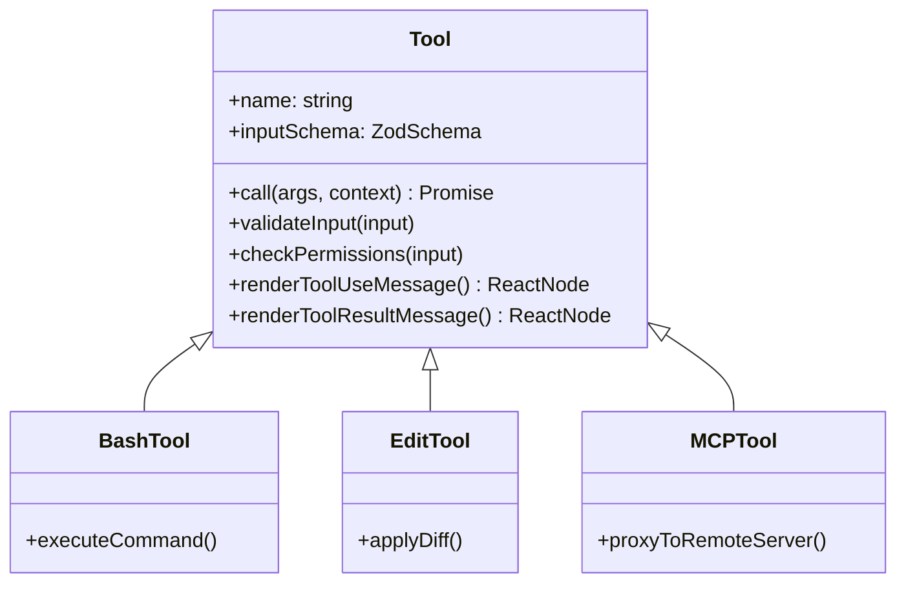

# 04. 工具系统分析

`claude-code` 的工具系统（Tool System）是其能够执行复杂工程任务的核心。它将 AI 的“思考”转化为真实的“行动”，涵盖了文件操作、Shell 执行、代码搜索及子代理调用。

## 4.1. 工具架构模型

每个工具都遵循一个统一的接口定义（见 `src/Tool.ts`），这使得系统可以以声明式的方式管理各种能力。

### 核心设计理念：
1.  **Schema 驱动**：使用 `zod` 定义输入参数，确保 AI 生成的参数在传给执行逻辑前是类型安全的。
2.  **UI/Logic 合一**：工具不仅负责 `call` 执行，还定义了自己在终端中的 React/Ink 渲染逻辑（`renderToolUseMessage`）。这使得 UI 能够随着工具集的扩展而自动扩展。
3.  **权限分级**：通过 `isReadOnly`、`isDestructive` 属性，系统自动判断是否需要弹出“确认对话框”。

## 4.2. 核心工具集解析

### 4.2.1. Bash 工具 (`src/tools/BashTool/`)
- **功能**：在本地 shell 中执行命令。
- **安全性**：包含命令黑名单过滤，并在执行破坏性操作前触发权限询问。
- **进度反馈**：支持流式输出 stdout/stderr，让用户能实时看到命令执行进展。

### 4.2.2. Edit 工具 (`src/tools/EditTool/`)
- **功能**：对文件进行精确的代码修改。
- **实现**：它不仅仅是简单的覆盖，通常接收统一差异（Unified Diff）格式，以确保在多人协作或模型预测略有偏差时能安全应用修改。
- **校验**：修改后通常会触发隐式的 Linter 或语法检查。

### 4.2.3. Agent 工具 (`src/tools/AgentTool/`)
- **功能**：开启一个“子代理”会话。
- **原理**：创建一个新的 `QueryEngine` 实例，将特定子任务委托给它。子代理可以拥有独立于主线程的工具集和上下文。

## 4.3. 动态扩展：MCP 系统
**Model Context Protocol (MCP)** 是 `claude-code` 的重要扩展机制。
- **动态发现**：通过连接到本地或远程的 MCP 服务器，CLI 可以动态加载这些服务器提供的工具。
- **协议转换**：`src/services/mcp/` 负责将 MCP 协议定义的工具元数据转换为系统内部的 `Tool` 接口。这使得 `claude-code` 可以无缝接入数据库查询、API 调用等第三方服务。

## 4.4. 工具执行生命周期
1.  **参数校验**：Zod 检查 AI 输入。
2.  **权限预检**：调用 `checkPermissions` 检查 `alwaysAllow` 规则或询问用户。
3.  **流式执行**：调用 `call`，期间不断通过 `onProgress` 回调更新 UI。
4.  **结果转换**：将输出（字符串、JSON 或错误）包装成 `tool_result` 返回给模型。
5.  **上下文回流**：如果是大文件读取，系统会自动触发 `applyToolResultBudget` 进行截断或引用化。

## 4.5. 总结
工具系统是 `claude-code` 的“手脚”。通过高度标准化的接口定义和灵活的 MCP 扩展协议，它不仅实现了强大的本地工程能力，还具备了无限的外部集成潜力。UI 与逻辑的深度绑定，则确保了在复杂的命令行交互中依然能提供直观的用户反馈。
