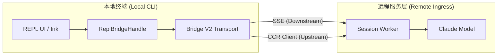

# 05. Bridge 远程系统分析

Bridge 是 `claude-code` 实现远程会话、云端同步及“无环境”执行模式的关键枢纽。它通过一套复杂的协议栈，将本地终端的交互无缝延伸至 Anthropic 的云端基础设施。

## 5.1. 架构定位

Bridge 系统（特别是 V2 版本）的设计目标是彻底解耦执行环境与交互界面。

- **下行链路 (SSE)**：服务端通过 Server-Sent Events 实时推送 AI 响应、状态更新和控制请求（如工具权限申请）。
- **上行链路 (CCR)**：客户端通过 Cloud Control Runtime 协议批量上报用户输入、工具执行结果和心跳。

## 5.2. 核心机制详解

### 5.2.1. 纪元管理 (Epoch Management)
为了防止多个 CLI 实例（如多个标签页或进程）同时控制同一个远程会话，系统引入了 `worker_epoch`。
- 每次调用 `/bridge` 接口获取新凭证时，纪元号都会递增。
- 服务端仅接受持有最新纪元号的客户端写请求，旧客户端的请求将触发 409 冲突错误并被强制断开。

### 5.2.2. 令牌自刷新与故障恢复
- **Proactive Refresh**：`jwtUtils.ts` 中的调度器会在 JWT 过期前 5 分钟自动获取新令牌并静默重建传输链路。
- **401 Recovery**：如果 SSE 链路因鉴权失效断开，`remoteBridgeCore.ts` 会捕获异常，触发 OAuth 刷新，并在不丢失当前会话进度的前提下重建 Transport。

### 5.2.3. 消息定序与冲刷门控 (`FlushGate`)
在远程会话初始化时，本地可能已有一段交互历史。
- `FlushGate` 确保在“历史历史冲刷（History Flush）”请求完成前，所有新产生的“实时消息（Live Messages）”都会被暂存在队列中。
- 这保证了远程服务端接收到的消息序列在逻辑和时间上是完全正确的。

## 5.3. 关键组件职责

| 文件 | 职责 |
| :--- | :--- |
| `remoteBridgeCore.ts` | Bridge 的核心状态机，处理初始化、重连、纪元切换及心跳逻辑。 |
| `codeSessionApi.ts` | 封装与后端会话管理接口（创建会话、获取凭证、归档会话）的 HTTP 调用。 |
| `replBridgeTransport.ts` | 传输层抽象，集成 SSE 监听器和 CCR 写客户端。 |
| `bridgeMessaging.ts` | 消息协议的编解码，负责将内部 Message 对象转换为 SDK 兼容的格式。 |

## 5.4. 协作模式 (Cowork)
Bridge 是实现 **Cowork** 功能的基石。在 Cowork 模式下：
1. 本地 CLI 只是一个视图层。
2. AI 在云端环境直接操作代码（通过远程工具）。
3. Bridge 负责将云端的每一次文件修改、每一个进度条实时同步到用户的本地终端屏幕上。

## 5.5. 总结
Bridge 系统展示了现代 TUI 应用对远程能力的极致追求。通过 SSE 与 CCR 的双工组合，结合严谨的纪元同步与自动恢复策略，它在保证安全性的同时，为用户提供了近乎零延迟的远程协作体验。
