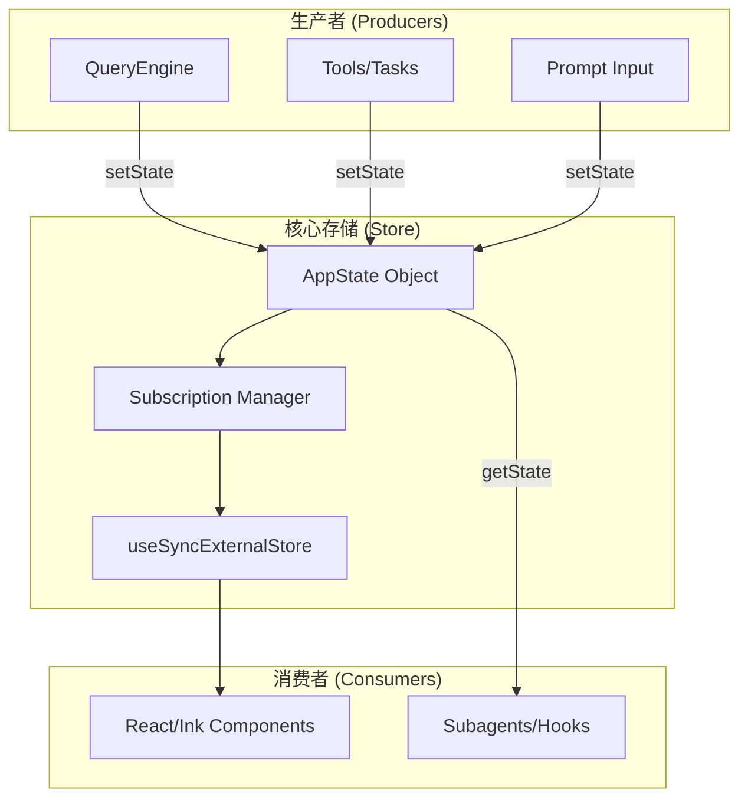

# 06. 状态管理系统分析

`claude-code` 的状态管理是一个典型的“中心化存储 + 反应式更新”架构，能够同时支撑高性能的终端渲染（TUI）和复杂的后台异步逻辑。

## 6.1. 核心架构：AppState & Store

系统状态的核心由 `AppState` 定义（见 `src/state/AppStateStore.ts`），并由一个自定义的 `Store` 对象管理。

### 关键设计点：
- **DeepImmutable**：通过 TypeScript 类型确保状态在逻辑上是深层不可变的，这强制开发者使用扩展运算符（`...state`）来触发更新，从而保证 React 的响应性。
- **Store 解耦**：Store 不依赖于 React 生命周期。这意味着即使在没有 UI 的“无头模式（Headless）”下，状态管理逻辑依然可以正常运行。

## 6.2. 状态深度解析

`AppState` 包含多个垂直领域的状态分片：

### 6.2.1. 环境与通信状态
- **replBridge**: 维护远程 Cowork 会话的所有细节（URL、ID、连接状态）。
- **mcp**: 动态存储所有已连接的 Model Context Protocol 服务器及其提供的工具。

### 6.2.2. 智能特性状态
- **Speculation (推测执行)**：这是一个非常高级的特性。系统会预测用户可能的操作并提前后台执行，`SpeculationState` 记录了这些预测任务的进度和“节省的时间”。
- **Prompt Suggestion**: 存储 AI 生成的建议文本，及其被用户看到或采纳的时间戳。

### 6.2.3. 特殊工具状态
- **Computer Use (Chicago)**：记录屏幕截图尺寸、允许访问的应用列表等。
- **Tungsten (Tmux)**：维护与终端复用器（Tmux）的连接，包括当前激活的窗格和最后执行的命令。

## 6.3. UI 响应式链路

在终端 UI 中，性能至关重要。`AppState.tsx` 通过以下方式优化渲染：
1.  **选择器模式 (`useAppState`)**：组件只订阅自己关心的那部分状态。例如，状态栏组件只订阅 `statusLineText`，其他状态的变化不会导致状态栏重绘。
2.  **Stable Updaters (`useSetAppState`)**：提供稳定的更新函数引用，防止组件因子组件重定义而频繁重刷。

## 6.4. 持久化与同步
虽然 `AppState` 主要驻留在内存中，但关键数据会通过以下方式同步：
- **Transcript (历史记录)**：对话历史被实时写入磁盘上的 JSONL 文件。
- **Settings**: 用户配置持久化在全局配置文件中，并通过 `useSettingsChange` 钩子实时同步到内存状态。

## 6.5. 总结
`claude-code` 的状态管理系统是一个既能应对高频 UI 更新，又能承载复杂分布式逻辑（如多进程、远程桥接）的健壮框架。它通过严格的类型约束和解耦的 Store 设计，确保了在终端这种资源敏感环境下的稳定运行。
