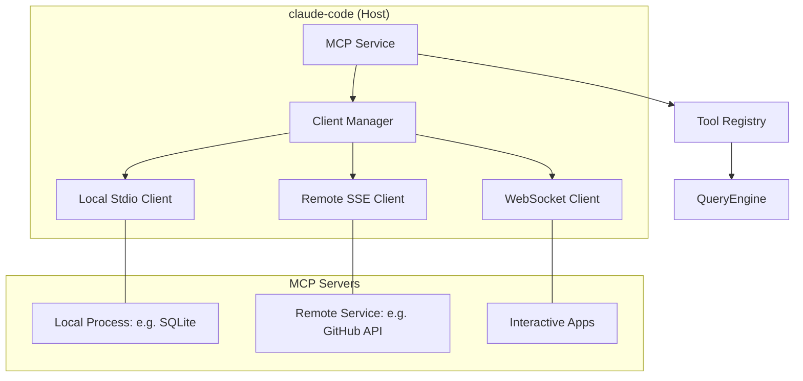

# 07. MCP 协议系统分析

Model Context Protocol (MCP) 是 `claude-code` 实现生态扩展的基石。它允许 AI 动态接入外部数据源、工具集和预定义的 Prompt 模板，极大地扩展了 CLI 的能力边界。

## 7.1. MCP 架构概览

`claude-code` 充当 MCP 客户端（Host），它可以同时连接多个 MCP 服务器。

## 7.2. 核心组件与机制

### 7.2.1. 灵活的传输层 (`client.ts`)
系统支持多种传输协议，以适应不同的部署场景：
- **Stdio**: 通过 `child_process` 启动本地工具（如 Python 脚本、二进制文件）。
- **SSE / Streamable HTTP**: 适配云端服务，支持流式数据同步。
- **WebSocket**: 专门用于需要低延迟双工通信的交互式应用。

### 7.2.2. 工具与资源的自动化映射
- **MCPTool**: 系统会自动将 MCP 服务器定义的 JSON Schema 工具转换为 AI 可识别的 `Tool` 对象。
- **资源发现**: 内置 `ListMcpResourcesTool`，允许 AI 像浏览文件系统一样浏览 MCP 服务器提供的虚拟资源（如数据库 Schema、远程文档）。

### 7.2.3. 鉴权与“启发”机制 (Elicitation)
MCP 系统处理复杂的交互式认证：
1.  **Needs-Auth 状态**：如果服务器返回 401，客户端将其标记为 `needs-auth` 并触发 UI 引导。
2.  **Elicitation (启发)**：这是 MCP 的一个高级特性。当工具执行中途需要用户操作（如点击 OAuth 授权链接）时，服务器会发送一个 `elicit` 请求。`elicitationHandler.ts` 会捕获该请求，在终端渲染交互界面，等待用户完成后再将结果写回服务器。

## 7.3. 典型应用案例：Computer Use (Chicago)

`Chicago` 是 `claude-code` 中最复杂的 MCP 实现，它允许 AI “像人一样”操作电脑。
- **截图与坐标**：通过 MCP 协议传输屏幕截图，并处理不同分辨率下的坐标缩放。
- **权限申请**：由于涉及敏感操作，它深度集成了权限守卫，每次截图或模拟点击都会经过严格的审计。

## 7.4. 关键代码路径

- `src/services/mcp/client.ts`: 所有的连接管理、心跳、重连及协议转换逻辑。
- `src/services/mcp/elicitationHandler.ts`: 处理交互式信息请求（如 URL 访问、MFA 输入）。
- `src/tools/MCPTool/`: 包装 MCP 原始工具，提供 UI 渲染支持。

## 7.5. 总结
MCP 不仅仅是一个插件系统，它是一套标准化的“AI 操作系统”接口。通过 MCP，`claude-code` 变成了一个可插拔的能力中心，能够连接到任何提供标准接口的外部服务，而无需修改核心代码。
