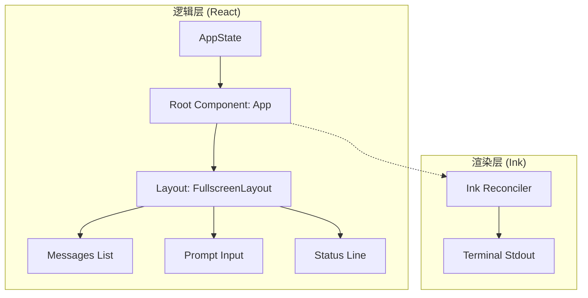

# 08. UI 与输出渲染系统分析

`claude-code` 提供了一个现代、动态且高度交互的终端用户界面（TUI）。它打破了传统 CLI 纯文本输出的局限，利用 React 的组件化思想在终端中实现了复杂的布局和交互。

## 8.1. 技术栈：React + Ink

UI 层的核心是 **Ink** 库，它提供了一个自定义的 React 渲染器，将 React 组件树转换为终端可识别的 ANSI 转义序列。

## 8.2. 布局架构

### 8.2.1. 全屏布局 (`FullscreenLayout.tsx`)
系统通常占据整个终端窗口（通过 `alternate screen` 模式）。
- **头部/中部**：显示 `Messages` 列表。为了性能，长列表采用了虚拟滚动技术（`VirtualMessageList`）。
- **底部**：固定显示 `PromptInput` 和 `StatusLine`。
- **侧边栏/叠加层**：支持显示任务面板、队友列表或全屏对话框（如 `/settings`）。

### 8.2.2. 动态消息组件 (`MessageRow.tsx`)
每一行消息不仅是文本，而是一个复杂的 React 组件：
- **Tool Use**：渲染为带图标的折叠块，展示工具名和参数。
- **Tool Result**：如果是文件修改，会渲染一个精美的彩色 `Diff` 视图。
- **Thinking**：展示 AI 的“思维过程”动画。

## 8.3. 交互式输入系统

`PromptInput` 是系统中复杂度最高的部分之一：
- **实时建议**：基于当前上下文和历史，在输入框上方显示虚幻的建议文本。
- **语法高亮**：对斜杠命令（Slash Commands）进行实时着色。
- **多模式支持**：支持普通模式和 `Vim` 输入模式（`VimTextInput.tsx`）。

## 8.4. 性能优化：FPS 与 响应性

终端渲染的性能瓶颈在于频繁的 `stdout` 写入。
1.  **FpsTracker**: 监控 UI 的刷新率。如果刷新过快导致终端闪烁，系统会自动降低更新频率。
2.  **局部渲染**: 配合 `useAppState` 选择器，确保只有受影响的 UI 部分（如状态栏的一个数字）发生变化时才触发重绘。
3.  **Sync External Store**: 确保 React 渲染循环与外部状态（如 Socket 消息）保持同步，避免掉帧。

## 8.5. 主题系统 (Theming)

系统内置了完善的主题支持（`ThemePicker.tsx`）：
- **色域适配**：支持 16 色、256 色和真彩色（TrueColor）终端。
- **语义化颜色**：通过统一的 `Theme` 上下文分发颜色变量（如 `error`, `warning`, `secondaryText`），确保在不同背景色下均有良好的可读性。

## 8.6. 总结
`claude-code` 的 UI 系统证明了：通过合理的架构设计，终端界面也可以拥有 web 级别的交互体验。它将 React 的声明式开发效率与终端的轻量级特性结合，创造出了一个既专业又灵动的开发者工具。
