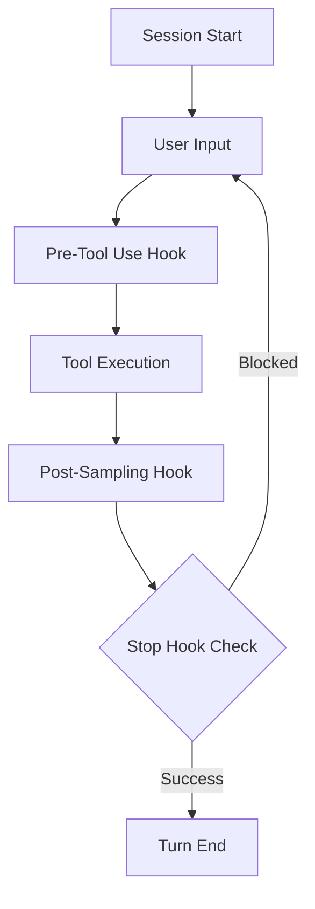

# 09. Hooks 钩子系统分析

Hooks 系统是 `claude-code` 实现自动化约束、任务增强和流程干预的核心机制。它通过在对话生命周期的关键节点注入逻辑，实现了 AI 能力与工程规范的深度融合。

## 9.1. 钩子生命周期与触发点

系统在对话的多个阶段定义了钩子触发点：

### 9.1.1. Pre-Tool Use (工具预检)
在工具正式执行前运行。常用于：
- **动态权限验证**：根据当前操作的风险等级动态调整权限要求。
- **参数改写**：根据环境信息对工具参数进行预修正。

### 9.1.2. Post-Sampling (响应后处理)
在模型完成输出后立即触发。用途包括：
- **任务提取**：自动识别 AI 回复中的潜在 TODO 项并更新任务面板。
- **背景分析**：在 AI 思考的同时，并行触发代码分析或索引更新。

### 9.1.3. Stop Hooks (终止拦截器)
这是最关键的钩子类型（见 `src/query/stopHooks.ts`）。
- **原理**：当 AI 认为任务已完成并尝试退出循环时，`Stop Hooks` 会被触发。
- **强制重试**：如果钩子执行失败（例如 Lint 检查未通过、单元测试失败），它会向消息队列中注入一条特殊的“错误反馈”消息。
- **自愈闭环**：AI 会接收到这条错误反馈并自动开始修复，直到所有 `Stop Hooks` 均返回成功，对话才能真正结束。

## 9.2. 事件与进度系统 (`hookEvents.ts`)

为了在 TUI 中提供良好的反馈，Hooks 具备完善的事件广播机制：
- **流式输出**：通过 `emitHookProgress` 实时广播钩子内部执行的 `stdout` 和 `stderr`。
- **状态追踪**：每个钩子都有唯一的 `hookId`，其状态（`started` / `response`）和结果（`success` / `error`）会被记录在遥测数据中。

## 9.3. 典型钩子案例

| 钩子名称 | 类型 | 功能描述 |
| :--- | :--- | :--- |
| `LintHook` | Stop Hook | 在修改代码后运行 Linter。如果报错，强制 AI 修复语法问题。 |
| `TestHook` | Stop Hook | 运行相关的单元测试。确保 AI 的修改没有引入回归错误。 |
| `TaskExtraction` | Post-Sampling | 从 AI 的自然语言回复中解析并生成结构化的任务卡片。 |
| `MemorySync` | Session Start | 同步本地记忆文件（CLAUDE.md）到当前的对话上下文。 |

## 9.4. 总结
Hooks 系统赋予了 `claude-code` “自我约束”和“主动增强”的能力。特别是 `Stop Hooks` 的引入，将原本开放的对话流程变成了受控的质量反馈循环，确保了 AI 生成的代码在提交前是符合工程标准的。
