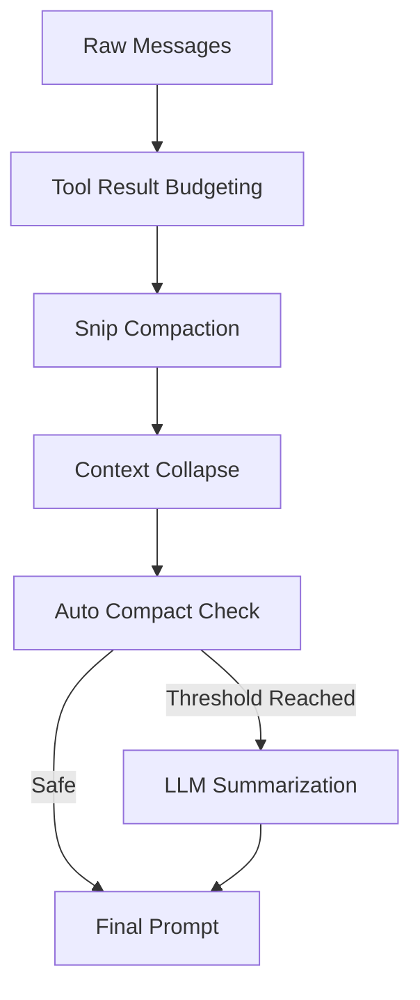

# 10. 上下文管理与压缩系统分析

在长周期的工程开发任务中，Token 上下文窗口是极其宝贵的资源。`claude-code` 设计了一套高度复杂的上下文压缩（Compaction）系统，确保在不丢失关键记忆的前提下，实现对话的无限延续。

## 10.1. 压缩管线概览

系统在每次请求发送前，都会按照以下顺序运行压缩管线：

## 10.2. 核心压缩技术

### 10.2.1. 物理切片 (Snip Compaction)
- **策略**：当消息数量超过阈值时，保留最重要的 System Prompt 和最新的 $N$ 条消息，将中间的过时交互直接切除。
- **优点**：计算成本为零，简单有效。

### 10.2.2. 上下文折叠 (Context Collapse)
- **策略**：将消息中包含的大段非结构化数据（如 `Read` 工具读取的代码、`Grep` 的搜索结果）替换为缩略引用或元数据标签。
- **效果**：极大地减少了冗余 Token，同时 AI 仍然知道这些操作曾经发生过，并可以通过引用再次获取详细信息。

### 10.2.3. 自动摘要压缩 (Auto Compact)
这是系统最具智能的部分（见 `src/services/compact/autoCompact.ts`）：
- **触发机制**：当预估 Token 占用达到模型窗口的 ~90% 时触发。
- **实现原理**：启动一个高性能的小模型（如 Claude 3 Haiku）作为背景任务，对需要压缩的历史进行“语义摘要”，将数十轮的对话浓缩为一段关键信息。
- **熔断机制**：如果自动压缩连续失败 3 次，系统会停止尝试，转而提示用户手动清理或重新开启会话。

### 10.2.4. 响应式抢救 (Reactive Compact)
- **应用场景**：处理模型预测误差导致的“Prompt Too Long” 413 错误。
- **自愈过程**：系统捕获错误后，立即在后台执行一次深度压缩，然后自动重试之前的请求。这对用户来说几乎是无感的。

## 10.3. 关键性能指标

| 指标名称 | 默认阈值 | 说明 |
| :--- | :--- | :--- |
| `AUTOCOMPACT_BUFFER` | 13,000 Tokens | 触发自动压缩的提前量。 |
| `MAX_OUTPUT_TOKENS` | 20,000 Tokens | 为摘要生成预留的输出空间。 |
| `BLOCKING_LIMIT` | 窗口边缘 | 强制拦截用户输入，要求必须压缩才能继续。 |

## 10.4. 代码实现位置

- `src/services/compact/compact.ts`: 摘要生成的 Prompt 模板与逻辑。
- `src/services/compact/snipCompact.ts`: 实现“掐头去尾”的物理过滤。
- `src/services/contextCollapse/`: 负责文件内容的折叠与元数据映射。
- `src/utils/tokens.ts`: 提供基于流式输出的高精度 Token 估算算法。

## 10.5. 总结
上下文管理系统是 `claude-code` 的“记忆过滤器”。它通过物理裁剪、语义折叠和 AI 摘要的组合拳，解决了大语言模型“健忘”和“窗口焦虑”的问题，是实现长序列任务处理（如大规模代码重构）的基石。
